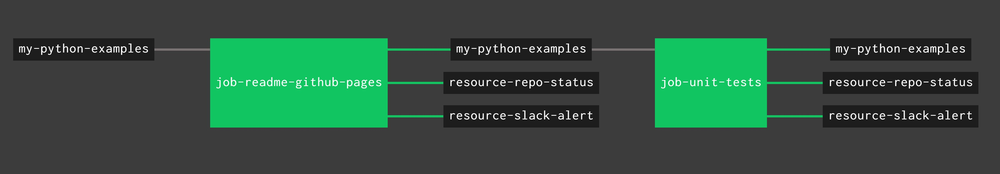

# my-systemverilog-examples

_A place to keep my SystemVerilog code snippets and examples._

These examples also contain info I gathered from other sources.

Table of Contents,

* [BASIC CODE](https://github.com/JeffDeCola/my-systemverilog-examples#basic-code)
  * COMBINATIONAL LOGIC
  * SEQUENTIAL LOGIC
* [COMBINATIONAL LOGIC](https://github.com/JeffDeCola/my-systemverilog-examples#combinational-logic)
  * ALUs
  * DATA OPERATORS
  * DECODERS & ENCODERS
  * MULTIPLEXERS & DEMULTIPLEXERS
* [SEQUENTIAL LOGIC](https://github.com/JeffDeCola/my-systemverilog-examples#sequential-logic)
  * ARBITERS
  * COUNTERS
  * FINITE SATE MACHINES
  * MEMORY
  * REGISTERS
  * SHIFTERS
* [SYSTEMS](https://github.com/JeffDeCola/my-systemverilog-examples#systems)
  * MICROPROCESSORS

Documentation and reference,

* [iverilog](https://github.com/JeffDeCola/my-cheat-sheets/tree/master/hardware/tools/simulation/iverilog-cheat-sheet)
  is a free verilog simulator and synthesis tool
* [GTKWave](https://github.com/JeffDeCola/my-cheat-sheets/tree/master/hardware/tools/simulation/gtkwave-cheat-sheet)
  is a free waveform viewer
* My cheat sheet on
  [SystemVerilog](https://github.com/JeffDeCola/my-cheat-sheets/tree/master/hardware/development/languages/systemverilog-cheat-sheet)
  
[GitHub Webpage](https://jeffdecola.github.io/my-systemverilog-examples/)

## SYSTEMVERILOG EXAMPLES

_All sections in alphabetical order.
Each example uses
[iverilog](https://github.com/JeffDeCola/my-cheat-sheets/tree/master/hardware/tools/simulation/iverilog-cheat-sheet)
to simulate and
[GTKWave](https://github.com/JeffDeCola/my-cheat-sheets/tree/master/hardware/tools/simulation/gtkwave-cheat-sheet)
to view the output._

### BASIC CODE

* COMBINATIONAL LOGIC

  * [and2](https://github.com/JeffDeCola/my-systemverilog-examples/tree/master/basic-code/combinational-logic/and2)

    _2-input AND gate used in my
    [programable-8-bit-microprocessor](https://github.com/JeffDeCola/my-systemverilog-examples/tree/master/systems/microprocessors/programable-8-bit-microprocessor)
    below._

  * [and-gate](https://github.com/JeffDeCola/my-systemverilog-examples/tree/master/basic-code/combinational-logic/and-gate)

    _A few different ways to model an AND gate._

  * [nand4](https://github.com/JeffDeCola/my-systemverilog-examples/tree/master/basic-code/combinational-logic/nand4)

    _4-input NAND gate used in my
    [programable-8-bit-microprocessor](https://github.com/JeffDeCola/my-systemverilog-examples/tree/master/systems/microprocessors/programable-8-bit-microprocessor)
    below._

  * [nor2](https://github.com/JeffDeCola/my-systemverilog-examples/tree/master/basic-code/combinational-logic/nor2)

    _2-input NOR gate used in my
    [programable-8-bit-microprocessor](https://github.com/JeffDeCola/my-systemverilog-examples/tree/master/systems/microprocessors/programable-8-bit-microprocessor)
    below._

  * [not1](https://github.com/JeffDeCola/my-systemverilog-examples/tree/master/basic-code/combinational-logic/not1)

    _NOT gate used in my
    [programable-8-bit-microprocessor](https://github.com/JeffDeCola/my-systemverilog-examples/tree/master/systems/microprocessors/programable-8-bit-microprocessor)
    below._

  * [or2](https://github.com/JeffDeCola/my-systemverilog-examples/tree/master/basic-code/combinational-logic/or2)

    _2-input OR gate used in my
    [programable-8-bit-microprocessor](https://github.com/JeffDeCola/my-systemverilog-examples/tree/master/systems/microprocessors/programable-8-bit-microprocessor)
    below._

  * [xor2](https://github.com/JeffDeCola/my-systemverilog-examples/tree/master/basic-code/combinational-logic/xor2)

    _2-input XOR gate used in my
    [programable-8-bit-microprocessor](https://github.com/JeffDeCola/my-systemverilog-examples/tree/master/systems/microprocessors/programable-8-bit-microprocessor)
    below._

* SEQUENTIAL LOGIC

  * [d-flip-flop](https://github.com/JeffDeCola/my-systemverilog-examples/tree/master/basic-code/sequential-logic/d-flip-flop)

     _A positive edge d flip-flop with asynchronous enable._
    Used in my
    [jeff-74x377](https://github.com/JeffDeCola/my-systemverilog-examples/tree/master/sequential-logic/registers/jeff-74x377)
    below._

  * [jk-flip-flop](https://github.com/JeffDeCola/my-systemverilog-examples/tree/master/basic-code/sequential-logic/jk-flip-flop)

     _A positive edge jk flip-flop with asynchronous clear.
    Used in my
    [jeff-74x161](https://github.com/JeffDeCola/my-systemverilog-examples/tree/master/sequential-logic/counters/jeff-74x161)
    below._

### COMBINATIONAL LOGIC

* ALUs

  * [jeff-74x181](https://github.com/JeffDeCola/my-systemverilog-examples/tree/master/combinational-logic/alus/jeff-74x181)

    _4-bit alu (arithmetic logic unit) and function generator.
    Provides 16 binary logic operations and 16 arithmetic operations
    on two 4-bit words.
    Based on the 7400-series integrated circuits used in my
    [programable-8-bit-microprocessor](https://github.com/JeffDeCola/my-systemverilog-examples/tree/master/systems/microprocessors/programable-8-bit-microprocessor)
    below._

* DATA OPERATORS

  * [full-adder](https://github.com/JeffDeCola/my-systemverilog-examples/tree/master/combinational-logic/data-operators/full-adder)

    _A 2-bit full-adder._

  * [half-adder](https://github.com/JeffDeCola/my-systemverilog-examples/tree/master/combinational-logic/data-operators/half-adder)

    _A 2-bit half-adder._

* DECODERS & ENCODERS

  * [decoder-3-8](https://github.com/JeffDeCola/my-systemverilog-examples/tree/master/combinational-logic/decoders-and-encoders/decoder-3-8)

    _Decoder - Three inputs decodes to 1 of 8 outputs (hot)._

  * [decoder-to-encoder](https://github.com/JeffDeCola/my-systemverilog-examples/tree/master/combinational-logic/decoders-and-encoders/decoder-to-encoder)

    _Combining the `decoder-3-8` to the `encoder-8-3` to prove the input will equal
    the output._

  * [encoder-8-3](https://github.com/JeffDeCola/my-systemverilog-examples/tree/master/combinational-logic/decoders-and-encoders/encoder-8-3)

    _Encoder - Eights inputs (1 hot) encodes to output._

* MULTIPLEXERS & DEMULTIPLEXERS

  * [demux-1x4](https://github.com/JeffDeCola/my-systemverilog-examples/tree/master/combinational-logic/multiplexers-and-demultiplexers/demux-1x4)

    _Demultiplexer - One input, four outputs (using a case statement)._

  * [jeff-74x151](https://github.com/JeffDeCola/my-systemverilog-examples/tree/master/combinational-logic/multiplexers-and-demultiplexers/jeff-74x151)

    _8-line to 1-line data selector/multiplexer.
    Based on the 7400-series integrated circuits used in my
    [programable-8-bit-microprocessor](https://github.com/JeffDeCola/my-systemverilog-examples/tree/master/systems/microprocessors/programable-8-bit-microprocessor)
    below._

  * [jeff-74x157](https://github.com/JeffDeCola/my-systemverilog-examples/tree/master/combinational-logic/multiplexers-and-demultiplexers/jeff-74x157)

    _Quad 2-line to 1-line data selector/multiplexer, non-inverting outputs.
    Based on the 7400-series integrated circuits used in my
    [programable-8-bit-microprocessor](https://github.com/JeffDeCola/my-systemverilog-examples/tree/master/systems/microprocessors/programable-8-bit-microprocessor)
    below._

  * [mux-4x1](https://github.com/JeffDeCola/my-systemverilog-examples/tree/master/combinational-logic/multiplexers-and-demultiplexers/mux-4x1)

    _Multiplexer - Four inputs, one output (using a case statement)._

  * [mux-to-demux](https://github.com/JeffDeCola/my-systemverilog-examples/tree/master/combinational-logic/multiplexers-and-demultiplexers/mux-to-demux)  

    _Combining the `mux-4x1` to the `demux-1x4` to prove the input will equal
    the output (For the selected output)._

### SEQUENTIAL LOGIC

* ARBITERS

  * [priority-arbiter](https://github.com/JeffDeCola/my-systemverilog-examples/tree/master/sequential-logic/arbiters/priority-arbiter)

    _A three level Priority Arbiter with asynchronous reset
    (Using if-then-else statements)._

* COUNTERS

  * [jeff-74x161](https://github.com/JeffDeCola/my-systemverilog-examples/tree/master/sequential-logic/counters/jeff-74x161)

    _Synchronous presettable 4-bit binary counter, asynchronous clear.
    Based on the 7400-series integrated circuits used in my
    [programable-8-bit-microprocessor](https://github.com/JeffDeCola/my-systemverilog-examples/tree/master/systems/microprocessors/programable-8-bit-microprocessor)
    below._

* FINITE STATE MACHINES

  * [pattern-recognition](https://github.com/JeffDeCola/my-systemverilog-examples/tree/master/sequential-logic/finite-state-machines/pattern-recognition)

    _Recognize the pattern `00110` in a serial stream._

* MEMORY

  * [simple-memory-using-1d-array](https://github.com/JeffDeCola/my-systemverilog-examples/tree/master/sequential-logic/memory/simple-memory-using-1d-array)

    _A simple 16 Byte memory modeled using a 1D array._

* REGISTERS

  * [jeff-74x377](https://github.com/JeffDeCola/my-systemverilog-examples/tree/master/sequential-logic/registers/jeff-74x377)

    _8-bit register, clock enable.
    Based on the 7400-series integrated circuits used in my
    [programable-8-bit-microprocessor](https://github.com/JeffDeCola/my-systemverilog-examples/tree/master/systems/microprocessors/programable-8-bit-microprocessor)
    below._

* SHIFTERS

  * [left-shift-register](https://github.com/JeffDeCola/my-systemverilog-examples/tree/master/sequential-logic/shifters/left-shift-register)

    _A 4-bit left shift register._

### SYSTEMS

* MICROPROCESSORS

  * [programable-8-bit-microprocessor](https://github.com/JeffDeCola/my-systemverilog-examples/tree/master/systems/microprocessors/programable-8-bit-microprocessor)

    _A programable 8-bit microprocessor._

## SCRIPT TO LAUNCH GTKWAVE

To make things easier when viewing a waveform, I wrote a script that will launch
[GTKWave](https://github.com/JeffDeCola/my-cheat-sheets/tree/master/hardware/tools/simulation/gtkwave-cheat-sheet)
with your saved `*.gtkw` file
from Windows WSL, macOS or Linux (Whatever you use).

The script is
[launch-gtkwave.sh](launch-GTKWave-script/launch-gtkwave.sh).

## UPDATE GITHUB WEBPAGE USING CONCOURSE (OPTIONAL)

For fun, I use concourse to update
[my-systemverilog-examples GitHub Webpage](https://jeffdecola.github.io/my-systemverilog-examples/)
and alert me of the changes via repo status and slack.

A pipeline file [pipeline.yml](https://github.com/JeffDeCola/my-systemverilog-examples/tree/master/ci/pipeline.yml)
shows the entire ci flow. Visually, it looks like,

The `jobs` and `tasks` are,

* `job-readme-github-pages` runs task
  [readme-github-pages.sh](https://github.com/JeffDeCola/my-systemverilog-examples/tree/master/ci/scripts/readme-github-pages.sh).

The concourse `resources types` are,

* `my-systemverilog-examples` uses a resource type
  [docker-image](https://hub.docker.com/r/concourse/git-resource/)
  to PULL a repo from github.
* `resource-slack-alert` uses a resource type
  [docker image](https://hub.docker.com/r/cfcommunity/slack-notification-resource)
  that will notify slack on your progress.
* `resource-repo-status` uses a resource type
  [docker image](https://hub.docker.com/r/dpb587/github-status-resource)
  that will update your git status for that particular commit.

For more information on using concourse for continuous integration,
refer to my cheat sheet on [concourse](https://github.com/JeffDeCola/my-cheat-sheets/tree/master/software/operations-tools/continuous-integration-continuous-deployment/concourse-cheat-sheet).
