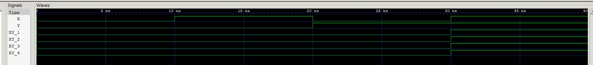

# AND GATE EXAMPLE

_A few different ways to model an AND gate._

Table of Contents

* [SCHEMATIC](https://github.com/JeffDeCola/my-verilog-examples/tree/master/basic-code/combinational-logic/and-gate#schematic)
* [TRUTH TABLE](https://github.com/JeffDeCola/my-verilog-examples/tree/master/basic-code/combinational-logic/and-gate#truth-table)
* [VERILOG CODE](https://github.com/JeffDeCola/my-verilog-examples/tree/master/basic-code/combinational-logic/and-gate#verilog-code)
* [RUN (SIMULATE)](https://github.com/JeffDeCola/my-verilog-examples/tree/master/basic-code/combinational-logic/and-gate#run-simulate)
* [CHECK WAVEFORM](https://github.com/JeffDeCola/my-verilog-examples/tree/master/basic-code/combinational-logic/and-gate#check-waveform)
* [TESTED IN HARDWARE - BURNED TO A FPGA](https://github.com/JeffDeCola/my-verilog-examples/tree/master/basic-code/combinational-logic/and-gate#tested-in-hardware---burned-to-a-fpga)

## SCHEMATIC

_This figure was created using `LaTeX` in
[my-latex-graphs](https://github.com/JeffDeCola/my-latex-graphs/tree/master/mathematics/applied/electrical-engineering/logic/and-gate)
repo._

<p align="center">
    

## TRUTH TABLE

| a     | b     | y     |
|:-----:|:-----:|:-----:|
| 0     | 0     | 0     |
| 0     | 1     | 0     |
| 1     | 0     | 0     |
| 1     | 1     | 1     |

## VERILOG CODE

Proper methods,

```verilog
    // METHOD 1 - CONTINUOUS ASSIGNMENT STATEMENT
    assign y_1 = x & y;

    // METHOD 2 - ALWAYS BLOCK with NON-BLOCKING PROCEDURAL ASSIGNMENT STATEMENT
    always @ ( * ) begin
        y_2 <= x & y;
    end
```

Other methods,

```verilog
    // METHOD 3 - ALWAYS BLOCK with BLOCKING PROCEDURAL ASSIGNMENT STATEMENT
    //          - ONLY USE IN TESTBENCHES
    always @ ( * ) begin
        y_3 = x & y;
    end

    // METHOD 4 - GATE PRIMITIVES
    and(y_4, x, y);
```

The entire code is
[and-gate.v](https://github.com/JeffDeCola/my-verilog-examples/blob/master/basic-code/combinational-logic/and-gate/and-gate.v).

## RUN (SIMULATE)

I created a testbench
[and-gate-tb.v](https://github.com/JeffDeCola/my-verilog-examples/blob/master/basic-code/combinational-logic/and-gate/and-gate-tb.v)
for
[iverilog](https://github.com/JeffDeCola/my-cheat-sheets/tree/master/hardware/tools/simulation/iverilog-cheat-sheet)
to simulate and create a `.vcd` file.

To [run-test.sh](https://github.com/JeffDeCola/my-verilog-examples/blob/master/basic-code/combinational-logic/and-gate/run-test.sh),

```bash
iverilog -o and-gate-tb.vvp and-gate-tb.v and-gate-headerfiles.vh
./and-gate-tb.vvp
```

## CHECK WAVEFORM

To
[launch-gtkwave.sh](https://github.com/JeffDeCola/my-verilog-examples/blob/master/launch-GTKWave-script/launch-gtkwave.sh),

```bash
gtkwave -f and-gate-tb.vcd
```



## TESTED IN HARDWARE - BURNED TO A FPGA

To test my design in real hardware, the above code was synthesized using the
[Xilinx Vivado](https://github.com/JeffDeCola/my-cheat-sheets/tree/master/hardware/tools/synthesis/xilinx-vivado-cheat-sheet)
IDE software suite and burned to a FPGA development board.
