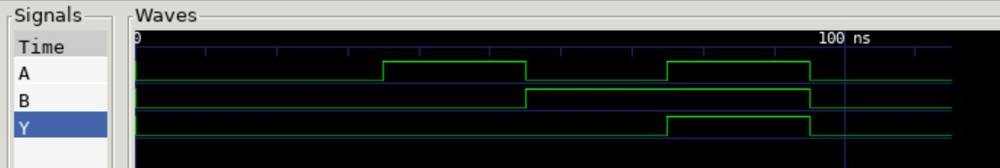

# AND2 EXAMPLE

_2-input AND gate used in my
[programable-8-bit-microprocessor](https://github.com/JeffDeCola/my-verilog-examples/tree/master/systems/microprocessors/programable-8-bit-microprocessor)._

Table of Contents

* [TRUTH TABLE](https://github.com/JeffDeCola/my-verilog-examples/tree/master/basic-code/combinational-logic/and2#truth-table)
* [VERILOG CODE](https://github.com/JeffDeCola/my-verilog-examples/tree/master/basic-code/combinational-logic/and2#verilog-code)
* [RUN (SIMULATE)](https://github.com/JeffDeCola/my-verilog-examples/tree/master/basic-code/combinational-logic/and2#run-simulate)
* [CHECK WAVEFORM](https://github.com/JeffDeCola/my-verilog-examples/tree/master/basic-code/combinational-logic/and2#check-waveform)
* [TESTED IN HARDWARE - BURNED TO A FPGA](https://github.com/JeffDeCola/my-verilog-examples/tree/master/basic-code/combinational-logic/and2#tested-in-hardware---burned-to-a-fpga)

## OVERVIEW

_I used
[iverilog](https://github.com/JeffDeCola/my-cheat-sheets/tree/master/hardware/tools/simulation/iverilog-cheat-sheet)
to simulate and
[GTKWave](https://github.com/JeffDeCola/my-cheat-sheets/tree/master/hardware/tools/simulation/gtkwave-cheat-sheet)
to view the waveform. I also used
[Xilinx Vivado](https://github.com/JeffDeCola/my-cheat-sheets/tree/master/hardware/tools/synthesis/xilinx-vivado-cheat-sheet)
to synthesize and program this example on a
[Digilent ARTY-S7](https://github.com/JeffDeCola/my-cheat-sheets/tree/master/hardware/development/fpga-development-boards/digilent-arty-s7-cheat-sheet)
FPGA development board._

## TRUTH TABLE

| a     | b     | y     |
|:-----:|:-----:|:-----:|
| 0     | 0     | 0     |
| 0     | 1     | 0     |
| 1     | 0     | 0     |
| 1     | 1     | 1     |

## VERILOG CODE

The
[and2.v](https://github.com/JeffDeCola/my-verilog-examples/blob/master/basic-code/combinational-logic/and2/and2.v)
main code is,

```verilog
    assign y = a & b;
```

## RUN (SIMULATE)

I created,

* [and2-tb.v](https://github.com/JeffDeCola/my-verilog-examples/blob/master/basic-code/combinational-logic/and2/and2-tb.v)
the testbench
* [and2.vh](https://github.com/JeffDeCola/my-verilog-examples/blob/master/basic-code/combinational-logic/and2/and2.vh)
the header file listing the verilog code
* [run-simulation.sh](https://github.com/JeffDeCola/my-verilog-examples/blob/master/basic-code/combinational-logic/and2/run-simuation.sh)
script containing the following commands

Use **iverilog** to compile the verilog to a vvp format
which is used by the vvp runtime simulation engine,

```bash
iverilog -o and2.vvp and2-tb.v and2.vh
```

Use **vvp** to run the simulation, which creates a waveform dump file *.vcd.

```bash
vvp and2.vvp
```

## CHECK WAVEFORM

Now you can open the waveform file and2.vcd file with GTKWave.

```bash
gtkwave -f and2.vcd &
```

Configure and save your waveform to a .gtkw file.

Now you can
[launch-gtkwave.sh](https://github.com/JeffDeCola/my-verilog-examples/blob/master/launch-GTKWave-script/launch-gtkwave.sh),

```bash
gtkwave -f and2.gtkw &
```



## TESTED IN HARDWARE - BURNED TO A FPGA

To test my design in real hardware, the above code was synthesized using the
[Xilinx Vivado](https://github.com/JeffDeCola/my-cheat-sheets/tree/master/hardware/tools/synthesis/xilinx-vivado-cheat-sheet)
IDE software suite and burned to a FPGA development board.
