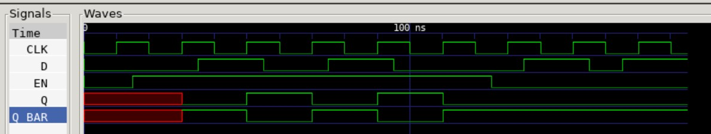

# D FLIP-FLOPS EXAMPLE

_A few different ways to model a positive edge d flip-flop._

Table of Contents

* tbd

## OVERVIEW

 A d flip-flop simply stores data.

_I used
[iverilog](https://github.com/JeffDeCola/my-cheat-sheets/tree/master/hardware/tools/simulation/iverilog-cheat-sheet)
to simulate and
[GTKWave](https://github.com/JeffDeCola/my-cheat-sheets/tree/master/hardware/tools/simulation/gtkwave-cheat-sheet)
to view the waveform. I also used
[Xilinx Vivado](https://github.com/JeffDeCola/my-cheat-sheets/tree/master/hardware/tools/synthesis/xilinx-vivado-cheat-sheet)
to synthesize and program this example on a
[Digilent ARTY-S7](https://github.com/JeffDeCola/my-cheat-sheets/tree/master/hardware/development/fpga-development-boards/digilent-arty-s7-cheat-sheet)
FPGA development board._

## SCHEMATIC

_This figure was created using `LaTeX` in
[my-latex-graphs](https://github.com/JeffDeCola/my-latex-graphs/tree/master/mathematics/applied/electrical-engineering/logic/d-flip-flop)
repo._

<p align="center">
    

A d flip-flop is built using a latch. A latch stores data but the output will change
not based on clock edge, but based on the input.


By combining two latches together we can make a d flip-flop in which the output
changes on the **positive edge of the clock**,


## TRUTH TABLE

| clk     | d     | q      |             |
|:-------:|:-----:|:------:|:-----------:|
| 0       |  X    | q      | No change   |
| 1       |  0    | 0      | Stores 0    |
| 1       |  1    | 1      | Stores 1    |
## TRUTH TABLE

| clk     | d     | q      |             |
|:-------:|:-----:|:------:|:-----------:|
| 0       |  X    | q      | No change   |
| 1       |  0    | 0      | Stores 0    |
| 1       |  1    | 1      | Stores 1    |

## VERILOG CODE

The
[d_flip_flop.v](https://github.com/JeffDeCola/my-verilog-examples/blob/master/basic-code/sequential-logic/d_flip_flop/d_flip_flop.v)
uses behavioral modeling,

```verilog
???
```

## RUN (SIMULATE)

I created,

* [d_flip_flop_tb.v](https://github.com/JeffDeCola/my-verilog-examples/blob/master/basic-code/sequential-logic/d_flip_flop/d_flip_flop_tb.v)
  the testbench
* [d_flip_flop.vh](https://github.com/JeffDeCola/my-verilog-examples/blob/master/basic-code/sequential-logic/d_flip_flop/d_flip_flop.vh)
  the header file listing the verilog code
* [run-simulation.sh](https://github.com/JeffDeCola/my-verilog-examples/blob/master/basic-code/sequential-logic/d_flip_flop/run-simulation.sh)
  a script containing the commands below

Use **iverilog** to compile the verilog to a vvp format
which is used by the vvp runtime simulation engine,

```bash
iverilog -o d_flip_flop_tb.vvp d_flip_flop_tb.v d_flip_flop.vh
```

Use **vvp** to run the simulation, which creates a waveform dump file *.vcd.

```bash
vvp d_flip_flop_tb.vvp
```

## CHECK WAVEFORM

Open the waveform file d_flip_flop_tb.vcd file with GTKWave,

```bash
gtkwave -f d_flip_flop_tb.vcd &
```

Save your waveform to a .gtkw file.

Now you can
[launch-gtkwave.sh](https://github.com/JeffDeCola/my-verilog-examples/blob/master/launch-GTKWave-script/launch-gtkwave.sh)
anytime you want,

```bash
gtkwave -f d_flip_flop_tb.gtkw &
```



## TESTED IN HARDWARE - BURNED TO A FPGA

The above code was synthesized using the
[Xilinx Vivado](https://github.com/JeffDeCola/my-cheat-sheets/tree/master/hardware/tools/synthesis/xilinx-vivado-cheat-sheet)
IDE software suite and burned to a FPGA development board.
