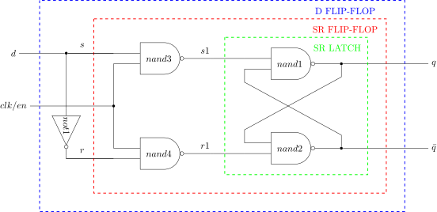

# D FLIP-FLOP EXAMPLE

_A positive edge d flip-flop with synchronous enable
used in my
[jeff-74x377](https://github.com/JeffDeCola/my-verilog-examples/tree/master/sequential-logic/registers/jeff-74x377)._

Table of Contents

* [SCHEMATIC](https://github.com/JeffDeCola/my-verilog-examples/tree/master/basic-code/sequential-logic/d-flip-flop#schematic)
* [TRUTH TABLE](https://github.com/JeffDeCola/my-verilog-examples/tree/master/basic-code/sequential-logic/d-flip-flop#truth-table)
* [VERILOG CODE](https://github.com/JeffDeCola/my-verilog-examples/tree/master/basic-code/sequential-logic/d-flip-flop#verilog-code)
* [RUN (SIMULATE)](https://github.com/JeffDeCola/my-verilog-examples/tree/master/basic-code/sequential-logic/d-flip-flop#run-simulate)
* [CHECK WAVEFORM](https://github.com/JeffDeCola/my-verilog-examples/tree/master/basic-code/sequential-logic/d-flip-flop#check-waveform)
* [TESTED IN HARDWARE - BURNED TO A FPGA](https://github.com/JeffDeCola/my-verilog-examples/tree/master/basic-code/sequential-logic/d-flip-flop#tested-in-hardware---burned-to-a-fpga)

## SCHEMATIC

_This figure was created using `LaTeX` in
[my-latex-graphs](https://github.com/JeffDeCola/my-latex-graphs/tree/master/mathematics/applied/electrical-engineering/logic/d-flip-flop)
repo._

<p align="center">
    

## TRUTH TABLE

| q_prev  | en     | d     | q      |
|:-------:|:------:|:-----:|:------:|
| 0       |  0     |  X    | 0      |
| 1       |  0     |  X    | 1      |
| X       |  1     |  0    | 0      |
| X       |  1     |  1    | 1      |

## VERILOG CODE

The main verilog code is,

```verilog
    assign q_bar = ~q;

    // D FLIP-FLOP WITH SYNC ENABLE
    always @ (posedge clk) begin
        if (en) begin
            q <= d;
        end else begin
            q <= q;
        end
    end
```

The entire code is
[d-flip-flop.v](d-flip-flop.v).

## RUN (SIMULATE)

I used my testbench
[d-flip-flop-tb.v](d-flip-flop-tb.v) with
[iverilog](https://github.com/JeffDeCola/my-cheat-sheets/tree/master/hardware/tools/simulation/iverilog-cheat-sheet)
to simulate and create a `.vcd` file.

```bash
sh run-test.sh
```

## CHECK WAVEFORM

Check you waveform using your `.vcd` file with a waveform viewer.

I used [GTKWave](https://github.com/JeffDeCola/my-cheat-sheets/tree/master/hardware/tools/simulation/gtkwave-cheat-sheet)
and launch it using
[launch-gtkwave.sh](launch-gtkwave.sh).


## TESTED IN HARDWARE - BURNED TO A FPGA

To test my design in real hardware, the above code was synthesized using the
[Xilinx Vivado](https://github.com/JeffDeCola/my-cheat-sheets/tree/master/hardware/tools/synthesis/xilinx-vivado-cheat-sheet)
IDE software suite and burned to a FPGA development board.
