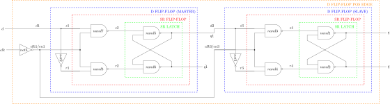

# D FLIP-FLOP POS EDGE EXAMPLE

_???._

Table of Contents

* [OVERVIEW](https://github.com/JeffDeCola/my-verilog-examples/tree/master/basic-code/sequential-logic/d_flip_flop_pos_edge#overview)
* [SCHEMATIC](https://github.com/JeffDeCola/my-verilog-examples/tree/master/basic-code/sequential-logic/d_flip_flop_pos_edge#schematic)
* [TRUTH TABLE](https://github.com/JeffDeCola/my-verilog-examples/tree/master/basic-code/sequential-logic/d_flip_flop_pos_edge#truth-table)
* [VERILOG CODE](https://github.com/JeffDeCola/my-verilog-examples/tree/master/basic-code/sequential-logic/d_flip_flop_pos_edge#verilog-code)
* [RUN (SIMULATE)](https://github.com/JeffDeCola/my-verilog-examples/tree/master/basic-code/sequential-logic/d_flip_flop_pos_edge#run-simulate)
* [VIEW WAVEFORM](https://github.com/JeffDeCola/my-verilog-examples/tree/master/basic-code/sequential-logic/d_flip_flop_pos_edge#view-waveform)
* [TESTED IN HARDWARE - BURNED TO A FPGA](https://github.com/JeffDeCola/my-verilog-examples/tree/master/basic-code/sequential-logic/d_flip_flop_pos_edge#tested-in-hardware---burned-to-a-fpga)

## OVERVIEW

Latches and flip-flops are part of sequential logic
digital system that stores data and outputs changes on input.

Latches are,

* 1-bit storage
* **No clk** (part of an asynchronous system)
* Outputs **level-triggered** from inputs (asynchronous)

Flip-flops are,

* A latch that is controlled by a clock
* **Uses clk** (part of synchronous system)
* Outputs are **edge-triggered** from a clk
* Outputs can also be **level-triggered** from an input

A d flip-flop pos edge is,

* ???

_I used
[iverilog](https://github.com/JeffDeCola/my-cheat-sheets/tree/master/hardware/tools/simulation/iverilog-cheat-sheet)
to simulate and
[GTKWave](https://github.com/JeffDeCola/my-cheat-sheets/tree/master/hardware/tools/simulation/gtkwave-cheat-sheet)
to view the waveform. I also used
[Xilinx Vivado](https://github.com/JeffDeCola/my-cheat-sheets/tree/master/hardware/tools/synthesis/xilinx-vivado-cheat-sheet)
to synthesize and program this example on a
[Digilent ARTY-S7](https://github.com/JeffDeCola/my-cheat-sheets/tree/master/hardware/development/fpga-development-boards/digilent-arty-s7-cheat-sheet)
FPGA development board._

## SCHEMATIC

_This figure was created using `LaTeX` in
[my-latex-graphs](https://github.com/JeffDeCola/my-latex-graphs/tree/master/mathematics/applied/electrical-engineering/sequential-logic/d-flip-flop-pos-edge)
repo._

<p align="center">
    

## TRUTH TABLE

???

## VERILOG CODE

The
[d_flip_flop_pos_edge.v](https://github.com/JeffDeCola/my-verilog-examples/blob/master/basic-code/sequential-logic/d_flip_flop_pos_edge/d_flip_flop_pos_edge.v)
gate model,

```verilog
    ???
```

Dataflow model,

```verilog
    ???
```

Behavioral model,

```verilog
    ???
```

## RUN (SIMULATE)

The testbench uses two files,

* [d_flip_flop_pos_edge_tb.v](https://github.com/JeffDeCola/my-verilog-examples/blob/master/basic-code/sequential-logic/d_flip_flop_pos_edge/d_flip_flop_pos_edge_tb.v)
  the testbench
* [d_flip_flop_pos_edge_tb.tv](https://github.com/JeffDeCola/my-verilog-examples/blob/master/basic-code/sequential-logic/d_flip_flop_pos_edge/d_flip_flop_pos_edge_tb.tv)
  the test vectors and expected results

with,

* [d_flip_flop_pos_edge.vh](https://github.com/JeffDeCola/my-verilog-examples/blob/master/basic-code/sequential-logic/d_flip_flop_pos_edge/d_flip_flop_pos_edge.vh)
  is the header file listing the verilog models
* [run-simulation.sh](https://github.com/JeffDeCola/my-verilog-examples/blob/master/basic-code/sequential-logic/d_flip_flop_pos_edge/run-simulation.sh)
  is a script containing the commands below

Use **iverilog** to compile the verilog to a vvp format
which is used by the vvp runtime simulation engine,

```bash
iverilog -o d_flip_flop_pos_edge_tb.vvp d_flip_flop_pos_edge_tb.v d_flip_flop_pos_edge.vh
```

Use **vvp** to run the simulation, which checks the UUT
and creates a waveform dump file *.vcd.

```bash
vvp d_flip_flop_pos_edge_tb.vvp
```

The output of the test,

```text
TEST START --------------------------------

    ???

TEST END --------------------------------
```

## VIEW WAVEFORM

Open the waveform file d_flip_flop_pos_edge_tb.vcd file with GTKWave,

```bash
gtkwave -f d_flip_flop_pos_edge_tb.vcd &
```

Save your waveform to a .gtkw file.

Now you can use the script
[launch-gtkwave.sh](https://github.com/JeffDeCola/my-verilog-examples/blob/master/launch-GTKWave-script/launch-gtkwave.sh)
anytime you want,

```bash
gtkwave -f d_flip_flop_pos_edge_tb.gtkw &
```


## TESTED IN HARDWARE - BURNED TO A FPGA

The above code was synthesized using the
[Xilinx Vivado](https://github.com/JeffDeCola/my-cheat-sheets/tree/master/hardware/tools/synthesis/xilinx-vivado-cheat-sheet)
IDE software suite and burned to a FPGA development board.
