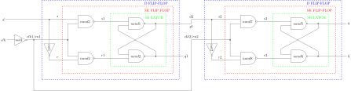
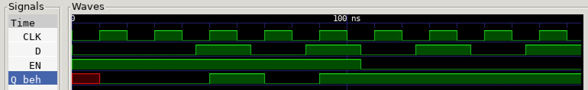

# D FLIP-FLOP POS EDGE SYNC EN EXAMPLE

_A **posedge-triggered** d flip-flop
with synchronous enable
used in my
[jeff_74x377](https://github.com/JeffDeCola/my-verilog-examples/tree/master/sequential-logic/registers/jeff_74x377)._

Table of Contents

* [OVERVIEW](https://github.com/JeffDeCola/my-verilog-examples/tree/master/basic-code/sequential-logic/d_flip_flop_pos_edge_sync_en#overview)
* [SCHEMATIC](https://github.com/JeffDeCola/my-verilog-examples/tree/master/basic-code/sequential-logic/d_flip_flop_pos_edge_sync_en#schematic)
* [TRUTH TABLE](https://github.com/JeffDeCola/my-verilog-examples/tree/master/basic-code/sequential-logic/d_flip_flop_pos_edge_sync_en#truth-table)
* [VERILOG CODE](https://github.com/JeffDeCola/my-verilog-examples/tree/master/basic-code/sequential-logic/d_flip_flop_pos_edge_sync_en#verilog-code)
* [RUN (SIMULATE)](https://github.com/JeffDeCola/my-verilog-examples/tree/master/basic-code/sequential-logic/d_flip_flop_pos_edge_sync_en#run-simulate)
* [VIEW WAVEFORM](https://github.com/JeffDeCola/my-verilog-examples/tree/master/basic-code/sequential-logic/d_flip_flop_pos_edge_sync_en#view-waveform)
* [TESTED IN HARDWARE - BURNED TO A FPGA](https://github.com/JeffDeCola/my-verilog-examples/tree/master/basic-code/sequential-logic/d_flip_flop_pos_edge_sync_en#tested-in-hardware---burned-to-a-fpga)

## OVERVIEW

Latches and flip-flops are part of sequential logic
digital system that stores data on the output.

LATCHES

* 1-bit storage
* **NO CLOCK** (part of an asynchronous system)
* Outputs **level-triggered** from inputs (asynchronous)

FLIP-FLOPS

* A latch that is controlled by a clock
* **USES CLOCK** (part of synchronous system)
* Outputs can be **level-triggered (pulse)**
  or **edge-triggered** from a clk (synchronous)

TRIGGER

* NO CLOCK
  * level-triggered
* CLOCK
  * pulse-triggered (level-triggered but using clock)
  * edge-triggered

POSITIVE EDGE-TRIGGERED D FLIP-FLOP WITH SYNCHRONOUS ENABLE

* **USES CLOCK** - **posedge-triggered**
* OPERATIONAL: on posedge clk
* BUILT: using behavioral model
* DATA: d output to q

_I used
[iverilog](https://github.com/JeffDeCola/my-cheat-sheets/tree/master/hardware/tools/simulation/iverilog-cheat-sheet)
to simulate and
[GTKWave](https://github.com/JeffDeCola/my-cheat-sheets/tree/master/hardware/tools/simulation/gtkwave-cheat-sheet)
to view the waveform. I also used
[Xilinx Vivado](https://github.com/JeffDeCola/my-cheat-sheets/tree/master/hardware/tools/synthesis/xilinx-vivado-cheat-sheet)
to synthesize and program this example on a
[Digilent ARTY-S7](https://github.com/JeffDeCola/my-cheat-sheets/tree/master/hardware/development/fpga-development-boards/digilent-arty-s7-cheat-sheet)
FPGA development board._

## SCHEMATIC

_This figure was created using `LaTeX` in
[my-latex-graphs](https://github.com/JeffDeCola/my-latex-graphs/tree/master/mathematics/applied/electrical-engineering/sequential-logic/d-flip-flop-pos-edge-sync-en)
repo._

<p align="center">
    

## TRUTH TABLE

| clk       |  en  |  d  |  q  | comment     |
|:---------:|:----:|:---:|:---:|:------------|
|  other    |  X   |  X  |  q  | NO CHANGE   |
|  posedge  |  0   |  X  |  q  | NO CHANGE   |
|  posedge  |  1   |  0  |  0  | DATA_0      |
|  posedge  |  1   |  1  |  1  | DATA_1      |

## VERILOG CODE

The
[d_flip_flop_pos_edge_sync_en.v](https://github.com/JeffDeCola/my-verilog-examples/blob/master/basic-code/sequential-logic/d_flip_flop_pos_edge_sync_en/d_flip_flop_pos_edge_sync_en.v)
behavioral model,

```verilog
    assign qbar = ~q;

    // D FLIP-FLOP WITH SYNC ENABLE
    always @ (posedge clk) begin
        if (en) begin
            q <= d;
        end else begin
            q <= q;
        end
    end
```

## RUN (SIMULATE)

The testbench uses two files,

* [d_flip_flop_pos_edge_sync_en_tb.v](https://github.com/JeffDeCola/my-verilog-examples/blob/master/basic-code/sequential-logic/d_flip_flop_pos_edge_sync_en/d_flip_flop_pos_edge_sync_en_tb.v)
  the testbench
* [d_flip_flop_pos_edge_sync_en_tb.tv](https://github.com/JeffDeCola/my-verilog-examples/blob/master/basic-code/sequential-logic/d_flip_flop_pos_edge_sync_en/d_flip_flop_pos_edge_sync_en_tb.tv)
  the test vectors and expected results

with,

* [d_flip_flop_pos_edge_sync_en.vh](https://github.com/JeffDeCola/my-verilog-examples/blob/master/basic-code/sequential-logic/d_flip_flop_pos_edge_sync_en/d_flip_flop_pos_edge_sync_en.vh)
  is the header file listing the verilog models
* [run-simulation.sh](https://github.com/JeffDeCola/my-verilog-examples/blob/master/basic-code/sequential-logic/d_flip_flop_pos_edge_sync_en/run-simulation.sh)
  is a script containing the commands below

Use **iverilog** to compile the verilog to a vvp format
which is used by the vvp runtime simulation engine,

```bash
iverilog -o d_flip_flop_pos_edge_sync_en_tb.vvp d_flip_flop_pos_edge_sync_en_tb.v d_flip_flop_pos_edge_sync_en.vh
```

Use **vvp** to run the simulation, which checks the UUT
and creates a waveform dump file *.vcd.

```bash
vvp d_flip_flop_pos_edge_sync_en_tb.vvp
```

The output of the test,

```text
TEST START --------------------------------

                               
                 | TIME(ns) | EN | D |  Q  |
                 ---------------------------
   0             |        0 | 1  | 0 |  x  |
   0             |       10 | 1  | 0 |  0  |
   1      DATA_0 |       25 | 1  | 0 |  0  |
   2      DATA_1 |       45 | 1  | 1 |  0  |
   2      DATA_1 |       50 | 1  | 1 |  1  |
   3      DATA_0 |       65 | 1  | 0 |  1  |
   3      DATA_0 |       70 | 1  | 0 |  0  |
   4      DATA_1 |       85 | 1  | 1 |  0  |
   4      DATA_1 |       90 | 1  | 1 |  1  |
   5      DATA_0 |      105 | 0  | 0 |  1  |
   6      DATA_1 |      125 | 0  | 1 |  1  |
   7      DATA_0 |      145 | 0  | 0 |  1  |
   8      DATA_1 |      165 | 0  | 1 |  1  |

 VECTORS:    8
  ERRORS:    0

TEST END ----------------------------------
```

## VIEW WAVEFORM

Open the waveform file d_flip_flop_pos_edge_sync_en_tb.vcd file with GTKWave,

```bash
gtkwave -f d_flip_flop_pos_edge_sync_en_tb.vcd &
```

Save your waveform to a .gtkw file.

Now you can use the script
[launch-gtkwave.sh](https://github.com/JeffDeCola/my-verilog-examples/blob/master/launch-GTKWave-script/launch-gtkwave.sh)
anytime you want,

```bash
gtkwave -f d_flip_flop_pos_edge_sync_en_tb.gtkw &
```



## TESTED IN HARDWARE - BURNED TO A FPGA

The above code was synthesized using the
[Xilinx Vivado](https://github.com/JeffDeCola/my-cheat-sheets/tree/master/hardware/tools/synthesis/xilinx-vivado-cheat-sheet)
IDE software suite and burned to a FPGA development board.
