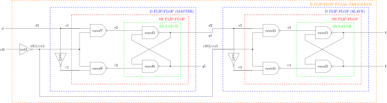
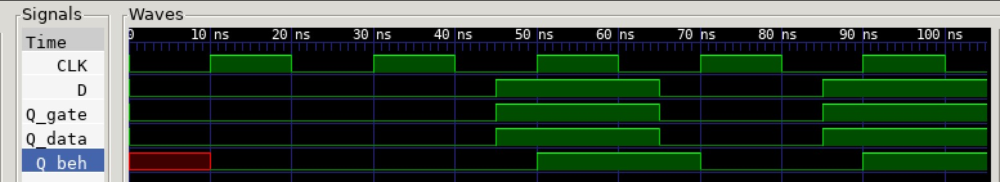

# D FLIP-FLOP PULSE-TRIGGERED EXAMPLE

[](https://jeffdecola.com)
[](https://jeffdecola.mit-license.org)

_A pulse-triggered d flip-flop (cascading)
can save input data on output._

Table of Contents

* [OVERVIEW](https://github.com/JeffDeCola/my-verilog-examples/tree/master/basic-code/sequential-logic/d_flip_flop_pulse_triggered#overview)
* [SCHEMATIC](https://github.com/JeffDeCola/my-verilog-examples/tree/master/basic-code/sequential-logic/d_flip_flop_pulse_triggered#schematic)
* [TRUTH TABLE](https://github.com/JeffDeCola/my-verilog-examples/tree/master/basic-code/sequential-logic/d_flip_flop_pulse_triggered#truth-table)
* [VERILOG CODE](https://github.com/JeffDeCola/my-verilog-examples/tree/master/basic-code/sequential-logic/d_flip_flop_pulse_triggered#verilog-code)
* [RUN (SIMULATE)](https://github.com/JeffDeCola/my-verilog-examples/tree/master/basic-code/sequential-logic/d_flip_flop_pulse_triggered#run-simulate)
* [VIEW WAVEFORM](https://github.com/JeffDeCola/my-verilog-examples/tree/master/basic-code/sequential-logic/d_flip_flop_pulse_triggered#view-waveform)
* [TESTED IN HARDWARE - BURNED TO A FPGA](https://github.com/JeffDeCola/my-verilog-examples/tree/master/basic-code/sequential-logic/d_flip_flop_pulse_triggered#tested-in-hardware---burned-to-a-fpga)

## OVERVIEW

Latches and flip-flops are part of sequential logic
digital system that stores data on the output.

LATCHES

* 1-bit storage
* **NO CLOCK** (part of an asynchronous system)
* Outputs **level-triggered** from inputs (asynchronous)

FLIP-FLOPS

* A latch that is controlled by a clock
* **USES CLOCK** (part of synchronous system)
* Outputs can be **level-triggered (pulse)**
  or **edge-triggered** from a clk (synchronous)

TRIGGER

* NO CLOCK
  * level-triggered
* CLOCK
  * pulse-triggered (level-triggered but using clock)
  * edge-triggered

PULSE-TRIGGERED D FLIP-FLOP

* **USE CLOCK** - **pulse-triggered**
* OPERATIONAL: when clk is 1
* PULSE TRIGGERED: Two cascading d flip-flops
* BUILT: with sr-flip-flops
* DATA: d output to q

_I used
[iverilog](https://github.com/JeffDeCola/my-cheat-sheets/tree/master/hardware/tools/simulation/iverilog-cheat-sheet)
to simulate and
[GTKWave](https://github.com/JeffDeCola/my-cheat-sheets/tree/master/hardware/tools/simulation/gtkwave-cheat-sheet)
to view the waveform. I also used
[Xilinx Vivado](https://github.com/JeffDeCola/my-cheat-sheets/tree/master/hardware/tools/synthesis/xilinx-vivado-cheat-sheet)
to synthesize and program this example on a
[Digilent ARTY-S7](https://github.com/JeffDeCola/my-cheat-sheets/tree/master/hardware/development/fpga-development-boards/digilent-arty-s7-cheat-sheet)
FPGA development board._

## SCHEMATIC

_This figure was created using `LaTeX` in
[my-latex-graphs](https://github.com/JeffDeCola/my-latex-graphs/tree/master/mathematics/applied/electrical-engineering/sequential-logic/d-flip-flop-pulse-triggered)
repo._

<p align="center">
    

## TRUTH TABLE

| clk |  d  |  q  | comment     |
|:---:|:---:|:---:|:------------|
|  0  |  X  |  q  | NO CHANGE   |
|  1  |  0  |  0  | DATA_0      |
|  1  |  1  |  1  | DATA_1      |

## VERILOG CODE

The
[d_flip_flop_pulse_triggered.v](https://github.com/JeffDeCola/my-verilog-examples/blob/master/basic-code/sequential-logic/d_flip_flop_pulse_triggered/d_flip_flop_pulse_triggered.v)
gate model,

```verilog
    // INTERNAL WIRES
    wire        clk1;

    //NOT 3
    not (clk1, clk);

    // D-FLIP FLOP (BOSS)

        // INTERNAL WIRES
        wire        s1, r1;
        wire        s2, r2;

        assign s1 = d;

        // NOT2
        not (r1, s1);

        // SR FLIP-FLOP ---------------------------------

        // NAND7
        nand (s2, s1, clk1);

        // NAND8
        nand (r2, r1, clk1);

        // SR-LATCH -------------------------------------

        // NAND5
        nand (q1, s2, q1bar);

        // NAND6
        nand (q1bar, r2, q1);

    // D-FLIP FLOP (WORKER)

        // INTERNAL WIRES
        wire        s3, r3;
        wire        s4, r4;

        assign s3 = q1;

        // NOT1
        not (r3, s3);

        // SR FLIP-FLOP ---------------------------------

        // NAND3
        nand (s4, s3, clk1);

        // NAND4
        nand (r4, r3, clk1);

        // SR-LATCH -------------------------------------

        // NAND1
        nand (q, s4, qbar);

        // NAND2
        nand (qbar, r4, q);
```

Dataflow model,

```verilog
    // INTERNAL WIRES
    wire        clk1;

    // NOT3
    assign clk1 = ~clk;

    // D-FLIP FLOP (BOSS)

        // INTERNAL WIRES
        wire        s1, r1;
        wire        s2, r2;

        assign s1 = d;

        // NOT2
        assign r1 = ~s1;

        // SR FLIP-FLOP ---------------------------------

        // NAND7
        assign s2 = ~(s1 & clk1);

        // NAND8
        assign r2 = ~(r1 & clk1);

        // SR-LATCH -------------------------------------

        // NAND5
        assign q1 = ~( s2 & q1bar);

        // NAND6
        assign q1bar = ~(r2 & q1);

    // D-FLIP FLOP (WORKER)

        // INTERNAL WIRES
        wire        s3, r3;
        wire        s4, r4;

        assign s3 = q1;

        // NOT1
        assign r3 = ~s3;

        // SR FLIP-FLOP ---------------------------------

        // NAND3
        assign s4 = ~(s3 & clk1);

        // NAND4
        assign r4 = ~(r3 & clk1);

        // SR-LATCH -------------------------------------

        // NAND1
        assign q = ~(s4 & qbar);

        // NAND2
        assign qbar = ~(r4 & q);
```

Behavioral model,

```verilog
    parameter    DATA0 = 1'b0,
                 DATA1 = 1'b1;

    // INTERNAL WIRES
    assign qbar = ~q;

    always @(posedge clk) begin
        case({d})
            DATA0 : q <= 1'b0;
            DATA1 : q <= 1'b1;
        endcase
    end
```

## RUN (SIMULATE)

The testbench uses two files,

* [d_flip_flop_pulse_triggered_tb.v](https://github.com/JeffDeCola/my-verilog-examples/blob/master/basic-code/sequential-logic/d_flip_flop_pulse_triggered/d_flip_flop_pulse_triggered_tb.v)
  the testbench
* [d_flip_flop_pulse_triggered_tb.tv](https://github.com/JeffDeCola/my-verilog-examples/blob/master/basic-code/sequential-logic/d_flip_flop_pulse_triggered/d_flip_flop_pulse_triggered_tb.tv)
  the test vectors and expected results

with,

* [d_flip_flop_pulse_triggered.vh](https://github.com/JeffDeCola/my-verilog-examples/blob/master/basic-code/sequential-logic/d_flip_flop_pulse_triggered/d_flip_flop_pulse_triggered.vh)
  is the header file listing the verilog models
* [run-simulation.sh](https://github.com/JeffDeCola/my-verilog-examples/blob/master/basic-code/sequential-logic/d_flip_flop_pulse_triggered/run-simulation.sh)
  is a script containing the commands below

Use **iverilog** to compile the verilog to a vvp format
which is used by the vvp runtime simulation engine,

```bash
iverilog -o d_flip_flop_pulse_triggered_tb.vvp d_flip_flop_pulse_triggered_tb.v d_flip_flop_pulse_triggered.vh
```

Use **vvp** to run the simulation, which checks the UUT
and creates a waveform dump file *.vcd.

```bash
vvp d_flip_flop_pulse_triggered_tb.vvp
```

The output of the test,

```text
TEST START --------------------------------

                                 GATE  DATA   BEH
                 | TIME(ns) | S |  Q  |  Q  |  Q  |
                 ----------------------------------
   1        INIT |       15 | 0 |  0  |  0  |  0  |
   2      DATA_0 |       35 | 0 |  0  |  0  |  0  |
   3      DATA_1 |       55 | 1 |  1  |  1  |  1  |
   4      DATA_0 |       75 | 0 |  0  |  0  |  0  |
   5      DATA_1 |       95 | 1 |  1  |  1  |  1  |

 VECTORS:    5
  ERRORS:    0

TEST END ----------------------------------
```

## VIEW WAVEFORM

Open the waveform file d_flip_flop_pulse_triggered_tb.vcd file with GTKWave,

```bash
gtkwave -f d_flip_flop_pulse_triggered_tb.vcd &
```

Save your waveform to a .gtkw file.

Now you can use the script
[launch-gtkwave.sh](https://github.com/JeffDeCola/my-verilog-examples/blob/master/launch-GTKWave-script/launch-gtkwave.sh)
anytime you want,

```bash
gtkwave -f d_flip_flop_pulse_triggered_tb.gtkw &
```



## TESTED IN HARDWARE - BURNED TO A FPGA

The above code was synthesized using the
[Xilinx Vivado](https://github.com/JeffDeCola/my-cheat-sheets/tree/master/hardware/tools/synthesis/xilinx-vivado-cheat-sheet)
IDE software suite and burned to a FPGA development board.
