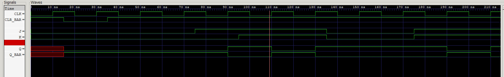

# jk-flip-flop example

_A positive edge jk flip-flop with synchronous clear._

[GitHub Webpage](https://jeffdecola.github.io/my-verilog-examples/)

## TRUTH TABLE

| clr_bar | j      | k     | q         |
|:-------:|:------:|:-----:|:---------:|
| 0       |  X     |  X    | 0         |
| 1       |  0     |  0    | q         |
| 1       |  1     |  0    | 1         |
| 1       |  0     |  1    | 0         |
| 1       |  1     |  1    | q_bar     |

## VERILOG CODE

The main code,

```verilog
    assign q_bar = ~q;

    // JK FLIP-FLOP WITH SYNC CLEAR
    always @ (posedge clk) begin
        if (!clr_bar) begin
            q <= 1'b0;
        end else begin
            case({j,k})
                2'b0_0 : q <= q;
                2'b0_1 : q <= 1'b0;
                2'b1_0 : q <= 1'b1;
                2'b1_1 : q <= ~q;
            endcase
        end
    end
```

The entire code is
[jk-flip-flop.v](jk-flip-flop.v).

## RUN (SIMULATE)

I used my testbench
[jk-flip-flop-tb.v](jk-flip-flop-tb.v) with
[iverilog](https://github.com/JeffDeCola/my-cheat-sheets/tree/master/hardware/tools/simulation/iverilog-cheat-sheet)
to simulate and create a `.vcd` file.

```bash
sh run-test.sh
```

## CHECK WAVEFORM

Check you waveform using your `.vcd` file with a waveform viewer.

I used [GTKWave](https://github.com/JeffDeCola/my-cheat-sheets/tree/master/hardware/tools/simulation/gtkwave-cheat-sheet)
and launch it using
[launch-gtkwave.sh](launch-gtkwave.sh).



## TESTED IN HARDWARE - BURNED TO A FPGA

To test my design in real hardware, the above code was synthesized using the
[Xilinx Vivado](https://github.com/JeffDeCola/my-cheat-sheets/tree/master/hardware/tools/synthesis/xilinx-vivado-cheat-sheet)
IDE software suite and burned to a FPGA development board.
