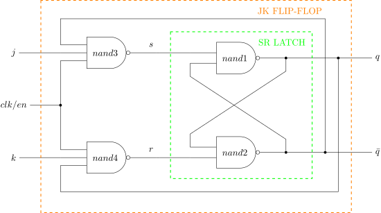
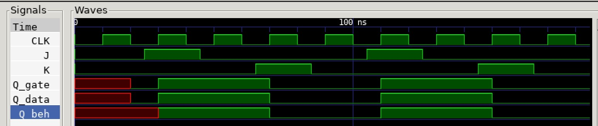

# JK FLIP-FLOP EXAMPLE

_A jk flip-flop which is **pulse-triggered**
can be set, reset and toggled.
This has a race condition when clock is high._

Table of Contents

* [OVERVIEW](https://github.com/JeffDeCola/my-verilog-examples/tree/master/basic-code/sequential-logic/jk_flip_flop#overview)
* [SCHEMATIC](https://github.com/JeffDeCola/my-verilog-examples/tree/master/basic-code/sequential-logic/jk_flip_flop#schematic)
* [TRUTH TABLE](https://github.com/JeffDeCola/my-verilog-examples/tree/master/basic-code/sequential-logic/jk_flip_flop#truth-table)
* [VERILOG CODE](https://github.com/JeffDeCola/my-verilog-examples/tree/master/basic-code/sequential-logic/jk_flip_flop#verilog-code)
* [RUN (SIMULATE)](https://github.com/JeffDeCola/my-verilog-examples/tree/master/basic-code/sequential-logic/jk_flip_flop#run-simulate)
* [VIEW WAVEFORM](https://github.com/JeffDeCola/my-verilog-examples/tree/master/basic-code/sequential-logic/jk_flip_flop#view-waveform)
* [TESTED IN HARDWARE - BURNED TO A FPGA](https://github.com/JeffDeCola/my-verilog-examples/tree/master/basic-code/sequential-logic/jk_flip_flop#tested-in-hardware---burned-to-a-fpga)

## OVERVIEW

Latches and flip-flops are part of sequential logic
digital system that stores data on the output.

LATCHES

* 1-bit storage
* **NO CLOCK** (part of an asynchronous system)
* Outputs **level-triggered** from inputs (asynchronous)

FLIP-FLOPS

* A latch that is controlled by a clock
* **USES CLOCK** (part of synchronous system)
* Outputs can be **level-triggered (pulse)**
  or **edge-triggered** from a clk (synchronous)

TRIGGER

* NO CLOCK
  * level-triggered
* CLOCK
  * pulse-triggered (level-triggered but using clock)
  * edge-triggered

JK FLIP-FLOP

* **USE CLOCK** - Called a **jk flip-flop** which is **pulse-triggered**
* **USE EN** - Called a **jk latch with enable** which is **level-triggered**
* OPERATIONAL: when clk/en is 1
* BUILT: with a sr-latch
* UPDATED: a jk flip-flop that has been updated with toggle
* SET: j=1 sets the output to 1
* RESET: k=1 resets the output to 0
* TOGGLED: j=1 k=1 state as a toggle
* There is a race condition problem that can be solved by cascading two together

There is a problem with this design, There is a race condition
when clock is high and j,k changes. This is solved by using a
cascading design.

_I used
[iverilog](https://github.com/JeffDeCola/my-cheat-sheets/tree/master/hardware/tools/simulation/iverilog-cheat-sheet)
to simulate and
[GTKWave](https://github.com/JeffDeCola/my-cheat-sheets/tree/master/hardware/tools/simulation/gtkwave-cheat-sheet)
to view the waveform. I also used
[Xilinx Vivado](https://github.com/JeffDeCola/my-cheat-sheets/tree/master/hardware/tools/synthesis/xilinx-vivado-cheat-sheet)
to synthesize and program this example on a
[Digilent ARTY-S7](https://github.com/JeffDeCola/my-cheat-sheets/tree/master/hardware/development/fpga-development-boards/digilent-arty-s7-cheat-sheet)
FPGA development board._

## SCHEMATIC

_This figure was created using `LaTeX` in
[my-latex-graphs](https://github.com/JeffDeCola/my-latex-graphs/tree/master/mathematics/applied/electrical-engineering/sequential-logic/jk-flip-flop)
repo._

<p align="center">
    

## TRUTH TABLE

| clk/en |  j  |  k  |  q  | comment     |
|:------:|:---:|:---:|:---:|:------------|
|  0     |  X  |  X  |  q  | NO CHANGE   |
|  1     |  0  |  0  |  q  | NO CHANGE   |
|  1     |  0  |  1  |  0  | RESET       |
|  1     |  1  |  0  |  1  | SET         |
|  1     |  1  |  1  | ~q  | TOGGLE      |

## VERILOG CODE

The
[jk_flip_flop.v](https://github.com/JeffDeCola/my-verilog-examples/blob/master/basic-code/sequential-logic/jk_flip_flop/jk_flip_flop.v)
gate model,

```verilog
    // INTERNAL WIRES
    wire        s, r;
  
    // NAND3
    nand (s, j, clk, qbar);

    // NAND4
    nand (r, k, clk, q);

    // SR- LATCH -------------------------------------
    
    // NAND1
    nand (q, s, qbar);

    // NAND2
    nand (qbar, r, q);
```

Dataflow model,

```verilog
    // INTERNAL WIRES
    wire        s, r;
  
    // NAND3
    assign s = ~(j & clk & qbar);

    // NAND4
    assign r = ~(k & clk & q);

    // SR- LATCH -------------------------------------
    
    // NAND1
    assign q = ~(s & qbar);

    // NAND2
    assign qbar = ~(r & q);
```

Behavioral model,

```verilog
    // INTERNAL WIRES
    assign qbar = ~q;

    always @(posedge clk) begin
        case({j,k})
            2'b0_0 : q <= q;
            2'b0_1 : q <= 1'b0;
            2'b1_0 : q <= 1'b1;
            2'b1_1 : q <= ~q;
        endcase
    end
```

## RUN (SIMULATE)

The testbench uses two files,

* [jk_flip_flop_tb.v](https://github.com/JeffDeCola/my-verilog-examples/blob/master/basic-code/sequential-logic/jk_flip_flop/jk_flip_flop_tb.v)
  the testbench
* [jk_flip_flop_tb.tv](https://github.com/JeffDeCola/my-verilog-examples/blob/master/basic-code/sequential-logic/jk_flip_flop/jk_flip_flop_tb.tv)
  the test vectors and expected results

with,

* [jk_flip_flop.vh](https://github.com/JeffDeCola/my-verilog-examples/blob/master/basic-code/sequential-logic/jk_flip_flop/jk_flip_flop.vh)
  is the header file listing the verilog models
* [run-simulation.sh](https://github.com/JeffDeCola/my-verilog-examples/blob/master/basic-code/sequential-logic/jk_flip_flop/run-simulation.sh)
  is a script containing the commands below

Use **iverilog** to compile the verilog to a vvp format
which is used by the vvp runtime simulation engine,

```bash
iverilog -o jk_flip_flop_tb.vvp jk_flip_flop_tb.v jk_flip_flop.vh
```

Use **vvp** to run the simulation, which checks the UUT
and creates a waveform dump file *.vcd.

```bash
vvp jk_flip_flop_tb.vvp
```

The output of the test,

```text
TEST START --------------------------------

    ???

TEST END --------------------------------
```

## VIEW WAVEFORM

Open the waveform file jk_flip_flop_tb.vcd file with GTKWave,

```bash
gtkwave -f jk_flip_flop_tb.vcd &
```

Save your waveform to a .gtkw file.

Now you can use the script
[launch-gtkwave.sh](https://github.com/JeffDeCola/my-verilog-examples/blob/master/launch-GTKWave-script/launch-gtkwave.sh)
anytime you want,

```bash
gtkwave -f jk_flip_flop_tb.gtkw &
```



## TESTED IN HARDWARE - BURNED TO A FPGA

The above code was synthesized using the
[Xilinx Vivado](https://github.com/JeffDeCola/my-cheat-sheets/tree/master/hardware/tools/synthesis/xilinx-vivado-cheat-sheet)
IDE software suite and burned to a FPGA development board.
