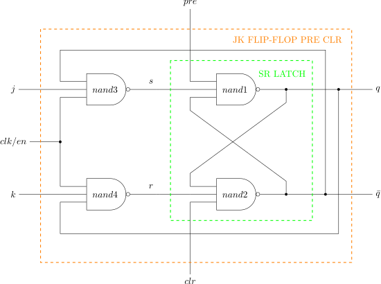

# JK FLIP-FLOP POS EDGE SYNC CLEAR EXAMPLE

_A **posedge-triggered** jk flip-flop
with synchronous clear
used in my
[jeff_74x161](https://github.com/JeffDeCola/my-verilog-examples/tree/master/sequential-logic/counters/jeff_74x161)._

Table of Contents

* [OVERVIEW](https://github.com/JeffDeCola/my-verilog-examples/tree/master/basic-code/sequential-logic/jk_flip_flop_sync_clear#overview)
* [SCHEMATIC](https://github.com/JeffDeCola/my-verilog-examples/tree/master/basic-code/sequential-logic/jk_flip_flop_sync_clear#schematic)
* [TRUTH TABLE](https://github.com/JeffDeCola/my-verilog-examples/tree/master/basic-code/sequential-logic/jk_flip_flop_sync_clear#truth-table)
* [VERILOG CODE](https://github.com/JeffDeCola/my-verilog-examples/tree/master/basic-code/sequential-logic/jk_flip_flop_sync_clear#verilog-code)
* [RUN (SIMULATE)](https://github.com/JeffDeCola/my-verilog-examples/tree/master/basic-code/sequential-logic/jk_flip_flop_sync_clear#run-simulate)
* [VIEW WAVEFORM](https://github.com/JeffDeCola/my-verilog-examples/tree/master/basic-code/sequential-logic/jk_flip_flop_sync_clear#view-waveform)
* [TESTED IN HARDWARE - BURNED TO A FPGA](https://github.com/JeffDeCola/my-verilog-examples/tree/master/basic-code/sequential-logic/jk_flip_flop_sync_clear#tested-in-hardware---burned-to-a-fpga)

## OVERVIEW

Latches and flip-flops are part of sequential logic
digital system that stores data on the output.

LATCHES

* 1-bit storage
* **NO CLOCK** (part of an asynchronous system)
* Outputs **level-triggered** from inputs (asynchronous)

FLIP-FLOPS

* A latch that is controlled by a clock
* **USES CLOCK** (part of synchronous system)
* Outputs can be **level-triggered (pulse)**
  or **edge-triggered** from a clk (synchronous)

TRIGGER

* NO CLOCK
  * level-triggered
* CLOCK
  * pulse-triggered (level-triggered but using clock)
  * edge-triggered

POSEDGE-TRIGGERED JK FLIP-FLIP WITH SYNC CLEAR

* **USES CLOCK** - **posedge-triggered**
* OPERATIONAL: on posedge clk
* BUILT: with a sr-latch????????????????
* UPDATED: a jk flip-flop that has been updated with toggle
* CLEAR: clr=1 resets the output to 0
* SET: j=1 sets the output to 1
* RESET: k=1 resets the output to 0
* TOGGLE: j=1 k=1 toggles output

_I used
[iverilog](https://github.com/JeffDeCola/my-cheat-sheets/tree/master/hardware/tools/simulation/iverilog-cheat-sheet)
to simulate and
[GTKWave](https://github.com/JeffDeCola/my-cheat-sheets/tree/master/hardware/tools/simulation/gtkwave-cheat-sheet)
to view the waveform. I also used
[Xilinx Vivado](https://github.com/JeffDeCola/my-cheat-sheets/tree/master/hardware/tools/synthesis/xilinx-vivado-cheat-sheet)
to synthesize and program this example on a
[Digilent ARTY-S7](https://github.com/JeffDeCola/my-cheat-sheets/tree/master/hardware/development/fpga-development-boards/digilent-arty-s7-cheat-sheet)
FPGA development board._

## SCHEMATIC

_This figure was created using `LaTeX` in
[my-latex-graphs](https://github.com/JeffDeCola/my-latex-graphs/tree/master/mathematics/applied/electrical-engineering/sequential-logic/jk-flip-flop-sync-clear)
repo._

<p align="center">
    

## TRUTH TABLE

| clk       |  clr |  j  |  k  |  q  | comment     |
|:---------:|:----:|:---:|:---:|:---:|:------------|
|  other    |  X   |  X  |  X  |  q  | NO CHANGE   |
|  posedge  |  1   |  X  |  X  |  1  | CLEAR       |
|  posedge  |  0   |  0  |  0  |  q  | NO CHANGE   |
|  posedge  |  0   |  0  |  1  |  0  | RESET       |
|  posedge  |  0   |  1  |  0  |  1  | SET         |
|  posedge  |  0   |  1  |  1  | ~q  | TOGGLE      |

## VERILOG CODE

The
[jk_flip_flop_sync_clear.v](https://github.com/JeffDeCola/my-verilog-examples/blob/master/basic-code/sequential-logic/jk_flip_flop_sync_clear/jk_flip_flop_sync_clear.v)
gate model,

```verilog
    ???
```

Dataflow model,

```verilog
    ???
```

Behavioral model,

```verilog
    ???
```

## RUN (SIMULATE)

The testbench uses two files,

* [jk_flip_flop_sync_clear_tb.v](https://github.com/JeffDeCola/my-verilog-examples/blob/master/basic-code/sequential-logic/jk_flip_flop_sync_clear/jk_flip_flop_sync_clear_tb.v)
  the testbench
* [jk_flip_flop_sync_clear_tb.tv](https://github.com/JeffDeCola/my-verilog-examples/blob/master/basic-code/sequential-logic/jk_flip_flop_sync_clear/jk_flip_flop_sync_clear_tb.tv)
  the test vectors and expected results

with,

* [jk_flip_flop_sync_clear.vh](https://github.com/JeffDeCola/my-verilog-examples/blob/master/basic-code/sequential-logic/jk_flip_flop_sync_clear/jk_flip_flop_sync_clear.vh)
  is the header file listing the verilog models
* [run-simulation.sh](https://github.com/JeffDeCola/my-verilog-examples/blob/master/basic-code/sequential-logic/jk_flip_flop_sync_clear/run-simulation.sh)
  is a script containing the commands below

Use **iverilog** to compile the verilog to a vvp format
which is used by the vvp runtime simulation engine,

```bash
iverilog -o jk_flip_flop_sync_clear_tb.vvp jk_flip_flop_sync_clear_tb.v jk_flip_flop_sync_clear.vh
```

Use **vvp** to run the simulation, which checks the UUT
and creates a waveform dump file *.vcd.

```bash
vvp jk_flip_flop_sync_clear_tb.vvp
```

The output of the test,

```text
TEST START --------------------------------

    ???

TEST END --------------------------------
```

## VIEW WAVEFORM

Open the waveform file jk_flip_flop_sync_clear_tb.vcd file with GTKWave,

```bash
gtkwave -f jk_flip_flop_sync_clear_tb.vcd &
```

Save your waveform to a .gtkw file.

Now you can use the script
[launch-gtkwave.sh](https://github.com/JeffDeCola/my-verilog-examples/blob/master/launch-GTKWave-script/launch-gtkwave.sh)
anytime you want,

```bash
gtkwave -f jk_flip_flop_sync_clear_tb.gtkw &
```


## TESTED IN HARDWARE - BURNED TO A FPGA

The above code was synthesized using the
[Xilinx Vivado](https://github.com/JeffDeCola/my-cheat-sheets/tree/master/hardware/tools/synthesis/xilinx-vivado-cheat-sheet)
IDE software suite and burned to a FPGA development board.
