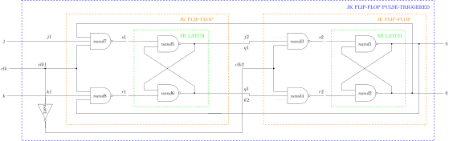
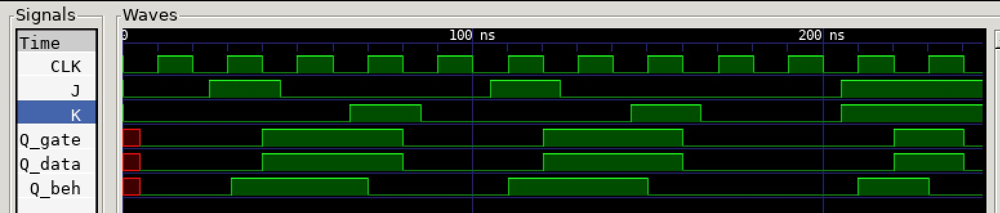

# JK FLIP-FLOP PULSE-TRIGGERED EXAMPLE

[](https://jeffdecola.com)
[](https://jeffdecola.mit-license.org)

_A pulse-triggered jk flip-flop (cascading)
can be set, reset and toggled._

Table of Contents

* [OVERVIEW](https://github.com/JeffDeCola/my-verilog-examples/tree/master/basic-code/sequential-logic/jk_flip_flop_pulse_triggered#overview)
* [SCHEMATIC](https://github.com/JeffDeCola/my-verilog-examples/tree/master/basic-code/sequential-logic/jk_flip_flop_pulse_triggered#schematic)
* [TRUTH TABLE](https://github.com/JeffDeCola/my-verilog-examples/tree/master/basic-code/sequential-logic/jk_flip_flop_pulse_triggered#truth-table)
* [VERILOG CODE](https://github.com/JeffDeCola/my-verilog-examples/tree/master/basic-code/sequential-logic/jk_flip_flop_pulse_triggered#verilog-code)
* [RUN (SIMULATE)](https://github.com/JeffDeCola/my-verilog-examples/tree/master/basic-code/sequential-logic/jk_flip_flop_pulse_triggered#run-simulate)
* [VIEW WAVEFORM](https://github.com/JeffDeCola/my-verilog-examples/tree/master/basic-code/sequential-logic/jk_flip_flop_pulse_triggered#view-waveform)
* [TESTED IN HARDWARE - BURNED TO A FPGA](https://github.com/JeffDeCola/my-verilog-examples/tree/master/basic-code/sequential-logic/jk_flip_flop_pulse_triggered#tested-in-hardware---burned-to-a-fpga)

## OVERVIEW

Latches and flip-flops are part of sequential logic
digital system that stores data on the output.

LATCHES

* 1-bit storage
* **NO CLOCK** (part of an asynchronous system)
* Outputs **level-triggered** from inputs (asynchronous)

FLIP-FLOPS

* A latch that is controlled by a clock
* **USES CLOCK** (part of synchronous system)
* Outputs can be **level-triggered (pulse)**
  or **edge-triggered** from a clk (synchronous)

TRIGGER

* NO CLOCK
  * level-triggered
* CLOCK
  * pulse-triggered (level-triggered but using clock)
  * edge-triggered

PULSE-TRIGGERED JK FLIP-FLOP

* **USE CLOCK** - **pulse-triggered**
* OPERATIONAL: when clk is 1
* PULSE TRIGGERED: Two cascading jk flip-flops
* BUILT: with a sr-latch
* UPDATED: a jk flip-flop that has been updated with toggle
* SET: j=1 sets the output to 1
* RESET: k=1 resets the output to 0
* TOGGLE: j=1 k=1 toggles output
* There is no race condition problem

_I used
[iverilog](https://github.com/JeffDeCola/my-cheat-sheets/tree/master/hardware/tools/simulation/iverilog-cheat-sheet)
to simulate and
[GTKWave](https://github.com/JeffDeCola/my-cheat-sheets/tree/master/hardware/tools/simulation/gtkwave-cheat-sheet)
to view the waveform. I also used
[Xilinx Vivado](https://github.com/JeffDeCola/my-cheat-sheets/tree/master/hardware/tools/synthesis/xilinx-vivado-cheat-sheet)
to synthesize and program this example on a
[Digilent ARTY-S7](https://github.com/JeffDeCola/my-cheat-sheets/tree/master/hardware/development/fpga-development-boards/digilent-arty-s7-cheat-sheet)
FPGA development board._

## SCHEMATIC

_This figure was created using `LaTeX` in
[my-latex-graphs](https://github.com/JeffDeCola/my-latex-graphs/tree/master/mathematics/applied/electrical-engineering/sequential-logic/jk-flip-flop)
repo._

<p align="center">
    

## TRUTH TABLE

| clk |  j  |  k  |  q  | comment     |
|:---:|:---:|:---:|:---:|:------------|
|  0  |  X  |  X  |  q  | NO CHANGE   |
|  1  |  0  |  0  |  q  | NO CHANGE   |
|  1  |  0  |  1  |  0  | RESET       |
|  1  |  1  |  0  |  1  | SET         |
|  1  |  1  |  1  | ~q  | TOGGLE      |

## VERILOG CODE

The
[jk_flip_flop_pulse_triggered.v](https://github.com/JeffDeCola/my-verilog-examples/blob/master/basic-code/sequential-logic/jk_flip_flop_pulse_triggered/jk_flip_flop_pulse_triggered.v)
gate model,

```verilog
    // JK FLIP FLOP 1 -----------------------------------

        // NAND7
        nand (s1, j, clk, qbar);

        // NAND8
        nand (r1, k, clk, q);

        // SR- LATCH -------------------------------------

        // NAND6
        nand (q1, s1, q1bar);

        // NAND6
        nand (q1bar, r1, q1);

    // JK FLIP FLOP 2 -----------------------------------

        // NAND3
        nand (s2, q1, clk2);

        // NAND4
        nand (r2, q1bar, clk2);

        // SR- LATCH -------------------------------------

        // NAND1
        nand (q, s2, qbar);

        // NAND2
        nand (qbar, r2, q);

    // CLOCK -------------------------------------------

        not (clk2, clk);
```

Dataflow model,

```verilog
    // JK FLIP FLOP 1 -----------------------------------

        // NAND7
        assign s1 = ~(j & clk & qbar);

        // NAND8
        assign r1 = ~(k & clk & q);

        // SR- LATCH -------------------------------------

        // NAND6
        assign q1 = ~(s1 & q1bar);

        // NAND6
        assign q1bar = ~(r1 & q1);

    // JK FLIP FLOP 2 -----------------------------------

        // NAND3
        assign s2 = ~(q1 & clk2);

        // NAND4
        assign r2 = ~(q1bar & clk2);

        // SR- LATCH -------------------------------------

        // NAND1
        assign q = ~(s2 & qbar);

        // NAND2
        assign qbar = ~(r2 & q);

    // CLOCK -------------------------------------------

        assign clk2 = ~(clk);
```

Behavioral model,

```verilog
    // INTERNAL WIRES
    assign qbar = ~q;

    always @(posedge clk) begin
        case({j,k})
            2'b0_0 : q <= q;
            2'b0_1 : q <= 1'b0;
            2'b1_0 : q <= 1'b1;
            2'b1_1 : q <= ~q;
        endcase
    end
```

## RUN (SIMULATE)

The testbench uses two files,

* [jk_flip_flop_pulse_triggered_tb.v](https://github.com/JeffDeCola/my-verilog-examples/blob/master/basic-code/sequential-logic/jk_flip_flop_pulse_triggered/jk_flip_flop_pulse_triggered_tb.v)
  the testbench
* [jk_flip_flop_pulse_triggered_tb.tv](https://github.com/JeffDeCola/my-verilog-examples/blob/master/basic-code/sequential-logic/jk_flip_flop_pulse_triggered/jk_flip_flop_pulse_triggered_tb.tv)
  the test vectors and expected results

with,

* [jk_flip_flop_pulse_triggered.vh](https://github.com/JeffDeCola/my-verilog-examples/blob/master/basic-code/sequential-logic/jk_flip_flop_pulse_triggered/jk_flip_flop_pulse_triggered.vh)
  is the header file listing the verilog models
* [run-simulation.sh](https://github.com/JeffDeCola/my-verilog-examples/blob/master/basic-code/sequential-logic/jk_flip_flop_pulse_triggered/run-simulation.sh)
  is a script containing the commands below

Use **iverilog** to compile the verilog to a vvp format
which is used by the vvp runtime simulation engine,

```bash
iverilog -o jk_flip_flop_pulse_triggered_tb.vvp \
            jk_flip_flop_pulse_triggered_tb.v jk_flip_flop_pulse_triggered.vh
```

Use **vvp** to run the simulation, which checks the UUT
and creates a waveform dump file *.vcd.

```bash
vvp jk_flip_flop_pulse_triggered_tb.vvp
```

The output of the test,

```text
TEST START --------------------------------

                                     GATE  DATA   BEH
                 | TIME(ns) | J | K |  Q  |  Q  |  Q  |
                 --------------------------------------
   1        INIT |       22 | 0 | 0 |  0  |  0  |  0  |
   2         SET |       42 | 1 | 0 |  1  |  1  |  1  |
   3   NO_CHANGE |       62 | 0 | 0 |  1  |  1  |  1  |
   4       RESET |       82 | 0 | 1 |  0  |  0  |  0  |
   5   NO_CHANGE |      102 | 0 | 0 |  0  |  0  |  0  |
   6         SET |      122 | 1 | 0 |  1  |  1  |  1  |
   7   NO_CHANGE |      142 | 0 | 0 |  1  |  1  |  1  |
   8       RESET |      162 | 0 | 1 |  0  |  0  |  0  |
   9   NO_CHANGE |      182 | 0 | 0 |  0  |  0  |  0  |
  10   NO_CHANGE |      202 | 0 | 0 |  0  |  0  |  0  |
  11      TOGGLE |      222 | 1 | 1 |  1  |  1  |  1  |
  12      TOGGLE |      242 | 1 | 1 |  0  |  0  |  0  |

 VECTORS:   12
  ERRORS:    0

TEST END ----------------------------------
```

## VIEW WAVEFORM

Open the waveform file jk_flip_flop_pulse_triggered_tb.vcd file with GTKWave,

```bash
gtkwave -f jk_flip_flop_pulse_triggered_tb.vcd &
```

Save your waveform to a .gtkw file.

Now you can use the script
[launch-gtkwave.sh](https://github.com/JeffDeCola/my-verilog-examples/blob/master/launch-GTKWave-script/launch-gtkwave.sh)
anytime you want,

```bash
gtkwave -f jk_flip_flop_pulse_triggered_tb.gtkw &
```



## TESTED IN HARDWARE - BURNED TO A FPGA

The above code was synthesized using the
[Xilinx Vivado](https://github.com/JeffDeCola/my-cheat-sheets/tree/master/hardware/tools/synthesis/xilinx-vivado-cheat-sheet)
IDE software suite and burned to a FPGA development board.
