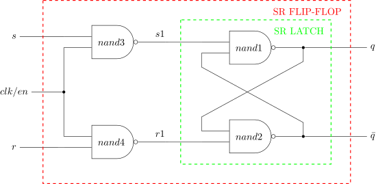
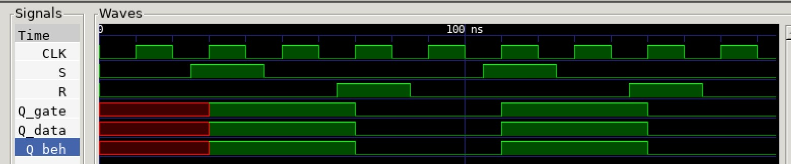

# SR FLIP-FLOP EXAMPLE

_A sr (set ready) flip-flop stores data on level of clock
but can have an unknown output._

Table of Contents

* [OVERVIEW](https://github.com/JeffDeCola/my-verilog-examples/tree/master/basic-code/sequential-logic/sr_flip_flop#overview)
* [SCHEMATIC](https://github.com/JeffDeCola/my-verilog-examples/tree/master/basic-code/sequential-logic/sr_flip_flop#schematic)
* [TRUTH TABLE](https://github.com/JeffDeCola/my-verilog-examples/tree/master/basic-code/sequential-logic/sr_flip_flop#truth-table)
* [VERILOG CODE](https://github.com/JeffDeCola/my-verilog-examples/tree/master/basic-code/sequential-logic/sr_flip_flop#verilog-code)
* [RUN (SIMULATE)](https://github.com/JeffDeCola/my-verilog-examples/tree/master/basic-code/sequential-logic/sr_flip_flop#run-simulate)
* [CHECK WAVEFORM](https://github.com/JeffDeCola/my-verilog-examples/tree/master/basic-code/sequential-logic/sr_flip_flop#check-waveform)
* [TESTED IN HARDWARE - BURNED TO A FPGA](https://github.com/JeffDeCola/my-verilog-examples/tree/master/basic-code/sequential-logic/sr_flip_flop#tested-in-hardware---burned-to-a-fpga)

## OVERVIEW

_I used
[iverilog](https://github.com/JeffDeCola/my-cheat-sheets/tree/master/hardware/tools/simulation/iverilog-cheat-sheet)
to simulate and
[GTKWave](https://github.com/JeffDeCola/my-cheat-sheets/tree/master/hardware/tools/simulation/gtkwave-cheat-sheet)
to view the waveform. I also used
[Xilinx Vivado](https://github.com/JeffDeCola/my-cheat-sheets/tree/master/hardware/tools/synthesis/xilinx-vivado-cheat-sheet)
to synthesize and program this example on a
[Digilent ARTY-S7](https://github.com/JeffDeCola/my-cheat-sheets/tree/master/hardware/development/fpga-development-boards/digilent-arty-s7-cheat-sheet)
FPGA development board._

## SCHEMATIC

_This figure was created using `LaTeX` in
[my-latex-graphs](https://github.com/JeffDeCola/my-latex-graphs/tree/master/mathematics/applied/electrical-engineering/sequential-logic/sr-flip-flop)
repo._

<p align="center">
    

## TRUTH TABLE

tbd

## VERILOG CODE

The
[sr_flip_flop.v](https://github.com/JeffDeCola/my-verilog-examples/blob/master/basic-code/sequential-logic/sr_flip_flop/sr_flip_flop.v)
uses behavioral modeling,

```verilog
tbd
```

## RUN (SIMULATE)

I created,

* [sr_flip_flop_tb.v](https://github.com/JeffDeCola/my-verilog-examples/blob/master/basic-code/sequential-logic/sr_flip_flop/sr_flip_flop_tb.v)
  the testbench
* [sr_flip_flop.vh](https://github.com/JeffDeCola/my-verilog-examples/blob/master/basic-code/sequential-logic/sr_flip_flop/sr_flip_flop.vh)
  the header file listing the verilog code
* [run-simulation.sh](https://github.com/JeffDeCola/my-verilog-examples/blob/master/basic-code/sequential-logic/sr_flip_flop/run-simulation.sh)
  a script containing the commands below

Use **iverilog** to compile the verilog to a vvp format
which is used by the vvp runtime simulation engine,

```bash
iverilog -o sr_flip_flop_tb.vvp sr_flip_flop_tb.v sr_flip_flop.vh
```

Use **vvp** to run the simulation, which creates a waveform dump file *.vcd.

```bash
vvp sr_flip_flop_tb.vvp
```

## CHECK WAVEFORM

Open the waveform file sr_flip_flop_tb.vcd file with GTKWave,

```bash
gtkwave -f sr_flip_flop_tb.vcd &
```

Save your waveform to a .gtkw file.

Now you can
[launch-gtkwave.sh](https://github.com/JeffDeCola/my-verilog-examples/blob/master/launch-GTKWave-script/launch-gtkwave.sh)
anytime you want,

```bash
gtkwave -f sr_flip_flop_tb.gtkw &
```



## TESTED IN HARDWARE - BURNED TO A FPGA

The above code was synthesized using the
[Xilinx Vivado](https://github.com/JeffDeCola/my-cheat-sheets/tree/master/hardware/tools/synthesis/xilinx-vivado-cheat-sheet)
IDE software suite and burned to a FPGA development board.
