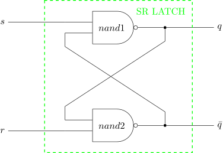

# SR LATCH EXAMPLE

_A sr (set ready) latch which is **level-triggered**
that can be set and reset.
The latch forms the basic building block
of other types of latches and flip-flops._

Table of Contents

* [OVERVIEW](https://github.com/JeffDeCola/my-verilog-examples/tree/master/basic-code/sequential-logic/sr_latch#overview)
* [SCHEMATIC](https://github.com/JeffDeCola/my-verilog-examples/tree/master/basic-code/sequential-logic/sr_latch#schematic)
* [TRUTH TABLE](https://github.com/JeffDeCola/my-verilog-examples/tree/master/basic-code/sequential-logic/sr_latch#truth-table)
* [VERILOG CODE](https://github.com/JeffDeCola/my-verilog-examples/tree/master/basic-code/sequential-logic/sr_latch#verilog-code)
* [RUN (SIMULATE)](https://github.com/JeffDeCola/my-verilog-examples/tree/master/basic-code/sequential-logic/sr_latch#run-simulate)
* [VIEW WAVEFORM](https://github.com/JeffDeCola/my-verilog-examples/tree/master/basic-code/sequential-logic/sr_latch#view-waveform)
* [TESTED IN HARDWARE - BURNED TO A FPGA](https://github.com/JeffDeCola/my-verilog-examples/tree/master/basic-code/sequential-logic/sr_latch#tested-in-hardware---burned-to-a-fpga)

## OVERVIEW

Latches and flip-flops are part of sequential logic
digital system that stores data on the output.

LATCHES

* 1-bit storage
* **NO CLOCK** (part of an asynchronous system)
* Outputs **level-triggered** from inputs (asynchronous)

FLIP-FLOPS

* A latch that is controlled by a clock
* **USES CLOCK** (part of synchronous system)
* Outputs can be **level-triggered (pulse)**
  or **edge-triggered** from a clk (synchronous)

TRIGGER

* NO CLOCK
  * level-triggered
* CLOCK
  * pulse-triggered (level-triggered but using clock)
  * edge-triggered

SR LATCH

* **level-triggered**
* The input s=0 sets the output to 1
* The input r=0 resets the output to 0
* Forms the basic building blocks of other types of flip-flops

_I used
[iverilog](https://github.com/JeffDeCola/my-cheat-sheets/tree/master/hardware/tools/simulation/iverilog-cheat-sheet)
to simulate and
[GTKWave](https://github.com/JeffDeCola/my-cheat-sheets/tree/master/hardware/tools/simulation/gtkwave-cheat-sheet)
to view the waveform. I also used
[Xilinx Vivado](https://github.com/JeffDeCola/my-cheat-sheets/tree/master/hardware/tools/synthesis/xilinx-vivado-cheat-sheet)
to synthesize and program this example on a
[Digilent ARTY-S7](https://github.com/JeffDeCola/my-cheat-sheets/tree/master/hardware/development/fpga-development-boards/digilent-arty-s7-cheat-sheet)
FPGA development board._

## SCHEMATIC

_This figure was created using `LaTeX` in
[my-latex-graphs](https://github.com/JeffDeCola/my-latex-graphs/tree/master/mathematics/applied/electrical-engineering/sequential-logic/sr-latch)
repo._

<p align="center">
    

## TRUTH TABLE

|  s  |  r  |  q  | comment     |
|:---:|:---:|:---:|:------------|
|  0  |  0  |  X  | INVALID     |
|  0  |  1  |  1  | SET         |
|  1  |  0  |  0  | RESET       |
|  1  |  1  |  q  | NO CHANGE   |

## VERILOG CODE

The
[sr_latch.v](https://github.com/JeffDeCola/my-verilog-examples/blob/master/basic-code/sequential-logic/sr_latch/sr_latch.v)
gate model,

```verilog
    // NAND1
    nand (q, s, qbar);

    // NAND2
    nand (qbar, r, q);
```

Dataflow model,

```verilog
    // NAND1
    assign q = ~(s & qbar);

    // NAND2
    assign qbar = ~(r & q);
```

Behavioral model,

```verilog
    always @(*) begin
        case({s,r})
            2'b0_0 : q <= 1'bx;
            2'b0_1 : q <= 1'b1;
            2'b1_0 : q <= 1'b0;
            2'b1_1 : q <= q;
        endcase
    end
```

## RUN (SIMULATE)

The testbench uses two files,

* [sr_latch_tb.v](https://github.com/JeffDeCola/my-verilog-examples/blob/master/basic-code/sequential-logic/sr_latch/sr_latch_tb.v)
  the testbench
* [sr_latch_tb.tv](https://github.com/JeffDeCola/my-verilog-examples/blob/master/basic-code/sequential-logic/sr_latch/sr_latch_tb.tv)
  the test vectors and expected results

with,

* [sr_latch.vh](https://github.com/JeffDeCola/my-verilog-examples/blob/master/basic-code/sequential-logic/sr_latch/sr_latch.vh)
  is the header file listing the verilog models
* [run-simulation.sh](https://github.com/JeffDeCola/my-verilog-examples/blob/master/basic-code/sequential-logic/sr_latch/run-simulation.sh)
  is a script containing the commands below

Use **iverilog** to compile the verilog to a vvp format
which is used by the vvp runtime simulation engine,

```bash
iverilog -o sr_latch_tb.vvp sr_latch_tb.v sr_latch.vh
```

Use **vvp** to run the simulation, which checks the UUT
and creates a waveform dump file *.vcd.

```bash
vvp sr_latch_tb.vvp
```

The output of the test,

```text
TEST START --------------------------------

                                     GATE  DATA   BEH
                 | TIME(ns) | S | R |  Q  |  Q  |  Q  |
                 --------------------------------------
   1        INIT |       15 | 1 | 1 |  x  |  x  |  x  |
   2         SET |       35 | 0 | 1 |  1  |  1  |  1  |
   3   NO_CHANGE |       55 | 1 | 1 |  1  |  1  |  1  |
   4       RESET |       75 | 1 | 0 |  0  |  0  |  0  |
   5   NO_CHANGE |       95 | 1 | 1 |  0  |  0  |  0  |
   6         SET |      115 | 0 | 1 |  1  |  1  |  1  |
   7   NO_CHANGE |      135 | 1 | 1 |  1  |  1  |  1  |
   8       RESET |      155 | 1 | 0 |  0  |  0  |  0  |
   9   NO_CHANGE |      175 | 1 | 1 |  0  |  0  |  0  |

 VECTORS:    9
  ERRORS:    0

TEST END ----------------------------------
```

## VIEW WAVEFORM

Open the waveform file sr_latch_tb.vcd file with GTKWave,

```bash
gtkwave -f sr_latch_tb.vcd &
```

Save your waveform to a .gtkw file.

Now you can use the script
[launch-gtkwave.sh](https://github.com/JeffDeCola/my-verilog-examples/blob/master/launch-GTKWave-script/launch-gtkwave.sh)
anytime you want,

```bash
gtkwave -f sr_latch_tb.gtkw &
```


## TESTED IN HARDWARE - BURNED TO A FPGA

The above code was synthesized using the
[Xilinx Vivado](https://github.com/JeffDeCola/my-cheat-sheets/tree/master/hardware/tools/synthesis/xilinx-vivado-cheat-sheet)
IDE software suite and burned to a FPGA development board.
