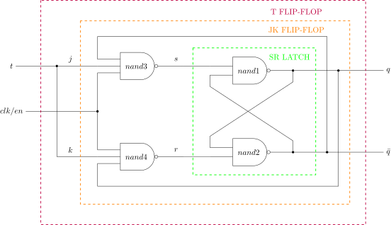
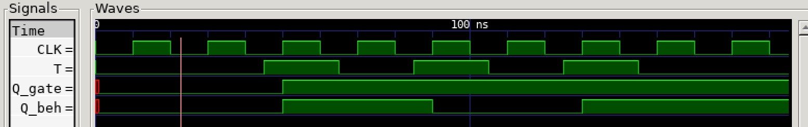

# T FLIP-FLOP EXAMPLE

_A t (toggle) flip-flop is a single input jk flip flop
which toggles output according to input._

Table of Contents

* [OVERVIEW](https://github.com/JeffDeCola/my-verilog-examples/tree/master/basic-code/sequential-logic/t_flip_flop#overview)
* [SCHEMATIC](https://github.com/JeffDeCola/my-verilog-examples/tree/master/basic-code/sequential-logic/t_flip_flop#schematic)
* [TRUTH TABLE](https://github.com/JeffDeCola/my-verilog-examples/tree/master/basic-code/sequential-logic/t_flip_flop#truth-table)
* [VERILOG CODE](https://github.com/JeffDeCola/my-verilog-examples/tree/master/basic-code/sequential-logic/t_flip_flop#verilog-code)
* [RUN (SIMULATE)](https://github.com/JeffDeCola/my-verilog-examples/tree/master/basic-code/sequential-logic/t_flip_flop#run-simulate)
* [CHECK WAVEFORM](https://github.com/JeffDeCola/my-verilog-examples/tree/master/basic-code/sequential-logic/t_flip_flop#check-waveform)
* [TESTED IN HARDWARE - BURNED TO A FPGA](https://github.com/JeffDeCola/my-verilog-examples/tree/master/basic-code/sequential-logic/t_flip_flop#tested-in-hardware---burned-to-a-fpga)

## OVERVIEW

_I used
[iverilog](https://github.com/JeffDeCola/my-cheat-sheets/tree/master/hardware/tools/simulation/iverilog-cheat-sheet)
to simulate and
[GTKWave](https://github.com/JeffDeCola/my-cheat-sheets/tree/master/hardware/tools/simulation/gtkwave-cheat-sheet)
to view the waveform. I also used
[Xilinx Vivado](https://github.com/JeffDeCola/my-cheat-sheets/tree/master/hardware/tools/synthesis/xilinx-vivado-cheat-sheet)
to synthesize and program this example on a
[Digilent ARTY-S7](https://github.com/JeffDeCola/my-cheat-sheets/tree/master/hardware/development/fpga-development-boards/digilent-arty-s7-cheat-sheet)
FPGA development board._

## SCHEMATIC

_This figure was created using `LaTeX` in
[my-latex-graphs](https://github.com/JeffDeCola/my-latex-graphs/tree/master/mathematics/applied/electrical-engineering/sequential-logic/t-flip-flop)
repo._

<p align="center">
    

## TRUTH TABLE

| q_prev  | en     | d     | q      |
|:-------:|:------:|:-----:|:------:|
| 0       |  0     |  X    | 0      |
| 1       |  0     |  X    | 1      |
| X       |  1     |  0    | 0      |
| X       |  1     |  1    | 1      |

## VERILOG CODE

The
[t_flip_flop.v](https://github.com/JeffDeCola/my-verilog-examples/blob/master/basic-code/sequential-logic/t_flip_flop/t_flip_flop.v)
uses behavioral modeling,

```verilog
    assign q_bar = ~q;

    // D FLIP-FLOP WITH SYNC ENABLE
    always @ (posedge clk) begin
        if (en) begin
            q <= d;
        end else begin
            q <= q;
        end
    end
```

## RUN (SIMULATE)

I created,

* [t_flip_flop_tb.v](https://github.com/JeffDeCola/my-verilog-examples/blob/master/basic-code/sequential-logic/t_flip_flop/t_flip_flop_tb.v)
  the testbench
* [t_flip_flop_tb.tv](https://github.com/JeffDeCola/my-verilog-examples/blob/master/basic-code/sequential-logic/sr_latch/t_flip_flop_tb.tv)
  the test vectors and expected results
* [t_flip_flop.vh](https://github.com/JeffDeCola/my-verilog-examples/blob/master/basic-code/sequential-logic/t_flip_flop/t_flip_flop.vh)
  the header file listing the verilog code
* [run-simulation.sh](https://github.com/JeffDeCola/my-verilog-examples/blob/master/basic-code/sequential-logic/t_flip_flop/run-simulation.sh)
  a script containing the commands below

Use **iverilog** to compile the verilog to a vvp format
which is used by the vvp runtime simulation engine,

```bash
iverilog -o t_flip_flop_tb.vvp t_flip_flop_tb.v t_flip_flop.vh
```

Use **vvp** to run the simulation, which checks the UUT
and creates a waveform dump file *.vcd.

```bash
vvp t_flip_flop_tb.vvp
```

## CHECK WAVEFORM

Open the waveform file t_flip_flop_tb.vcd file with GTKWave,

```bash
gtkwave -f t_flip_flop_tb.vcd &
```

Save your waveform to a .gtkw file.

Now you can
[launch-gtkwave.sh](https://github.com/JeffDeCola/my-verilog-examples/blob/master/launch-GTKWave-script/launch-gtkwave.sh)
anytime you want,

```bash
gtkwave -f t_flip_flop_tb.gtkw &
```



## TESTED IN HARDWARE - BURNED TO A FPGA

The above code was synthesized using the
[Xilinx Vivado](https://github.com/JeffDeCola/my-cheat-sheets/tree/master/hardware/tools/synthesis/xilinx-vivado-cheat-sheet)
IDE software suite and burned to a FPGA development board.
