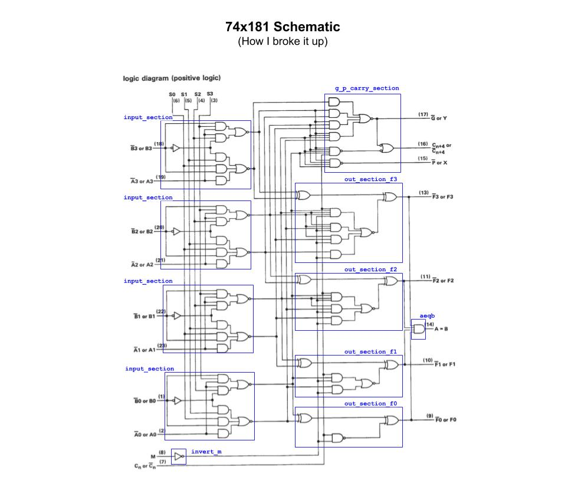
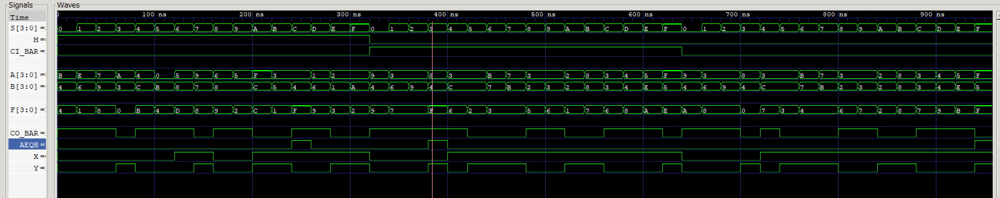

# JEFF 74x181 EXAMPLE

_4-bit alu (arithmetic logic unit) and function generator.
Provides 16 binary logic operations and 16 arithmetic operations
on two 4-bit words.
Based on the 7400-series integrated circuits used in my
[programable-8-bit-microprocessor](https://github.com/JeffDeCola/my-verilog-examples/tree/master/systems/microprocessors/programable-8-bit-microprocessor)._

Table of Contents

* [SCHEMATIC](https://github.com/JeffDeCola/my-verilog-examples/tree/master/combinational-logic/alus/jeff-74x181#schematic)
* [FUNCTION TABLE](https://github.com/JeffDeCola/my-verilog-examples/tree/master/combinational-logic/alus/jeff-74x181#function-table)
* [VERILOG CODE](https://github.com/JeffDeCola/my-verilog-examples/tree/master/combinational-logic/alus/jeff-74x181#verilog-code)
* [RUN (SIMULATE)](https://github.com/JeffDeCola/my-verilog-examples/tree/master/combinational-logic/alus/jeff-74x181#run-simulate)
* [CHECK WAVEFORM](https://github.com/JeffDeCola/my-verilog-examples/tree/master/combinational-logic/alus/jeff-74x181#check-waveform)
* [TESTED IN HARDWARE - BURNED TO AN FPGA](https://github.com/JeffDeCola/my-verilog-examples/tree/master/combinational-logic/alus/jeff-74x181#tested-in-hardware---burned-to-an-fpga)

Documentation and Reference

* I really like this
  [explanation](http://www.righto.com/2017/03/inside-vintage-74181-alu-chip-how-it.html)

## SCHEMATIC

I designed this processor form the 1972 Texas Instruments spec sheet.
I love the care and thought put into this.



## FUNCTION TABLE

This is when the inputs/outputs are treated as active high.

| SELECT | M=1 LOGIC    | M=0 ARITHMETIC NO CARRY | M=0 ARITHMETIC WITH CARRY |
|:------:|--------------|-------------------------|---------------------------|
|  0000  | !A           | A                       | A PLUS 1                  |
|  0001  | !(A+B)       | A+B                     | A+B PLUS 1                |
|  0010  | (!A)B        | A+!B                    | A+!B PLUS 1               |
|  0011  | 0            | MINUS 1 (2's compliment)| ZERO                      |
|  0100  | !(AB)        | A PLUS A(!B)            | A PLUS A(!B) PLUS 1       |
|  0101  | !B           | (A+B) PLUS A(!B)        | (A+B) PLUS A(!B) PLUS 1   |
|  0110  | A^B          | A MINUS B MINUS 1       | A MINUS B                 |
|  0111  | A(!B)        | A(!B) MINUS 1           | A(!B)                     |
|  1000  | !A+B         | A PLUS AB               | A PLUS AB PLUS 1          |
|  1001  | !(A^B)       | A PLUS B                | A PLUS B PLUS 1           |
|  1010  | B            | (A+!B) PLUS AB          | (A+!B) PLUS AB PLUS 1     |
|  1011  | AB           | AB MINUS 1              | AB                        |
|  1100  | 1            | A PLUS A (bit shifted)  | A PLUS A PLUS 1 (shifted) |
|  1101  | A+!B         | (A+B) PLUS A            | (A+B) PLUS A PLUS 1       |
|  1110  | A+B          | (A+!B) PLUS A           | (A+!B) PLUS A PLUS 1      |
|  1111  | A            | A MINUS 1               | A                         |

## VERILOG CODE

The entire code is
[jeff-74x181.v](jeff-74x181.v).

## RUN (SIMULATE)

I used my testbench
[jeff-74x181-tb.v](jeff-74x181-tb.v) with
[iverilog](https://github.com/JeffDeCola/my-cheat-sheets/tree/master/hardware/tools/simulation/iverilog-cheat-sheet)
to simulate and create a `.vcd` file.

```bash
sh run-test.sh
```

## CHECK WAVEFORM

Check you waveform using your `.vcd` file with a waveform viewer.

I used [GTKWave](https://github.com/JeffDeCola/my-cheat-sheets/tree/master/hardware/tools/simulation/gtkwave-cheat-sheet)
and launch it using
[launch-gtkwave.sh](launch-gtkwave.sh).



## TESTED IN HARDWARE - BURNED TO AN FPGA

To test my design in real hardware, the above code was synthesized using the
[Xilinx Vivado](https://github.com/JeffDeCola/my-cheat-sheets/tree/master/hardware/tools/synthesis/xilinx-vivado-cheat-sheet)
IDE software suite and burned to a FPGA development board.
