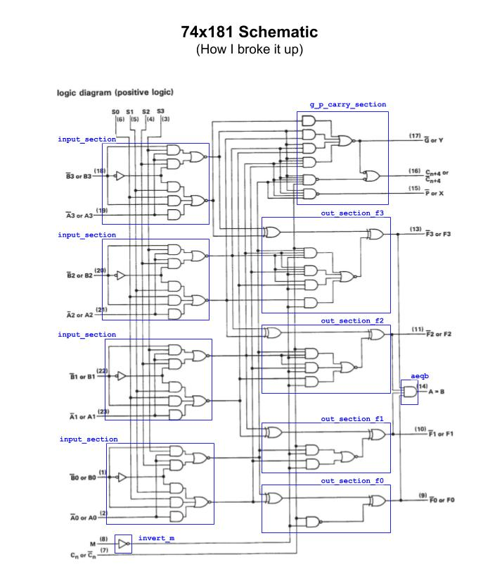
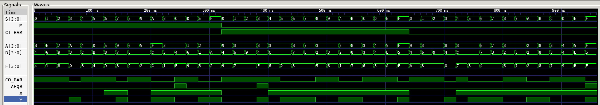

# JEFF 74x181 EXAMPLE

_4-bit alu (arithmetic logic unit) and function generator.
Provides 16 binary logic operations and 16 arithmetic operations
on two 4-bit words.
Based on the 7400-series integrated circuits used in my
[programable_8_bit_microprocessor](https://github.com/JeffDeCola/my-verilog-examples/tree/master/systems/microprocessors/programable_8_bit_microprocessor)._

Table of Contents

* [OVERVIEW](https://github.com/JeffDeCola/my-verilog-examples/tree/master/combinational-logic/alus/jeff_74x181#overview)
* [SCHEMATIC](https://github.com/JeffDeCola/my-verilog-examples/tree/master/combinational-logic/alus/jeff_74x181#schematic)
* [TRUTH TABLE](https://github.com/JeffDeCola/my-verilog-examples/tree/master/combinational-logic/alus/jeff_74x181#truth-table)
* [VERILOG CODE](https://github.com/JeffDeCola/my-verilog-examples/tree/master/combinational-logic/alus/jeff_74x181#verilog-code)
* [RUN (SIMULATE)](https://github.com/JeffDeCola/my-verilog-examples/tree/master/combinational-logic/alus/jeff_74x181#run-simulate)
* [VIEW WAVEFORM](https://github.com/JeffDeCola/my-verilog-examples/tree/master/combinational-logic/alus/jeff_74x181#view-waveform)
* [TESTED IN HARDWARE - BURNED TO A FPGA](https://github.com/JeffDeCola/my-verilog-examples/tree/master/combinational-logic/alus/jeff_74x181#tested-in-hardware---burned-to-a-fpga)

Documentation and Reference

* I really like this
  [explanation](http://www.righto.com/2017/03/inside-vintage-74181-alu-chip-how-it.html)

## OVERVIEW

_I used
[iverilog](https://github.com/JeffDeCola/my-cheat-sheets/tree/master/hardware/tools/simulation/iverilog-cheat-sheet)
to simulate and
[GTKWave](https://github.com/JeffDeCola/my-cheat-sheets/tree/master/hardware/tools/simulation/gtkwave-cheat-sheet)
to view the waveform. I also used
[Xilinx Vivado](https://github.com/JeffDeCola/my-cheat-sheets/tree/master/hardware/tools/synthesis/xilinx-vivado-cheat-sheet)
to synthesize and program this example on a
[Digilent ARTY-S7](https://github.com/JeffDeCola/my-cheat-sheets/tree/master/hardware/development/fpga-development-boards/digilent-arty-s7-cheat-sheet)
FPGA development board._

## SCHEMATIC

I designed this alu from the 1972 Texas Instruments spec sheet.
I love the care and thought put into this.



## TRUTH TABLE

This is when the inputs/outputs are treated as active high.

| SELECT | M=1 LOGIC    | M=0 ARITHMETIC NO CARRY | M=0 ARITHMETIC WITH CARRY |
|:------:|--------------|-------------------------|---------------------------|
|  0000  | !A           | A                       | A PLUS 1                  |
|  0001  | !(A+B)       | A+B                     | A+B PLUS 1                |
|  0010  | (!A)B        | A+!B                    | A+!B PLUS 1               |
|  0011  | 0            | MINUS 1 (2's compliment)| ZERO                      |
|  0100  | !(AB)        | A PLUS A(!B)            | A PLUS A(!B) PLUS 1       |
|  0101  | !B           | (A+B) PLUS A(!B)        | (A+B) PLUS A(!B) PLUS 1   |
|  0110  | A^B          | A MINUS B MINUS 1       | A MINUS B                 |
|  0111  | A(!B)        | A(!B) MINUS 1           | A(!B)                     |
|  1000  | !A+B         | A PLUS AB               | A PLUS AB PLUS 1          |
|  1001  | !(A^B)       | A PLUS B                | A PLUS B PLUS 1           |
|  1010  | B            | (A+!B) PLUS AB          | (A+!B) PLUS AB PLUS 1     |
|  1011  | AB           | AB MINUS 1              | AB                        |
|  1100  | 1            | A PLUS A (bit shifted)  | A PLUS A PLUS 1 (shifted) |
|  1101  | A+!B         | (A+B) PLUS A            | (A+B) PLUS A PLUS 1       |
|  1110  | A+B          | (A+!B) PLUS A           | (A+!B) PLUS A PLUS 1      |
|  1111  | A            | A MINUS 1               | A                         |

## VERILOG CODE

The
[jeff_74x181.v](https://github.com/JeffDeCola/my-verilog-examples/blob/master/combinational-logic/alus/jeff_74x181/jeff_74x181.v)
is a dataflow model.

## RUN (SIMULATE)

The testbench uses two files,

* [jeff_74x181_tb.v](https://github.com/JeffDeCola/my-verilog-examples/blob/master/combinational-logic/alus/jeff_74x181/jeff_74x181_tb.v)
  the testbench

with,

* [jeff_74x181.vh](https://github.com/JeffDeCola/my-verilog-examples/blob/master/combinational-logic/alus/jeff_74x181/jeff_74x181.vh)
  is the header file listing the verilog models
* [run-simulation.sh](https://github.com/JeffDeCola/my-verilog-examples/blob/master/combinational-logic/alus/jeff_74x181/run-simulation.sh)
  is a script containing the commands below

Use **iverilog** to compile the verilog to a vvp format
which is used by the vvp runtime simulation engine,

```bash
iverilog -o jeff_74x181_tb.vvp jeff_74x181_tb.v jeff_74x181.vh
```

Use **vvp** to run the simulation, which checks the UUT
and creates a waveform dump file *.vcd.

```bash
vvp jeff_74x181_tb.vvp
```

The output of the test,

```text
TEST START --------------------------------

                       | TIME(ns) | M | CI_BAR |  S   |  A   |  B   |  F   |
                       -----------------------------------------------------
   1              INIT |       15 | 1 |   0    | 0000 | 1011 | 0100 | 0100 |
   2              (!A) |       35 | 1 |   0    | 0000 | 1011 | 0100 | 0100 |
   3            !(A+B) |       55 | 1 |   0    | 0001 | 1110 | 0110 | 0001 |
   4             (!A)B |       75 | 1 |   0    | 0010 | 0111 | 1001 | 1000 |
   5                 0 |       95 | 1 |   0    | 0011 | 1010 | 0011 | 0000 |
   6             !(AB) |      115 | 1 |   0    | 0100 | 0100 | 1100 | 1011 |
   7                !B |      135 | 1 |   0    | 0101 | 0000 | 1011 | 0100 |
   8               A^B |      155 | 1 |   0    | 0110 | 0101 | 1000 | 1101 |
   9             A(!B) |      175 | 1 |   0    | 0111 | 1001 | 0111 | 1000 |
  10              !A+B |      195 | 1 |   0    | 1000 | 0110 | 1000 | 1001 |
  11            !(A^B) |      215 | 1 |   0    | 1001 | 0101 | 1000 | 0010 |
  12                 B |      235 | 1 |   0    | 1010 | 1111 | 1100 | 1100 |
  13                AB |      255 | 1 |   0    | 1011 | 0011 | 0101 | 0001 |
  14                 1 |      275 | 1 |   0    | 1100 | 0011 | 0100 | 1111 |
  15              A+!B |      295 | 1 |   0    | 1101 | 0001 | 0110 | 1001 |
  16               A+B |      315 | 1 |   0    | 1110 | 0010 | 0001 | 0011 |
  17                 A |      335 | 1 |   0    | 1111 | 0010 | 1010 | 0010 |
  18                 A |      355 | 0 |   1    | 0000 | 1001 | 0100 | 1001 |
  19               A+B |      375 | 0 |   1    | 0001 | 0011 | 0110 | 0111 |
  20              A+!B |      395 | 0 |   1    | 0010 | 0011 | 1001 | 0111 |
  21   MINUS1(2'sComp) |      415 | 0 |   1    | 0011 | 1000 | 0100 | 1111 |
  22        AplusA(!B) |      435 | 0 |   1    | 0100 | 0011 | 1100 | 0110 |
  23    (A+B)plusA(!B) |      455 | 0 |   1    | 0101 | 0011 | 1100 | 0010 |
  24     AminusBminus1 |      475 | 0 |   1    | 0110 | 1011 | 0111 | 0011 |
  25       A(!B)minus1 |      495 | 0 |   1    | 0111 | 0111 | 1011 | 0011 |
  26           AplusAB |      515 | 0 |   1    | 1000 | 0011 | 0010 | 0101 |
  27            AplusB |      535 | 0 |   1    | 1001 | 0011 | 0011 | 0110 |
  28      (A+!B)plusAB |      555 | 0 |   1    | 1010 | 0010 | 0010 | 0001 |
  29          ABminus1 |      575 | 0 |   1    | 1011 | 1000 | 1000 | 0111 |
  30     AplusA(shift) |      595 | 0 |   1    | 1100 | 0011 | 0011 | 0110 |
  31        (A+B)plusA |      615 | 0 |   1    | 1101 | 0100 | 0100 | 1000 |
  32       (A+!B)plusA |      635 | 0 |   1    | 1110 | 0101 | 1110 | 1010 |
  33           Aminus1 |      655 | 0 |   1    | 1111 | 1111 | 0101 | 1110 |
  34            Aplus1 |      675 | 0 |   0    | 0000 | 1001 | 0100 | 1010 |
  35          A+Bplus1 |      695 | 0 |   0    | 0001 | 0011 | 0110 | 1000 |
  36         A+!Bplus1 |      715 | 0 |   0    | 0010 | 0011 | 1001 | 1000 |
  37              ZERO |      735 | 0 |   0    | 0011 | 1000 | 0100 | 0000 |
  38   AplusA(!B)plus1 |      755 | 0 |   0    | 0100 | 0011 | 1100 | 0111 |
  39   (A+B)plusA(!B)1 |      775 | 0 |   0    | 0101 | 0011 | 1100 | 0011 |
  40           AminusB |      795 | 0 |   0    | 0110 | 1011 | 0111 | 0100 |
  41             A(!B) |      815 | 0 |   0    | 0111 | 0111 | 1011 | 0100 |
  42      AplusABplus1 |      835 | 0 |   0    | 1000 | 0011 | 0010 | 0110 |
  43       AplusBplus1 |      855 | 0 |   0    | 1001 | 0011 | 0011 | 0111 |
  44    (A+!B)plusABp1 |      875 | 0 |   0    | 1010 | 0010 | 0010 | 0010 |
  45                AB |      895 | 0 |   0    | 1011 | 1000 | 1000 | 1000 |
  46   AplusA(shift)p1 |      915 | 0 |   0    | 1100 | 0011 | 0011 | 0111 |
  47   (A+B)plusAplus1 |      935 | 0 |   0    | 1101 | 0100 | 0100 | 1001 |
  48     (A+!B)plusAp1 |      955 | 0 |   0    | 1110 | 0101 | 1110 | 1011 |
  49                 A |      975 | 0 |   0    | 1111 | 1111 | 0101 | 1111 |

 VECTORS:   49
  ERRORS:    0

TEST END ----------------------------------
```

## VIEW WAVEFORM

Open the waveform file jeff_74x181_tb.vcd file with GTKWave,

```bash
gtkwave -f jeff_74x181_tb.vcd &
```

Save your waveform to a .gtkw file.

Now you can use the script
[launch-gtkwave.sh](https://github.com/JeffDeCola/my-verilog-examples/blob/master/launch-GTKWave-script/launch-gtkwave.sh)
anytime you want,

```bash
gtkwave -f jeff_74x181_tb.gtkw &
```



## TESTED IN HARDWARE - BURNED TO A FPGA

The above code was synthesized using the
[Xilinx Vivado](https://github.com/JeffDeCola/my-cheat-sheets/tree/master/hardware/tools/synthesis/xilinx-vivado-cheat-sheet)
IDE software suite and burned to a FPGA development board.
