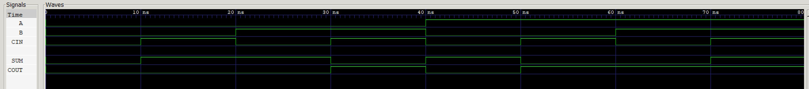

# FULL ADDER EXAMPLE

_A 2-bit full adder._

Table of Contents

* [VERILOG CODE](https://github.com/JeffDeCola/my-verilog-examples/tree/master/combinational-logic/data-operators/full-adder#verilog-code)
* [RUN (SIMULATE)](https://github.com/JeffDeCola/my-verilog-examples/tree/master/combinational-logic/data-operators/full-adder#run-simulate)
* [CHECK WAVEFORM](https://github.com/JeffDeCola/my-verilog-examples/tree/master/combinational-logic/data-operators/full-adder#check-waveform)

## VERILOG CODE

The main part of the code is,

```verilog
    reg sum, cout;

    always @ ( a or b or cin) begin
        {cout, sum} <= a + b + cin;
    end
```

The entire code is
[full-adder.v](full-adder.v).

## RUN (SIMULATE)

I used my testbench
[full-adder-tb.v](full-adder-tb.v) with
[iverilog](https://github.com/JeffDeCola/my-cheat-sheets/tree/master/hardware/tools/simulation/iverilog-cheat-sheet)
to simulate and create a `.vcd` file.

```bash
sh run-test.sh
```

## CHECK WAVEFORM

Check you waveform using your `.vcd` file with a waveform viewer.

I used [GTKWave](https://github.com/JeffDeCola/my-cheat-sheets/tree/master/hardware/tools/simulation/gtkwave-cheat-sheet)
and launch it using
[launch-gtkwave.sh](launch-gtkwave.sh).


