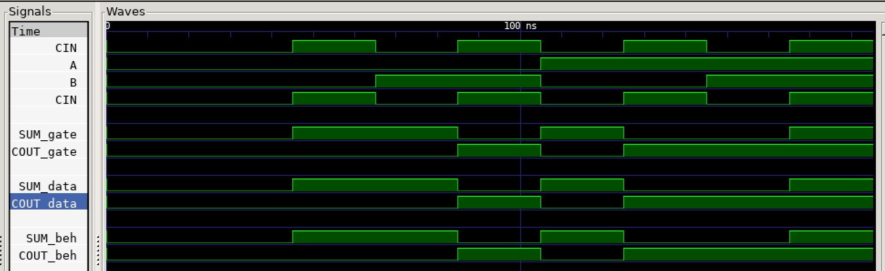

# FULL ADDER EXAMPLE

_A 2-bit full adder._

Table of Contents

* [OVERVIEW](https://github.com/JeffDeCola/my-verilog-examples/tree/master/combinational-logic/data-operators/full_adder#overview)
* [SCHEMATIC](https://github.com/JeffDeCola/my-verilog-examples/tree/master/combinational-logic/data-operators/full_adder#schematic)
* [TRUTH TABLE](https://github.com/JeffDeCola/my-verilog-examples/tree/master/combinational-logic/data-operators/full_adder#truth-table)
* [VERILOG CODE](https://github.com/JeffDeCola/my-verilog-examples/tree/master/combinational-logic/data-operators/full_adder#verilog-code)
* [RUN (SIMULATE)](https://github.com/JeffDeCola/my-verilog-examples/tree/master/combinational-logic/data-operators/full_adder#run-simulate)
* [VIEW WAVEFORM](https://github.com/JeffDeCola/my-verilog-examples/tree/master/combinational-logic/data-operators/full_adder#view-waveform)
* [TESTED IN HARDWARE - BURNED TO A FPGA](https://github.com/JeffDeCola/my-verilog-examples/tree/master/combinational-logic/data-operators/full_adder#tested-in-hardware---burned-to-a-fpga)

## OVERVIEW

_I used
[iverilog](https://github.com/JeffDeCola/my-cheat-sheets/tree/master/hardware/tools/simulation/iverilog-cheat-sheet)
to simulate and
[GTKWave](https://github.com/JeffDeCola/my-cheat-sheets/tree/master/hardware/tools/simulation/gtkwave-cheat-sheet)
to view the waveform. I also used
[Xilinx Vivado](https://github.com/JeffDeCola/my-cheat-sheets/tree/master/hardware/tools/synthesis/xilinx-vivado-cheat-sheet)
to synthesize and program this example on a
[Digilent ARTY-S7](https://github.com/JeffDeCola/my-cheat-sheets/tree/master/hardware/development/fpga-development-boards/digilent-arty-s7-cheat-sheet)
FPGA development board._

## SCHEMATIC

_This figure was created using `LaTeX` in
[my-latex-graphs](https://github.com/JeffDeCola/my-latex-graphs/tree/master/mathematics/applied/electrical-engineering/combinational-logic/full_adder)
repo._

<p align="center">
    

## TRUTH TABLE

| a     | b     |  cin  |  sum  |  cout |
|:-----:|:-----:|:-----:|:-----:|:-----:|
| 0     | 0     | 0     |   0   |   0   |
| 0     | 0     | 1     |   1   |   0   |
| 0     | 1     | 0     |   1   |   0   |
| 0     | 1     | 1     |   0   |   1   |
| 1     | 0     | 0     |   1   |   0   |
| 1     | 0     | 1     |   0   |   1   |
| 1     | 1     | 0     |   0   |   1   |
| 1     | 1     | 1     |   1   |   1   |

## VERILOG CODE

The
[full_adder.v](https://github.com/JeffDeCola/my-verilog-examples/blob/master/combinational-logic/data-operators/full_adder/full_adder.v)
gate model,

```verilog
    wire        w1, w2, w3;

    // GATE PRIMITIVE
    xor         xor1(w1, a, b);
    xor         xor2(sum, w1, cin);
    and         and1(w2, w1, cin);
    and         and2(w3, a, b);
    or          or1(cout, w2, w3);

```

Dataflow model,

```verilog
    // CONTINUOUS ASSIGNMENT STATEMENT
    assign sum  = a ^ b ^ cin;
    assign cout = (a & b) | (cin & (a ^ b));
```

Behavioral model,

```verilog
    // ALWAYS BLOCK with NON-BLOCKING PROCEDURAL ASSIGNMENT STATEMENT
    always @ ( a or b or cin) begin
        {cout, sum} <= a + b + cin;
    end
```

## RUN (SIMULATE)

The testbench uses two files,

* [full_adder_tb.v](https://github.com/JeffDeCola/my-verilog-examples/blob/master/combinational-logic/data-operators/full_adder/full_adder_tb.v)
  the testbench
* [full_adder_tb.tv](https://github.com/JeffDeCola/my-verilog-examples/blob/master/combinational-logic/data-operators/full_adder/full_adder_tb.tv)
  the test vectors and expected results

with,

* [full_adder.vh](https://github.com/JeffDeCola/my-verilog-examples/blob/master/combinational-logic/data-operators/full_adder/full_adder.vh)
  is the header file listing the verilog models
* [run-simulation.sh](https://github.com/JeffDeCola/my-verilog-examples/blob/master/combinational-logic/data-operators/full_adder/run-simulation.sh)
  is a script containing the commands below

Use **iverilog** to compile the verilog to a vvp format
which is used by the vvp runtime simulation engine,

```bash
iverilog -o full_adder_tb.vvp full_adder_tb.v full_adder.vh
```

Use **vvp** to run the simulation, which checks the UUT
and creates a waveform dump file *.vcd.

```bash
vvp full_adder_tb.vvp
```

The output of the test,

```text
TEST START --------------------------------

                                            GATE -----   DATA -----   BEH ------  
                 | TIME(ns) | A | B | CIN | SUM | COUT | SUM | COUT | SUM | COUT |
                 -----------------------------------------------------------------
   0        INIT |        0 |  0  | 0 | 0 |  0   |  0  |  0   |  0  |  0   |  0  |
   1           - |       25 |  0  | 0 | 0 |  0   |  0  |  0   |  0  |  0   |  0  |
   2           - |       45 |  0  | 0 | 1 |  1   |  0  |  1   |  0  |  1   |  1  |
   3           - |       65 |  0  | 1 | 0 |  1   |  0  |  1   |  0  |  1   |  1  |
   4           - |       85 |  0  | 1 | 1 |  0   |  1  |  0   |  1  |  0   |  0  |
   5           - |      105 |  1  | 0 | 0 |  1   |  0  |  1   |  0  |  1   |  1  |
   6           - |      125 |  1  | 0 | 1 |  0   |  1  |  0   |  1  |  0   |  0  |
   7           - |      145 |  1  | 1 | 0 |  0   |  1  |  0   |  1  |  0   |  0  |
   8           - |      165 |  1  | 1 | 1 |  1   |  1  |  1   |  1  |  1   |  1  |

 VECTORS:    8
  ERRORS:    0

TEST END ----------------------------------
```

## VIEW WAVEFORM

Open the waveform file full_adder_tb.vcd file with GTKWave,

```bash
gtkwave -f full_adder_tb.vcd &
```

Save your waveform to a .gtkw file.

Now you can use the script
[launch-gtkwave.sh](https://github.com/JeffDeCola/my-verilog-examples/blob/master/launch-GTKWave-script/launch-gtkwave.sh)
anytime you want,

```bash
gtkwave -f full_adder_tb.gtkw &
```



## TESTED IN HARDWARE - BURNED TO A FPGA

The above code was synthesized using the
[Xilinx Vivado](https://github.com/JeffDeCola/my-cheat-sheets/tree/master/hardware/tools/synthesis/xilinx-vivado-cheat-sheet)
IDE software suite and burned to a FPGA development board.
