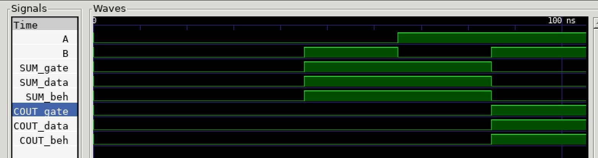

# HALF ADDER EXAMPLE

_A 2-bit half adder._

Table of Contents

* [OVERVIEW](https://github.com/JeffDeCola/my-verilog-examples/tree/master/combinational-logic/data-operators/half_adder#overview)
* [SCHEMATIC](https://github.com/JeffDeCola/my-verilog-examples/tree/master/combinational-logic/data-operators/half_adder#schematic)
* [TRUTH TABLE](https://github.com/JeffDeCola/my-verilog-examples/tree/master/combinational-logic/data-operators/half_adder#truth-table)
* [VERILOG CODE](https://github.com/JeffDeCola/my-verilog-examples/tree/master/combinational-logic/data-operators/half_adder#verilog-code)
* [RUN (SIMULATE)](https://github.com/JeffDeCola/my-verilog-examples/tree/master/combinational-logic/data-operators/half_adder#run-simulate)
* [VIEW WAVEFORM](https://github.com/JeffDeCola/my-verilog-examples/tree/master/combinational-logic/data-operators/half_adder#view-waveform)
* [TESTED IN HARDWARE - BURNED TO A FPGA](https://github.com/JeffDeCola/my-verilog-examples/tree/master/combinational-logic/data-operators/half_adder#tested-in-hardware---burned-to-a-fpga)

## OVERVIEW

_I used
[iverilog](https://github.com/JeffDeCola/my-cheat-sheets/tree/master/hardware/tools/simulation/iverilog-cheat-sheet)
to simulate and
[GTKWave](https://github.com/JeffDeCola/my-cheat-sheets/tree/master/hardware/tools/simulation/gtkwave-cheat-sheet)
to view the waveform. I also used
[Xilinx Vivado](https://github.com/JeffDeCola/my-cheat-sheets/tree/master/hardware/tools/synthesis/xilinx-vivado-cheat-sheet)
to synthesize and program this example on a
[Digilent ARTY-S7](https://github.com/JeffDeCola/my-cheat-sheets/tree/master/hardware/development/fpga-development-boards/digilent-arty-s7-cheat-sheet)
FPGA development board._

## SCHEMATIC

_This figure was created using `LaTeX` in
[my-latex-graphs](https://github.com/JeffDeCola/my-latex-graphs/tree/master/mathematics/applied/electrical-engineering/combinational-logic/half_adder)
repo._

<p align="center">
    

## TRUTH TABLE

| a     | b     | sum   | cout  |
|:-----:|:-----:|:-----:|:-----:|
| 0     | 0     | 0     | 0     |
| 0     | 1     | 1     | 0     |
| 1     | 0     | 1     | 0     |
| 1     | 1     | 0     | 1     |

## VERILOG CODE

The
[half_adder.v](https://github.com/JeffDeCola/my-verilog-examples/blob/master/combinational-logic/data-operators/half_adder/half_adder.v)
gate model,

```verilog
    // GATE PRIMITIVE
    xor         xor1(sum, a, b);
    and         and1(cout, a, b);
```

Dataflow model,

```verilog
    // CONTINUOUS ASSIGNMENT STATEMENT
    assign sum  = a ^ b;
    assign cout = a & b;
```

Behavioral model,

```verilog
    // ALWAYS BLOCK with NON-BLOCKING PROCEDURAL ASSIGNMENT STATEMENT
    always @ ( a or b) begin
        {cout, sum} <= a + b;
    end
```

## RUN (SIMULATE)

The testbench uses two files,

* [half_adder_tb.v](https://github.com/JeffDeCola/my-verilog-examples/blob/master/combinational-logic/data-operators/half_adder/half_adder_tb.v)
  the testbench
* [half_adder_tb.tv](https://github.com/JeffDeCola/my-verilog-examples/blob/master/combinational-logic/data-operators/half_adder/half_adder_tb.tv)
  the test vectors and expected results

with,

* [half_adder.vh](https://github.com/JeffDeCola/my-verilog-examples/blob/master/combinational-logic/data-operators/half_adder/half_adder.vh)
  is the header file listing the verilog models
* [run-simulation.sh](https://github.com/JeffDeCola/my-verilog-examples/blob/master/combinational-logic/data-operators/half_adder/run-simulation.sh)
  is a script containing the commands below

Use **iverilog** to compile the verilog to a vvp format
which is used by the vvp runtime simulation engine,

```bash
iverilog -o half_adder_tb.vvp half_adder_tb.v half_adder.vh
```

Use **vvp** to run the simulation, which checks the UUT
and creates a waveform dump file *.vcd.

```bash
vvp half_adder_tb.vvp
```

The output of the test,

```text
TEST START --------------------------------

                                      GATE -----   DATA -----   BEH ------
                 | TIME(ns) | A | B | SUM | COUT | SUM | COUT | SUM | COUT |
                 -----------------------------------------------------------
   0        INIT |        0 | 0 | 0 |  0   |  0  |  0   |  0  |  0   |  0  |
   1           - |       25 | 0 | 0 |  0   |  0  |  0   |  0  |  0   |  0  |
   2           - |       45 | 0 | 1 |  1   |  0  |  1   |  0  |  1   |  1  |
   3           - |       65 | 1 | 0 |  1   |  0  |  1   |  0  |  1   |  1  |
   4           - |       85 | 1 | 1 |  0   |  1  |  0   |  1  |  0   |  0  |

 VECTORS:    4
  ERRORS:    0

TEST END ----------------------------------
```

## VIEW WAVEFORM

Open the waveform file half_adder_tb.vcd file with GTKWave,

```bash
gtkwave -f half_adder_tb.vcd &
```

Save your waveform to a .gtkw file.

Now you can use the script
[launch-gtkwave.sh](https://github.com/JeffDeCola/my-verilog-examples/blob/master/launch-GTKWave-script/launch-gtkwave.sh)
anytime you want,

```bash
gtkwave -f half_adder_tb.gtkw &
```



## TESTED IN HARDWARE - BURNED TO A FPGA

The above code was synthesized using the
[Xilinx Vivado](https://github.com/JeffDeCola/my-cheat-sheets/tree/master/hardware/tools/synthesis/xilinx-vivado-cheat-sheet)
IDE software suite and burned to a FPGA development board.
