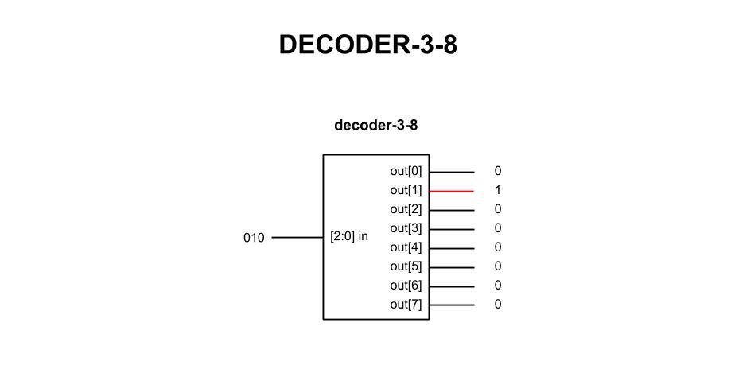

# decoder-3-8 example

_Decoder - Three inputs decodes to 1 of 8 outputs (hot)._

[GitHub Webpage](https://jeffdecola.github.io/my-systemverilog-examples/)

## SCHEMATIC

This may help,



## VERILOG CODE

The main part of the code is,

```verilog
    reg  [7:0] out;

    always @ ( * ) begin
        case (in)
            3'b000 : out <= 8'b00000001;
            3'b001 : out <= 8'b00000010;
            3'b010 : out <= 8'b00000100;
            3'b011 : out <= 8'b00001000;
            3'b100 : out <= 8'b00010000;
            3'b101 : out <= 8'b00100000;
            3'b110 : out <= 8'b01000000;
            3'b111 : out <= 8'b10000000;
        endcase
    end
```

The entire code is
[decoder-3-8.v](decoder-3-8.v).

## RUN (SIMULATE)

I used my testbench
[decoder-3-8-tb.v](decoder-3-8-tb.v) with
[iverilog](https://github.com/JeffDeCola/my-cheat-sheets/tree/master/hardware/tools/simulation/iverilog-cheat-sheet)
to simulate and create a `.vcd` file.

```bash
sh run-test.sh
```

## CHECK WAVEFORM

Check you waveform using your `.vcd` file with a waveform viewer.

I used [GTKWave](https://github.com/JeffDeCola/my-cheat-sheets/tree/master/hardware/tools/simulation/gtkwave-cheat-sheet)
and launch it using
[launch-gtkwave.sh](launch-gtkwave.sh).
