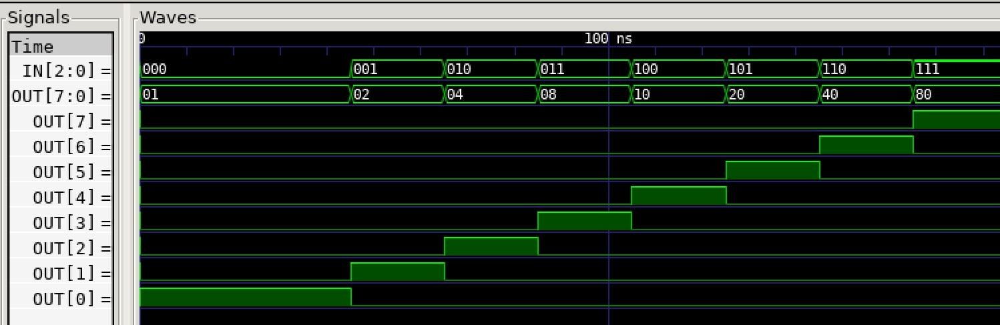

# DECODER 3-8 EXAMPLE

[](https://jeffdecola.com)
[](https://jeffdecola.mit-license.org)

_Decoder - Three inputs decodes to 1 of 8 outputs (hot)._

Table of Contents

* [OVERVIEW](https://github.com/JeffDeCola/my-verilog-examples/tree/master/combinational-logic/decoders-and-encoders/decoder_3_8#overview)
* [SCHEMATIC](https://github.com/JeffDeCola/my-verilog-examples/tree/master/combinational-logic/decoders-and-encoders/decoder_3_8#schematic)
* [TRUTH TABLE](https://github.com/JeffDeCola/my-verilog-examples/tree/master/combinational-logic/decoders-and-encoders/decoder_3_8#truth-table)
* [VERILOG CODE](https://github.com/JeffDeCola/my-verilog-examples/tree/master/combinational-logic/decoders-and-encoders/decoder_3_8#verilog-code)
* [RUN (SIMULATE)](https://github.com/JeffDeCola/my-verilog-examples/tree/master/combinational-logic/decoders-and-encoders/decoder_3_8#run-simulate)
* [VIEW WAVEFORM](https://github.com/JeffDeCola/my-verilog-examples/tree/master/combinational-logic/decoders-and-encoders/decoder_3_8#view-waveform)
* [TESTED IN HARDWARE - BURNED TO A FPGA](https://github.com/JeffDeCola/my-verilog-examples/tree/master/combinational-logic/decoders-and-encoders/decoder_3_8#tested-in-hardware---burned-to-a-fpga)

## OVERVIEW

_I used
[iverilog](https://github.com/JeffDeCola/my-cheat-sheets/tree/master/hardware/tools/simulation/iverilog-cheat-sheet)
to simulate and
[GTKWave](https://github.com/JeffDeCola/my-cheat-sheets/tree/master/hardware/tools/simulation/gtkwave-cheat-sheet)
to view the waveform. I also used
[Xilinx Vivado](https://github.com/JeffDeCola/my-cheat-sheets/tree/master/hardware/tools/synthesis/xilinx-vivado-cheat-sheet)
to synthesize and program this example on a
[Digilent ARTY-S7](https://github.com/JeffDeCola/my-cheat-sheets/tree/master/hardware/development/fpga-development-boards/digilent-arty-s7-cheat-sheet)
FPGA development board._

## SCHEMATIC

_This figure was created using `LaTeX` in
[my-latex-graphs](https://github.com/JeffDeCola/my-latex-graphs/tree/master/mathematics/applied/electrical-engineering/combinational-logic/decoder-3-8)
repo._

<p align="center">
    

## TRUTH TABLE

| in     | out     |
|:-----:|:--------:|
| 000   | 00000001 |
| 001   | 00000010 |
| 010   | 00000100 |
| 011   | 00001000 |
| 100   | 00010001 |
| 101   | 00100000 |
| 110   | 01000000 |
| 111   | 10000000 |

## VERILOG CODE

The
[decoder_3_8.v](https://github.com/JeffDeCola/my-verilog-examples/blob/master/combinational-logic/decoders-and-encoders/decoder_3_8/decoder_3_8.v)
behavioral model,

```verilog
    // ALWAYS BLOCK with NON-BLOCKING PROCEDURAL ASSIGNMENT STATEMENT
    always @ ( * ) begin
        case (in)
            3'b000 : out <= 8'b00000001;
            3'b001 : out <= 8'b00000010;
            3'b010 : out <= 8'b00000100;
            3'b011 : out <= 8'b00001000;
            3'b100 : out <= 8'b00010000;
            3'b101 : out <= 8'b00100000;
            3'b110 : out <= 8'b01000000;
            3'b111 : out <= 8'b10000000;
        endcase
    end
```

## RUN (SIMULATE)

The testbench uses two files,

* [decoder_3_8_tb.v](https://github.com/JeffDeCola/my-verilog-examples/blob/master/combinational-logic/decoders-and-encoders/decoder_3_8/decoder_3_8_tb.v)
  the testbench
* [decoder_3_8_tb.tv](https://github.com/JeffDeCola/my-verilog-examples/blob/master/combinational-logic/decoders-and-encoders/decoder_3_8/decoder_3_8_tb.tv)
  the test vectors and expected results

with,

* [decoder_3_8.vh](https://github.com/JeffDeCola/my-verilog-examples/blob/master/combinational-logic/decoders-and-encoders/decoder_3_8/decoder_3_8.vh)
  is the header file listing the verilog models
* [run-simulation.sh](https://github.com/JeffDeCola/my-verilog-examples/blob/master/combinational-logic/decoders-and-encoders/decoder_3_8/run-simulation.sh)
  is a script containing the commands below

Use **iverilog** to compile the verilog to a vvp format
which is used by the vvp runtime simulation engine,

```bash
iverilog -o decoder_3_8_tb.vvp decoder_3_8_tb.v decoder_3_8.vh
```

Use **vvp** to run the simulation, which checks the UUT
and creates a waveform dump file *.vcd.

```bash
vvp decoder_3_8_tb.vvp
```

The output of the test,

```text
TEST START --------------------------------

                 | TIME(ns) | IN  |   OUT    |
                 -----------------------------
   1        INIT |       15 | 000 | 00000001 |
   2           - |       35 | 000 | 00000001 |
   3           - |       55 | 001 | 00000010 |
   4           - |       75 | 010 | 00000100 |
   5           - |       95 | 011 | 00001000 |
   6           - |      115 | 100 | 00010000 |
   7           - |      135 | 101 | 00100000 |
   8           - |      155 | 110 | 01000000 |
   9           - |      175 | 111 | 10000000 |

 VECTORS:    9
  ERRORS:    0

TEST END ----------------------------------
```

## VIEW WAVEFORM

Open the waveform file decoder_3_8_tb.vcd file with GTKWave,

```bash
gtkwave -f decoder_3_8_tb.vcd &
```

Save your waveform to a .gtkw file.

Now you can use the script
[launch-gtkwave.sh](https://github.com/JeffDeCola/my-verilog-examples/blob/master/launch-GTKWave-script/launch-gtkwave.sh)
anytime you want,

```bash
gtkwave -f decoder_3_8_tb.gtkw &
```



## TESTED IN HARDWARE - BURNED TO A FPGA

The above code was synthesized using the
[Xilinx Vivado](https://github.com/JeffDeCola/my-cheat-sheets/tree/master/hardware/tools/synthesis/xilinx-vivado-cheat-sheet)
IDE software suite and burned to a FPGA development board.
