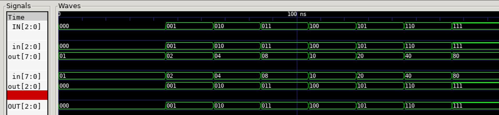

# DECODER TO ENCODER EXAMPLE

_Combining the
[decoder_3_8](https://github.com/JeffDeCola/my-verilog-examples/tree/master/combinational-logic/decoders-and-encoders/decoder_3_8)
to the
[encoder_8_3](https://github.com/JeffDeCola/my-verilog-examples/tree/master/combinational-logic/decoders-and-encoders/encoder_8_3)
to prove the input will equal
the output._

Table of Contents

* [OVERVIEW](https://github.com/JeffDeCola/my-verilog-examples/tree/master/combinational-logic/decoders-and-encoders/decoder_to_encoder#overview)
* [SCHEMATIC](https://github.com/JeffDeCola/my-verilog-examples/tree/master/combinational-logic/decoders-and-encoders/decoder_to_encoder#schematic)
* [TRUTH TABLE](https://github.com/JeffDeCola/my-verilog-examples/tree/master/combinational-logic/decoders-and-encoders/decoder_to_encoder#truth-table)
* [VERILOG CODE](https://github.com/JeffDeCola/my-verilog-examples/tree/master/combinational-logic/decoders-and-encoders/decoder_to_encoder#verilog-code)
* [RUN (SIMULATE)](https://github.com/JeffDeCola/my-verilog-examples/tree/master/combinational-logic/decoders-and-encoders/decoder_to_encoder#run-simulate)
* [VIEW WAVEFORM](https://github.com/JeffDeCola/my-verilog-examples/tree/master/combinational-logic/decoders-and-encoders/decoder_to_encoder#view-waveform)
* [TESTED IN HARDWARE - BURNED TO A FPGA](https://github.com/JeffDeCola/my-verilog-examples/tree/master/combinational-logic/decoders-and-encoders/decoder_to_encoder#tested-in-hardware---burned-to-a-fpga)

## OVERVIEW

_I used
[iverilog](https://github.com/JeffDeCola/my-cheat-sheets/tree/master/hardware/tools/simulation/iverilog-cheat-sheet)
to simulate and
[GTKWave](https://github.com/JeffDeCola/my-cheat-sheets/tree/master/hardware/tools/simulation/gtkwave-cheat-sheet)
to view the waveform. I also used
[Xilinx Vivado](https://github.com/JeffDeCola/my-cheat-sheets/tree/master/hardware/tools/synthesis/xilinx-vivado-cheat-sheet)
to synthesize and program this example on a
[Digilent ARTY-S7](https://github.com/JeffDeCola/my-cheat-sheets/tree/master/hardware/development/fpga-development-boards/digilent-arty-s7-cheat-sheet)
FPGA development board._

## SCHEMATIC

_This figure was created using `LaTeX` in
[my-latex-graphs](https://github.com/JeffDeCola/my-latex-graphs/tree/master/mathematics/applied/electrical-engineering/combinational-logic/decoder-to-encoder)
repo._

<p align="center">
    

## TRUTH TABLE

| in  | out |
|:---:|:---:|
| 000 | 000 |
| 001 | 001 |
| 010 | 010 |
| 011 | 011 |
| 100 | 100 |
| 101 | 101 |
| 110 | 110 |
| 111 | 111 |

## VERILOG CODE

The
[decoder_to_encoder.v](https://github.com/JeffDeCola/my-verilog-examples/blob/master/combinational-logic/decoders-and-encoders/decoder_to_encoder/decoder_to_encoder.v)
structural model,

```verilog
    wire [7:0] connect;

    // DECODER
    decoder_3_8_behavioral decoder_3_8 (
        .in(in),
        .out(connect)
    );

    // ENCODER
    encoder_8_3_behavioral encoder_8_3 (
        .in(connect),
        .out(out)
    );
```

## RUN (SIMULATE)

The testbench uses two files,

* [decoder_to_encoder_tb.v](https://github.com/JeffDeCola/my-verilog-examples/blob/master/combinational-logic/decoders-and-encoders/decoder_to_encoder/decoder_to_encoder_tb.v)
  the testbench
* [decoder_to_encoder_tb.tv](https://github.com/JeffDeCola/my-verilog-examples/blob/master/combinational-logic/decoders-and-encoders/decoder_to_encoder/decoder_to_encoder_tb.tv)
  the test vectors and expected results

with,

* [decoder_to_encoder.vh](https://github.com/JeffDeCola/my-verilog-examples/blob/master/combinational-logic/decoders-and-encoders/decoder_to_encoder/decoder_to_encoder.vh)
  is the header file listing the verilog models
* [run-simulation.sh](https://github.com/JeffDeCola/my-verilog-examples/blob/master/combinational-logic/decoders-and-encoders/decoder_to_encoder/run-simulation.sh)
  is a script containing the commands below

Use **iverilog** to compile the verilog to a vvp format
which is used by the vvp runtime simulation engine,

```bash
iverilog -o decoder_to_encoder_tb.vvp decoder_to_encoder_tb.v decoder_to_encoder.vh
```

Use **vvp** to run the simulation, which checks the UUT
and creates a waveform dump file *.vcd.

```bash
vvp decoder_to_encoder_tb.vvp
```

The output of the test,

```text
TEST START --------------------------------

                 | TIME(ns) | IN  | OUT |
                 ------------------------
   0        INIT |        0 | 000 | 000 |
   1           - |       25 | 000 | 000 |
   2           - |       45 | 001 | 001 |
   3           - |       65 | 010 | 010 |
   4           - |       85 | 011 | 011 |
   5           - |      105 | 100 | 100 |
   6           - |      125 | 101 | 101 |
   7           - |      145 | 110 | 110 |
   8           - |      165 | 111 | 111 |

 VECTORS:    8
  ERRORS:    0

TEST END ----------------------------------
```

## VIEW WAVEFORM

Open the waveform file decoder_to_encoder_tb.vcd file with GTKWave,

```bash
gtkwave -f decoder_to_encoder_tb.vcd &
```

Save your waveform to a .gtkw file.

Now you can use the script
[launch-gtkwave.sh](https://github.com/JeffDeCola/my-verilog-examples/blob/master/launch-GTKWave-script/launch-gtkwave.sh)
anytime you want,

```bash
gtkwave -f decoder_to_encoder_tb.gtkw &
```



## TESTED IN HARDWARE - BURNED TO A FPGA

The above code was synthesized using the
[Xilinx Vivado](https://github.com/JeffDeCola/my-cheat-sheets/tree/master/hardware/tools/synthesis/xilinx-vivado-cheat-sheet)
IDE software suite and burned to a FPGA development board.
