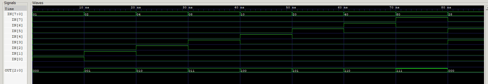

# encoder-8-3 example

_Encoder - Eights inputs (1 hot) encodes to output._

[GitHub Webpage](https://jeffdecola.github.io/my-systemverilog-examples/)

## SCHEMATIC

This may help,


## VERILOG CODE

The main part of the code is,

```verilog
reg  [2:0] out;

always @ ( * ) begin
    case(in)
        8'b00000001 : out <= 3'b000;
        8'b00000010 : out <= 3'b001;
        8'b00000100 : out <= 3'b010;
        8'b00001000 : out <= 3'b011;
        8'b00010000 : out <= 3'b100;
        8'b00100000 : out <= 3'b101;
        8'b01000000 : out <= 3'b110;
        8'b10000000 : out <= 3'b111;
        default     : out <= 3'b000;
    endcase
 end
 ```

The entire code is
[encoder-8-3.v](encoder-8-3.v).

## RUN (SIMULATE)

I used my testbench
[encoder-8-3-tb.v](encoder-8-3-tb.v) with
[iverilog](https://github.com/JeffDeCola/my-cheat-sheets/tree/master/hardware/tools/simulation/iverilog-cheat-sheet)
to simulate and create a `.vcd` file.

```bash
sh run-test.sh
```

## CHECK WAVEFORM

Check you waveform using your `.vcd` file with a waveform viewer.

I used [GTKWave](https://github.com/JeffDeCola/my-cheat-sheets/tree/master/hardware/tools/simulation/gtkwave-cheat-sheet)
and launch it using
[launch-gtkwave.sh](launch-gtkwave.sh).


