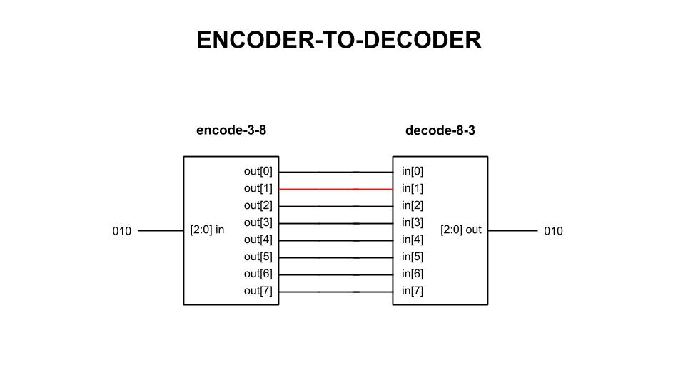

# encoder-to-decoder example

_Combining the
[decoder-8-3](https://github.com/JeffDeCola/my-systemverilog-examples/tree/master/combinational-logic/decoders-and-encoders/decoder-8-3)
to the
[encoder-3-8](https://github.com/JeffDeCola/my-systemverilog-examples/tree/master/combinational-logic/decoders-and-encoders/encoder-3-8)
to prove the input will equal the output._

[GitHub Webpage](https://jeffdecola.github.io/my-systemverilog-examples/)

## SCHEMATIC

This may help,



## VERILOG CODE

The main part of the code is,

```verilog
    ??????????
```

The entire code is
[encoder-to-decoder.v](encoder-to-decoder.v).

## RUN (SIMULATE)

I used my testbench
[encoder-to-decoder-tb.v](encoder-to-decoder-tb.v) with
[iverilog](https://github.com/JeffDeCola/my-cheat-sheets/tree/master/hardware/tools/simulation/iverilog-cheat-sheet)
to simulate and create a `.vcd` file.

```bash
sh run-test.sh
```

## CHECK WAVEFORM

Check you waveform using your `.vcd` file with a waveform viewer.

I used [GTKWave](https://github.com/JeffDeCola/my-cheat-sheets/tree/master/hardware/tools/simulation/gtkwave-cheat-sheet)
and launch it using
[launch-gtkwave.sh](launch-gtkwave.sh).
