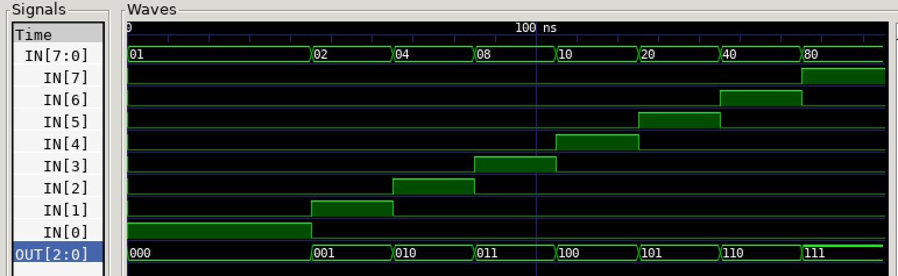

# ENCODER 8-3 EXAMPLE

_Encoder - Eights inputs (1 hot) encodes to output._

Table of Contents

* [OVERVIEW](https://github.com/JeffDeCola/my-verilog-examples/tree/master/combinational-logic/decoders-and-encoders/encoder_8_3#overview)
* [SCHEMATIC](https://github.com/JeffDeCola/my-verilog-examples/tree/master/combinational-logic/decoders-and-encoders/encoder_8_3#schematic)
* [TRUTH TABLE](https://github.com/JeffDeCola/my-verilog-examples/tree/master/combinational-logic/decoders-and-encoders/encoder_8_3#truth-table)
* [VERILOG CODE](https://github.com/JeffDeCola/my-verilog-examples/tree/master/combinational-logic/decoders-and-encoders/encoder_8_3#verilog-code)
* [RUN (SIMULATE)](https://github.com/JeffDeCola/my-verilog-examples/tree/master/combinational-logic/decoders-and-encoders/encoder_8_3#run-simulate)
* [VIEW WAVEFORM](https://github.com/JeffDeCola/my-verilog-examples/tree/master/combinational-logic/decoders-and-encoders/encoder_8_3#view-waveform)
* [TESTED IN HARDWARE - BURNED TO A FPGA](https://github.com/JeffDeCola/my-verilog-examples/tree/master/combinational-logic/decoders-and-encoders/encoder_8_3#tested-in-hardware---burned-to-a-fpga)

## OVERVIEW

_I used
[iverilog](https://github.com/JeffDeCola/my-cheat-sheets/tree/master/hardware/tools/simulation/iverilog-cheat-sheet)
to simulate and
[GTKWave](https://github.com/JeffDeCola/my-cheat-sheets/tree/master/hardware/tools/simulation/gtkwave-cheat-sheet)
to view the waveform. I also used
[Xilinx Vivado](https://github.com/JeffDeCola/my-cheat-sheets/tree/master/hardware/tools/synthesis/xilinx-vivado-cheat-sheet)
to synthesize and program this example on a
[Digilent ARTY-S7](https://github.com/JeffDeCola/my-cheat-sheets/tree/master/hardware/development/fpga-development-boards/digilent-arty-s7-cheat-sheet)
FPGA development board._

## SCHEMATIC

_This figure was created using `LaTeX` in
[my-latex-graphs](https://github.com/JeffDeCola/my-latex-graphs/tree/master/mathematics/applied/electrical-engineering/combinational-logic/encoder-8-3)
repo._

<p align="center">
    

## TRUTH TABLE

| in       | out |
|:--------:|:---:|
| 00000001 | 000 |
| 00000010 | 001 |
| 00000100 | 010 |
| 00001000 | 011 |
| 00010000 | 100 |
| 00100000 | 101 |
| 01000000 | 110 |
| 10000000 | 111 |

## VERILOG CODE

The
[encoder_8_3.v](https://github.com/JeffDeCola/my-verilog-examples/blob/master/combinational-logic/decoders-and-encoders/encoder_8_3/encoder_8_3.v)
behavioral model,

```verilog
    // ALWAYS BLOCK with NON-BLOCKING PROCEDURAL ASSIGNMENT STATEMENT
    always @ ( * ) begin
        case(in)
            8'b00000001 : out <= 3'b000;
            8'b00000010 : out <= 3'b001;
            8'b00000100 : out <= 3'b010;
            8'b00001000 : out <= 3'b011;
            8'b00010000 : out <= 3'b100;
            8'b00100000 : out <= 3'b101;
            8'b01000000 : out <= 3'b110;
            8'b10000000 : out <= 3'b111;
            default     : out <= 3'b000;
        endcase
    end
```

## RUN (SIMULATE)

The testbench uses two files,

* [encoder_8_3_tb.v](https://github.com/JeffDeCola/my-verilog-examples/blob/master/combinational-logic/decoders-and-encoders/encoder_8_3/encoder_8_3_tb.v)
  the testbench
* [encoder_8_3_tb.tv](https://github.com/JeffDeCola/my-verilog-examples/blob/master/combinational-logic/decoders-and-encoders/encoder_8_3/encoder_8_3_tb.tv)
  the test vectors and expected results

with,

* [encoder_8_3.vh](https://github.com/JeffDeCola/my-verilog-examples/blob/master/combinational-logic/decoders-and-encoders/encoder_8_3/encoder_8_3.vh)
  is the header file listing the verilog models
* [run-simulation.sh](https://github.com/JeffDeCola/my-verilog-examples/blob/master/combinational-logic/decoders-and-encoders/encoder_8_3/run-simulation.sh)
  is a script containing the commands below

Use **iverilog** to compile the verilog to a vvp format
which is used by the vvp runtime simulation engine,

```bash
iverilog -o encoder_8_3_tb.vvp encoder_8_3_tb.v encoder_8_3.vh
```

Use **vvp** to run the simulation, which checks the UUT
and creates a waveform dump file *.vcd.

```bash
vvp encoder_8_3_tb.vvp
```

The output of the test,

```text
TEST START --------------------------------

                 | TIME(ns) | IN  |   OUT    |
                 -----------------------------
   1        INIT |       15 | 00000001 | 000 |
   2           - |       35 | 00000001 | 000 |
   3           - |       55 | 00000010 | 001 |
   4           - |       75 | 00000100 | 010 |
   5           - |       95 | 00001000 | 011 |
   6           - |      115 | 00010000 | 100 |
   7           - |      135 | 00100000 | 101 |
   8           - |      155 | 01000000 | 110 |
   9           - |      175 | 10000000 | 111 |

 VECTORS:    9
  ERRORS:    0

TEST END ----------------------------------
```

## VIEW WAVEFORM

Open the waveform file encoder_8_3_tb.vcd file with GTKWave,

```bash
gtkwave -f encoder_8_3_tb.vcd &
```

Save your waveform to a .gtkw file.

Now you can use the script
[launch-gtkwave.sh](https://github.com/JeffDeCola/my-verilog-examples/blob/master/launch-GTKWave-script/launch-gtkwave.sh)
anytime you want,

```bash
gtkwave -f encoder_8_3_tb.gtkw &
```



## TESTED IN HARDWARE - BURNED TO A FPGA

The above code was synthesized using the
[Xilinx Vivado](https://github.com/JeffDeCola/my-cheat-sheets/tree/master/hardware/tools/synthesis/xilinx-vivado-cheat-sheet)
IDE software suite and burned to a FPGA development board.
