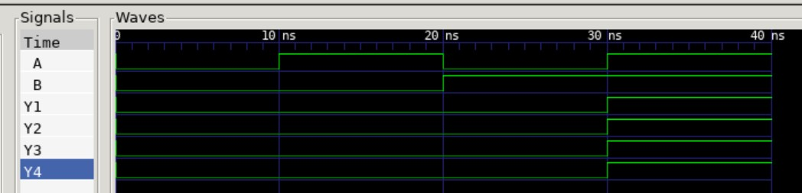

# ENCODER 8-3 EXAMPLE

_Encoder - Eights inputs (1 hot) encodes to output._

Table of Contents

* [SCHEMATIC](https://github.com/JeffDeCola/my-verilog-examples/tree/master/combinational-logic/decoders-and-encoders/encoder-8-3#schematic)
* [VERILOG CODE](https://github.com/JeffDeCola/my-verilog-examples/tree/master/combinational-logic/decoders-and-encoders/encoder-8-3#verilog-code)
* [RUN (SIMULATE)](https://github.com/JeffDeCola/my-verilog-examples/tree/master/combinational-logic/decoders-and-encoders/encoder-8-3#run-simulate)
* [CHECK WAVEFORM](https://github.com/JeffDeCola/my-verilog-examples/tree/master/combinational-logic/decoders-and-encoders/encoder-8-3#check-waveform)

## OVERVIEW

_I used
[iverilog](https://github.com/JeffDeCola/my-cheat-sheets/tree/master/hardware/tools/simulation/iverilog-cheat-sheet)
to simulate and
[GTKWave](https://github.com/JeffDeCola/my-cheat-sheets/tree/master/hardware/tools/simulation/gtkwave-cheat-sheet)
to view the waveform. I also used
[Xilinx Vivado](https://github.com/JeffDeCola/my-cheat-sheets/tree/master/hardware/tools/synthesis/xilinx-vivado-cheat-sheet)
to synthesize and program this example on a
[Digilent ARTY-S7](https://github.com/JeffDeCola/my-cheat-sheets/tree/master/hardware/development/fpga-development-boards/digilent-arty-s7-cheat-sheet)
FPGA development board._

## SCHEMATIC

This may help,


## VERILOG CODE

The
[and_gates.v](https://github.com/JeffDeCola/my-verilog-examples/blob/master/basic-code/combinational-logic/and_gates/and_gates.v)
uses behavioral modeling,

```verilog
    reg  [2:0] out;

    always @ ( * ) begin
        case(in)
            8'b00000001 : out <= 3'b000;
            8'b00000010 : out <= 3'b001;
            8'b00000100 : out <= 3'b010;
            8'b00001000 : out <= 3'b011;
            8'b00010000 : out <= 3'b100;
            8'b00100000 : out <= 3'b101;
            8'b01000000 : out <= 3'b110;
            8'b10000000 : out <= 3'b111;
            default     : out <= 3'b000;
        endcase
    end
 ```

## RUN (SIMULATE)

I created,

* [and_gates_tb.v](https://github.com/JeffDeCola/my-verilog-examples/blob/master/basic-code/combinational-logic/and_gates/and_gates_tb.v)
the testbench
* [and_gates.vh](https://github.com/JeffDeCola/my-verilog-examples/blob/master/basic-code/combinational-logic/and_gates/and_gates.vh)
the header file listing the verilog code
* [run-simulation.sh](https://github.com/JeffDeCola/my-verilog-examples/blob/master/basic-code/combinational-logic/and_gates/run-simulation.sh)
a script containing the commands below

Use **iverilog** to compile the verilog to a vvp format
which is used by the vvp runtime simulation engine,

```bash
iverilog -o and_gates_tb.vvp and_gates_tb.v and_gates.vh
```

Use **vvp** to run the simulation, which creates a waveform dump file *.vcd.

```bash
vvp and_gates_tb.vvp
```

## CHECK WAVEFORM

Open the waveform file and_gates_tb.vcd file with GTKWave,

```bash
gtkwave -f and_gates_tb.vcd &
```

Save your waveform to a .gtkw file.

Now you can
[launch-gtkwave.sh](https://github.com/JeffDeCola/my-verilog-examples/blob/master/launch-GTKWave-script/launch-gtkwave.sh)
anytime you want,

```bash
gtkwave -f and_gates_tb.gtkw &
```



## TESTED IN HARDWARE - BURNED TO A FPGA

The above code was synthesized using the
[Xilinx Vivado](https://github.com/JeffDeCola/my-cheat-sheets/tree/master/hardware/tools/synthesis/xilinx-vivado-cheat-sheet)
IDE software suite and burned to a FPGA development board.
