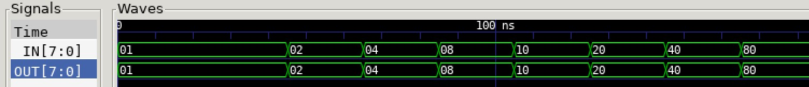

# ENCODER TO DECODER EXAMPLE

[](https://jeffdecola.com)
[](https://jeffdecola.mit-license.org)

_Combining the
[encoder_8_3](https://github.com/JeffDeCola/my-verilog-examples/tree/master/combinational-logic/decoders-and-encoders/encoder_8_3)
to the
[decoder_3_8](https://github.com/JeffDeCola/my-verilog-examples/tree/master/combinational-logic/decoders-and-encoders/decoder_3_8)
to prove the input will equal
the output._

Table of Contents

* [OVERVIEW](https://github.com/JeffDeCola/my-verilog-examples/tree/master/combinational-logic/decoders-and-encoders/encoder_to_decoder#overview)
* [SCHEMATIC](https://github.com/JeffDeCola/my-verilog-examples/tree/master/combinational-logic/decoders-and-encoders/encoder_to_decoder#schematic)
* [TRUTH TABLE](https://github.com/JeffDeCola/my-verilog-examples/tree/master/combinational-logic/decoders-and-encoders/encoder_to_decoder#truth-table)
* [VERILOG CODE](https://github.com/JeffDeCola/my-verilog-examples/tree/master/combinational-logic/decoders-and-encoders/encoder_to_decoder#verilog-code)
* [RUN (SIMULATE)](https://github.com/JeffDeCola/my-verilog-examples/tree/master/combinational-logic/decoders-and-encoders/encoder_to_decoder#run-simulate)
* [VIEW WAVEFORM](https://github.com/JeffDeCola/my-verilog-examples/tree/master/combinational-logic/decoders-and-encoders/encoder_to_decoder#view-waveform)
* [TESTED IN HARDWARE - BURNED TO A FPGA](https://github.com/JeffDeCola/my-verilog-examples/tree/master/combinational-logic/decoders-and-encoders/encoder_to_decoder#tested-in-hardware---burned-to-a-fpga)

## OVERVIEW

_I used
[iverilog](https://github.com/JeffDeCola/my-cheat-sheets/tree/master/hardware/tools/simulation/iverilog-cheat-sheet)
to simulate and
[GTKWave](https://github.com/JeffDeCola/my-cheat-sheets/tree/master/hardware/tools/simulation/gtkwave-cheat-sheet)
to view the waveform. I also used
[Xilinx Vivado](https://github.com/JeffDeCola/my-cheat-sheets/tree/master/hardware/tools/synthesis/xilinx-vivado-cheat-sheet)
to synthesize and program this example on a
[Digilent ARTY-S7](https://github.com/JeffDeCola/my-cheat-sheets/tree/master/hardware/development/fpga-development-boards/digilent-arty-s7-cheat-sheet)
FPGA development board._

## SCHEMATIC

_This figure was created using `LaTeX` in
[my-latex-graphs](https://github.com/JeffDeCola/my-latex-graphs/tree/master/mathematics/applied/electrical-engineering/combinational-logic/encoder-to-decoder)
repo._

<p align="center">
    

## TRUTH TABLE

What goes in must come out. :)

| in       |  out     |
|:--------:|:--------:|
| 00000000 | 00000000 |
| 00000001 | 00000001 |
| 00000010 | 00000010 |
| 00000100 | 00000100 |
| 00001000 | 00001000 |
| 00010000 | 00010000 |
| 00100000 | 00100000 |
| 01000000 | 01000000 |
| 10000000 | 10000000 |

## VERILOG CODE

The
[encoder_to_decoder.v](https://github.com/JeffDeCola/my-verilog-examples/blob/master/combinational-logic/decoders-and-encoders/encoder_to_decoder/encoder_to_decoder.v)
structural model,

```verilog
    wire [7:0] connect;

    // ENCODER
    encoder_8_3_behavioral encoder_8_3 (
        .in(in),
        .out(connect)
    );

    // DECODER
    decoder_3_8_behavioral decoder_3_8 (
        .in(connect),
        .out(out)
    );
```

## RUN (SIMULATE)

The testbench uses two files,

* [encoder_to_decoder_tb.v](https://github.com/JeffDeCola/my-verilog-examples/blob/master/combinational-logic/decoders-and-encoders/encoder_to_decoder/encoder_to_decoder_tb.v)
  the testbench
* [encoder_to_decoder_tb.tv](https://github.com/JeffDeCola/my-verilog-examples/blob/master/combinational-logic/decoders-and-encoders/encoder_to_decoder/encoder_to_decoder_tb.tv)
  the test vectors and expected results

with,

* [encoder_to_decoder.vh](https://github.com/JeffDeCola/my-verilog-examples/blob/master/combinational-logic/decoders-and-encoders/encoder_to_decoder/encoder_to_decoder.vh)
  is the header file listing the verilog models
* [run-simulation.sh](https://github.com/JeffDeCola/my-verilog-examples/blob/master/combinational-logic/decoders-and-encoders/encoder_to_decoder/run-simulation.sh)
  is a script containing the commands below

Use **iverilog** to compile the verilog to a vvp format
which is used by the vvp runtime simulation engine,

```bash
iverilog -o encoder_to_decoder_tb.vvp encoder_to_decoder_tb.v encoder_to_decoder.vh
```

Use **vvp** to run the simulation, which checks the UUT
and creates a waveform dump file *.vcd.

```bash
vvp encoder_to_decoder_tb.vvp
```

The output of the test,

```text
TEST START --------------------------------

                 | TIME(ns) |    IN    |    OUT   |
                 ----------------------------------
   1        INIT |       15 | 00000001 | 00000001 |
   2           - |       35 | 00000001 | 00000001 |
   3           - |       55 | 00000010 | 00000010 |
   4           - |       75 | 00000100 | 00000100 |
   5           - |       95 | 00001000 | 00001000 |
   6           - |      115 | 00010000 | 00010000 |
   7           - |      135 | 00100000 | 00100000 |
   8           - |      155 | 01000000 | 01000000 |
   9           - |      175 | 10000000 | 10000000 |

 VECTORS:    9
  ERRORS:    0

TEST END ----------------------------------
```

## VIEW WAVEFORM

Open the waveform file encoder_to_decoder_tb.vcd file with GTKWave,

```bash
gtkwave -f encoder_to_decoder_tb.vcd &
```

Save your waveform to a .gtkw file.

Now you can use the script
[launch-gtkwave.sh](https://github.com/JeffDeCola/my-verilog-examples/blob/master/launch-GTKWave-script/launch-gtkwave.sh)
anytime you want,

```bash
gtkwave -f encoder_to_decoder_tb.gtkw &
```



## TESTED IN HARDWARE - BURNED TO A FPGA

The above code was synthesized using the
[Xilinx Vivado](https://github.com/JeffDeCola/my-cheat-sheets/tree/master/hardware/tools/synthesis/xilinx-vivado-cheat-sheet)
IDE software suite and burned to a FPGA development board.
