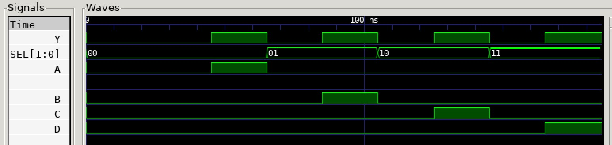

# DEMUX 1x4 EXAMPLE

[](https://jeffdecola.com)
[](https://jeffdecola.mit-license.org)

_Demultiplexer - One input, four outputs._

Table of Contents

* [OVERVIEW](https://github.com/JeffDeCola/my-verilog-examples/tree/master/combinational-logic/multiplexers-and-demultiplexers/demux_1x4#overview)
* [SCHEMATIC](https://github.com/JeffDeCola/my-verilog-examples/tree/master/combinational-logic/multiplexers-and-demultiplexers/demux_1x4#schematic)
* [TRUTH TABLE](https://github.com/JeffDeCola/my-verilog-examples/tree/master/combinational-logic/multiplexers-and-demultiplexers/demux_1x4#truth-table)
* [VERILOG CODE](https://github.com/JeffDeCola/my-verilog-examples/tree/master/combinational-logic/multiplexers-and-demultiplexers/demux_1x4#verilog-code)
* [RUN (SIMULATE)](https://github.com/JeffDeCola/my-verilog-examples/tree/master/combinational-logic/multiplexers-and-demultiplexers/demux_1x4#run-simulate)
* [VIEW WAVEFORM](https://github.com/JeffDeCola/my-verilog-examples/tree/master/combinational-logic/multiplexers-and-demultiplexers/demux_1x4#view-waveform)
* [TESTED IN HARDWARE - BURNED TO A FPGA](https://github.com/JeffDeCola/my-verilog-examples/tree/master/combinational-logic/multiplexers-and-demultiplexers/demux_1x4#tested-in-hardware---burned-to-a-fpga)

## OVERVIEW

_I used
[iverilog](https://github.com/JeffDeCola/my-cheat-sheets/tree/master/hardware/tools/simulation/iverilog-cheat-sheet)
to simulate and
[GTKWave](https://github.com/JeffDeCola/my-cheat-sheets/tree/master/hardware/tools/simulation/gtkwave-cheat-sheet)
to view the waveform. I also used
[Xilinx Vivado](https://github.com/JeffDeCola/my-cheat-sheets/tree/master/hardware/tools/synthesis/xilinx-vivado-cheat-sheet)
to synthesize and program this example on a
[Digilent ARTY-S7](https://github.com/JeffDeCola/my-cheat-sheets/tree/master/hardware/development/fpga-development-boards/digilent-arty-s7-cheat-sheet)
FPGA development board._

## SCHEMATIC

_This figure was created using `LaTeX` in
[my-latex-graphs](https://github.com/JeffDeCola/my-latex-graphs/tree/master/mathematics/applied/electrical-engineering/combinational-logic/demux-1x4)
repo._

<p align="center">
    

## TRUTH TABLE

| sel   | y | a | b | c | d |
|:-----:|:-:|:-:|:-:|:-:|:-:|
| 00    | 0 | 0 | 0 | 0 | 0 |
| 00    | 1 | 1 | 0 | 0 | 0 |
| 01    | 0 | 0 | 0 | 0 | 0 |
| 01    | 1 | 0 | 1 | 0 | 0 |
| 10    | 0 | 0 | 0 | 0 | 0 |
| 10    | 1 | 0 | 0 | 1 | 0 |
| 11    | 0 | 0 | 0 | 0 | 0 |
| 11    | 1 | 0 | 0 | 0 | 1 |

## VERILOG CODE

The
[demux_1x4.v](https://github.com/JeffDeCola/my-verilog-examples/blob/master/combinational-logic/multiplexers-and-demultiplexers/demux_1x4/demux_1x4.v)
behavioral model,

```verilog
    // ALWAYS BLOCK with NON-BLOCKING PROCEDURAL ASSIGNMENT STATEMENT
    always @ ( * ) begin
        case(sel)
            2'b00 : begin
                a <= y; b <= 0; c <= 0; d <= 0;
            end
            2'b01 : begin
                a <= 0; b <= y; c <= 0; d <= 0;
            end
            2'b10 : begin
                a <= 0; b <= 0; c <= y; d <= 0;
            end
            2'b11 : begin
                a <= 0; b <= 0; c <= 0; d <= y;
            end
        endcase
    end
```

## RUN (SIMULATE)

The testbench uses two files,

* [demux_1x4_tb.v](https://github.com/JeffDeCola/my-verilog-examples/blob/master/combinational-logic/multiplexers-and-demultiplexers/demux_1x4/demux_1x4_tb.v)
  the testbench
* [demux_1x4_tb.tv](https://github.com/JeffDeCola/my-verilog-examples/blob/master/combinational-logic/multiplexers-and-demultiplexers/demux_1x4/demux_1x4_tb.tv)
  the test vectors and expected results

with,

* [demux_1x4.vh](https://github.com/JeffDeCola/my-verilog-examples/blob/master/combinational-logic/multiplexers-and-demultiplexers/demux_1x4/demux_1x4.vh)
  is the header file listing the verilog models
* [run-simulation.sh](https://github.com/JeffDeCola/my-verilog-examples/blob/master/combinational-logic/multiplexers-and-demultiplexers/demux_1x4/run-simulation.sh)
  is a script containing the commands below

Use **iverilog** to compile the verilog to a vvp format
which is used by the vvp runtime simulation engine,

```bash
iverilog -o demux_1x4_tb.vvp demux_1x4_tb.v demux_1x4.vh
```

Use **vvp** to run the simulation, which checks the UUT
and creates a waveform dump file *.vcd.

```bash
vvp demux_1x4_tb.vvp
```

The output of the test,

```text
TEST START --------------------------------

                 | TIME(ns) | SEL | Y | A | B | C | D |
                 --------------------------------------
   1        INIT |       15 | 00  | 0 | 0 | 0 | 0 | 0 |
   2           - |       35 | 00  | 0 | 0 | 0 | 0 | 0 |
   3           - |       55 | 00  | 1 | 1 | 0 | 0 | 0 |
   4           - |       75 | 01  | 0 | 0 | 0 | 0 | 0 |
   5           - |       95 | 01  | 1 | 0 | 1 | 0 | 0 |
   6           - |      115 | 10  | 0 | 0 | 0 | 0 | 0 |
   7           - |      135 | 10  | 1 | 0 | 0 | 1 | 0 |
   8           - |      155 | 11  | 0 | 0 | 0 | 0 | 0 |
   9           - |      175 | 11  | 1 | 0 | 0 | 0 | 1 |

 VECTORS:    9
  ERRORS:    0

TEST END ----------------------------------
```

## VIEW WAVEFORM

Open the waveform file demux_1x4_tb.vcd file with GTKWave,

```bash
gtkwave -f demux_1x4_tb.vcd &
```

Save your waveform to a .gtkw file.

Now you can use the script
[launch-gtkwave.sh](https://github.com/JeffDeCola/my-verilog-examples/blob/master/launch-GTKWave-script/launch-gtkwave.sh)
anytime you want,

```bash
gtkwave -f demux_1x4_tb.gtkw &
```



## TESTED IN HARDWARE - BURNED TO A FPGA

The above code was synthesized using the
[Xilinx Vivado](https://github.com/JeffDeCola/my-cheat-sheets/tree/master/hardware/tools/synthesis/xilinx-vivado-cheat-sheet)
IDE software suite and burned to a FPGA development board.
