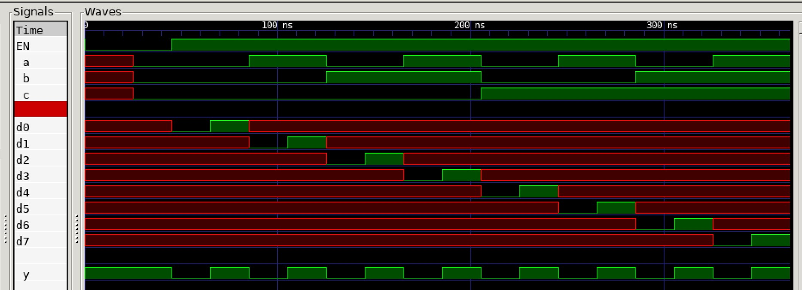

# JEFF 74x151 EXAMPLE

_8-line to 1-line data selector/multiplexer.
Based on the 7400-series integrated circuits used in my
[programable_8_bit_microprocessor](https://github.com/JeffDeCola/my-verilog-examples/tree/master/systems/microprocessors/programable_8_bit_microprocessor)._

Table of Contents

* [OVERVIEW](https://github.com/JeffDeCola/my-verilog-examples/tree/master/combinational-logic/multiplexers-and-demultiplexers/jeff_74x151#overview)
* [SCHEMATIC](https://github.com/JeffDeCola/my-verilog-examples/tree/master/combinational-logic/multiplexers-and-demultiplexers/jeff_74x151#schematic)
* [TRUTH TABLE](https://github.com/JeffDeCola/my-verilog-examples/tree/master/combinational-logic/multiplexers-and-demultiplexers/jeff_74x151#truth-table)
* [VERILOG CODE](https://github.com/JeffDeCola/my-verilog-examples/tree/master/combinational-logic/multiplexers-and-demultiplexers/jeff_74x151#verilog-code)
* [RUN (SIMULATE)](https://github.com/JeffDeCola/my-verilog-examples/tree/master/combinational-logic/multiplexers-and-demultiplexers/jeff_74x151#run-simulate)
* [VIEW WAVEFORM](https://github.com/JeffDeCola/my-verilog-examples/tree/master/combinational-logic/multiplexers-and-demultiplexers/jeff_74x151#view-waveform)
* [TESTED IN HARDWARE - BURNED TO A FPGA](https://github.com/JeffDeCola/my-verilog-examples/tree/master/combinational-logic/multiplexers-and-demultiplexers/jeff_74x151#tested-in-hardware---burned-to-a-fpga)

## OVERVIEW

_I used
[iverilog](https://github.com/JeffDeCola/my-cheat-sheets/tree/master/hardware/tools/simulation/iverilog-cheat-sheet)
to simulate and
[GTKWave](https://github.com/JeffDeCola/my-cheat-sheets/tree/master/hardware/tools/simulation/gtkwave-cheat-sheet)
to view the waveform. I also used
[Xilinx Vivado](https://github.com/JeffDeCola/my-cheat-sheets/tree/master/hardware/tools/synthesis/xilinx-vivado-cheat-sheet)
to synthesize and program this example on a
[Digilent ARTY-S7](https://github.com/JeffDeCola/my-cheat-sheets/tree/master/hardware/development/fpga-development-boards/digilent-arty-s7-cheat-sheet)
FPGA development board._

## SCHEMATIC

_This figure was created using `LaTeX` in
[my-latex-graphs](https://github.com/JeffDeCola/my-latex-graphs/tree/master/mathematics/applied/electrical-engineering/combinational-logic/74x151-multiplexer)
repo._

<p align="center">
    

## TRUTH TABLE

| en  | cba | d[7:0]   |  y  |
|:---:|:---:|:--------:|:---:|
| 0   | xxx | xxxxxxx1 | 0   |
| 1   | 000 | xxxxxxx0 | 0   |
| 1   | 000 | xxxxxxx1 | 1   |
| 1   | 001 | xxxxxx0x | 0   |
| 1   | 001 | xxxxxx1x | 1   |
| 1   | 010 | xxxxx0xx | 0   |
| 1   | 010 | xxxxx1xx | 1   |
| 1   | 011 | xxxx0xxx | 0   |
| 1   | 011 | xxxx1xxx | 1   |
| 1   | 100 | xxx0xxxx | 0   |
| 1   | 100 | xxx1xxxx | 1   |
| 1   | 101 | xx0xxxxx | 0   |
| 1   | 101 | xx1xxxxx | 1   |
| 1   | 110 | x0xxxxxx | 0   |
| 1   | 110 | x1xxxxxx | 1   |
| 1   | 111 | 0xxxxxxx | 0   |
| 1   | 111 | 1xxxxxxx | 1   |

## VERILOG CODE

The
[jeff_74x151.v](https://github.com/JeffDeCola/my-verilog-examples/blob/master/combinational-logic/multiplexers-and-demultiplexers/jeff_74x151/jeff_74x151.v)
behavioral model,

```verilog
    assign w = ~y;

    // ALWAYS BLOCK with NON-BLOCKING PROCEDURAL ASSIGNMENT STATEMENT
    always @ ( * ) begin
        if (en) begin
            case({c,b,a})
                3'b000 : y <= d0;
                3'b001 : y <= d1;
                3'b010 : y <= d2;
                3'b011 : y <= d3;
                3'b100 : y <= d4;
                3'b101 : y <= d5;
                3'b110 : y <= d6;
                3'b111 : y <= d7;
            endcase
        end else begin
            y <= 1'b1;
        end
    end
```

## RUN (SIMULATE)

The testbench uses two files,

* [jeff_74x151_tb.v](https://github.com/JeffDeCola/my-verilog-examples/blob/master/combinational-logic/multiplexers-and-demultiplexers/jeff_74x151/jeff_74x151_tb.v)
  the testbench
* [jeff_74x151_tb.tv](https://github.com/JeffDeCola/my-verilog-examples/blob/master/combinational-logic/multiplexers-and-demultiplexers/jeff_74x151/jeff_74x151_tb.tv)
  the test vectors and expected results

with,

* [jeff_74x151.vh](https://github.com/JeffDeCola/my-verilog-examples/blob/master/combinational-logic/multiplexers-and-demultiplexers/jeff_74x151/jeff_74x151.vh)
  is the header file listing the verilog models
* [run-simulation.sh](https://github.com/JeffDeCola/my-verilog-examples/blob/master/combinational-logic/multiplexers-and-demultiplexers/jeff_74x151/run-simulation.sh)
  is a script containing the commands below

Use **iverilog** to compile the verilog to a vvp format
which is used by the vvp runtime simulation engine,

```bash
iverilog -o jeff_74x151_tb.vvp jeff_74x151_tb.v jeff_74x151.vh
```

Use **vvp** to run the simulation, which checks the UUT
and creates a waveform dump file *.vcd.

```bash
vvp jeff_74x151_tb.vvp
```

The output of the test,

```text
TEST START --------------------------------

                 | TIME(ns) | EN | SEL | D        | Y |
                 --------------------------------------
   1        INIT |       15 | 0  | xxx | xxxxxxxx | 1 |
   2           - |       35 | 0  | 000 | xxxxxxxx | 1 |
   3           - |       55 | 1  | 000 | xxxxxxx0 | 0 |
   4           - |       75 | 1  | 000 | xxxxxxx1 | 1 |
   5           - |       95 | 1  | 001 | xxxxxx0x | 0 |
   6           - |      115 | 1  | 001 | xxxxxx1x | 1 |
   7           - |      135 | 1  | 010 | xxxxx0xx | 0 |
   8           - |      155 | 1  | 010 | xxxxx1xx | 1 |
   9           - |      175 | 1  | 011 | xxxx0xxx | 0 |
  10           - |      195 | 1  | 011 | xxxx1xxx | 1 |
  11           - |      215 | 1  | 100 | xxx0xxxx | 0 |
  12           - |      235 | 1  | 100 | xxx1xxxx | 1 |
  13           - |      255 | 1  | 101 | xx0xxxxx | 0 |
  14           - |      275 | 1  | 101 | xx1xxxxx | 1 |
  15           - |      295 | 1  | 110 | x0xxxxxx | 0 |
  16           - |      315 | 1  | 110 | x1xxxxxx | 1 |
  17           - |      335 | 1  | 111 | 0xxxxxxx | 0 |
  18           - |      355 | 1  | 111 | 1xxxxxxx | 1 |

 VECTORS:   18
  ERRORS:    0

TEST END ----------------------------------
```

## VIEW WAVEFORM

Open the waveform file jeff_74x151_tb.vcd file with GTKWave,

```bash
gtkwave -f jeff_74x151_tb.vcd &
```

Save your waveform to a .gtkw file.

Now you can use the script
[launch-gtkwave.sh](https://github.com/JeffDeCola/my-verilog-examples/blob/master/launch-GTKWave-script/launch-gtkwave.sh)
anytime you want,

```bash
gtkwave -f jeff_74x151_tb.gtkw &
```



## TESTED IN HARDWARE - BURNED TO A FPGA

The above code was synthesized using the
[Xilinx Vivado](https://github.com/JeffDeCola/my-cheat-sheets/tree/master/hardware/tools/synthesis/xilinx-vivado-cheat-sheet)
IDE software suite and burned to a FPGA development board.
