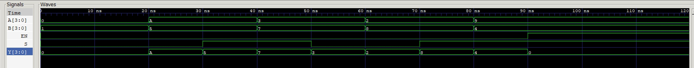

# JEFF 74x157 EXAMPLE

_Quad 2-line to 1-line data selector/multiplexer, non-inverting outputs.
Based on the 7400-series integrated circuits used in my
[programable-8-bit-microprocessor](https://github.com/JeffDeCola/my-verilog-examples/tree/master/systems/microprocessors/programable-8-bit-microprocessor)._

Table of Contents

* [VERILOG CODE](https://github.com/JeffDeCola/my-verilog-examples/tree/master/combinational-logic/multiplexers-and-demultiplexers/jeff-74x157#verilog-code)
* [RUN (SIMULATE)](https://github.com/JeffDeCola/my-verilog-examples/tree/master/combinational-logic/multiplexers-and-demultiplexers/jeff-74x157#run-simulate)
* [CHECK WAVEFORM](https://github.com/JeffDeCola/my-verilog-examples/tree/master/combinational-logic/multiplexers-and-demultiplexers/jeff-74x157#check-waveform)
* [TESTED IN HARDWARE - BURNED TO AN FPGA](https://github.com/JeffDeCola/my-verilog-examples/tree/master/combinational-logic/multiplexers-and-demultiplexers/jeff-74x157#tested-in-hardware---burned-to-an-fpga)

## VERILOG CODE

The main part of the code is,

```verilog
    reg [3:0] y;

    // 2x1 multiplexer
    always @ ( * ) begin
        if (~en) begin
            y <= 4'h0;
        end else begin
            case(s)
                1'b0 : y <= a;
                1'b1 : y <= b;
            endcase
        end
    end
```

The entire code is
[jeff-74x157.v](jeff-74x157.v).

## RUN (SIMULATE)

I used my testbench
[jeff-74x157-tb.v](jeff-74x157-tb.v) with
[iverilog](https://github.com/JeffDeCola/my-cheat-sheets/tree/master/hardware/tools/simulation/iverilog-cheat-sheet)
to simulate and create a `.vcd` file.

```bash
sh run-test.sh
```

## CHECK WAVEFORM

Check you waveform using your `.vcd` file with a waveform viewer.

I used [GTKWave](https://github.com/JeffDeCola/my-cheat-sheets/tree/master/hardware/tools/simulation/gtkwave-cheat-sheet)
and launch it using
[launch-gtkwave.sh](launch-gtkwave.sh).



## TESTED IN HARDWARE - BURNED TO AN FPGA

To test my design in real hardware, the above code was synthesized using the
[Xilinx Vivado](https://github.com/JeffDeCola/my-cheat-sheets/tree/master/hardware/tools/synthesis/xilinx-vivado-cheat-sheet)
IDE software suite and burned to a FPGA development board.
