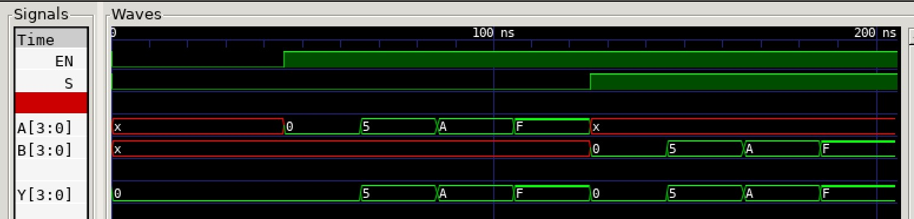

# JEFF 74x157 EXAMPLE

_Quad 2-line to 1-line data selector/multiplexer, non-inverting outputs.
Based on the 7400-series integrated circuits used in my
[programable_8_bit_microprocessor](https://github.com/JeffDeCola/my-verilog-examples/tree/master/systems/microprocessors/programable_8_bit_microprocessor)._

Table of Contents

* [OVERVIEW](https://github.com/JeffDeCola/my-verilog-examples/tree/master/combinational-logic/multiplexers-and-demultiplexers/jeff_74x157#overview)
* [SCHEMATIC](https://github.com/JeffDeCola/my-verilog-examples/tree/master/combinational-logic/multiplexers-and-demultiplexers/jeff_74x157#schematic)
* [TRUTH TABLE](https://github.com/JeffDeCola/my-verilog-examples/tree/master/combinational-logic/multiplexers-and-demultiplexers/jeff_74x157#truth-table)
* [VERILOG CODE](https://github.com/JeffDeCola/my-verilog-examples/tree/master/combinational-logic/multiplexers-and-demultiplexers/jeff_74x157#verilog-code)
* [RUN (SIMULATE)](https://github.com/JeffDeCola/my-verilog-examples/tree/master/combinational-logic/multiplexers-and-demultiplexers/jeff_74x157#run-simulate)
* [VIEW WAVEFORM](https://github.com/JeffDeCola/my-verilog-examples/tree/master/combinational-logic/multiplexers-and-demultiplexers/jeff_74x157#view-waveform)
* [TESTED IN HARDWARE - BURNED TO A FPGA](https://github.com/JeffDeCola/my-verilog-examples/tree/master/combinational-logic/multiplexers-and-demultiplexers/jeff_74x157#tested-in-hardware---burned-to-a-fpga)

## OVERVIEW

_I used
[iverilog](https://github.com/JeffDeCola/my-cheat-sheets/tree/master/hardware/tools/simulation/iverilog-cheat-sheet)
to simulate and
[GTKWave](https://github.com/JeffDeCola/my-cheat-sheets/tree/master/hardware/tools/simulation/gtkwave-cheat-sheet)
to view the waveform. I also used
[Xilinx Vivado](https://github.com/JeffDeCola/my-cheat-sheets/tree/master/hardware/tools/synthesis/xilinx-vivado-cheat-sheet)
to synthesize and program this example on a
[Digilent ARTY-S7](https://github.com/JeffDeCola/my-cheat-sheets/tree/master/hardware/development/fpga-development-boards/digilent-arty-s7-cheat-sheet)
FPGA development board._

## SCHEMATIC

_This figure was created using `LaTeX` in
[my-latex-graphs](https://github.com/JeffDeCola/my-latex-graphs/tree/master/mathematics/applied/electrical-engineering/combinational-logic/74x157-quad-multiplexer)
repo._

<p align="center">
    

## TRUTH TABLE

| en | s  |  a   |  b   |  y   |
|:--:|:--:|:----:|:----:|:----:|
| 0  | 0  | xxxx | xxxx | 0000 |
| 1  | 0  | a    | xxxx | a    |
| 1  | 1  | xxxx | b    | b    |

## VERILOG CODE

The
[jeff_74x157.v](https://github.com/JeffDeCola/my-verilog-examples/blob/master/combinational-logic/multiplexers-and-demultiplexers/jeff_74x157/jeff_74x157.v)
behavioral model,

```verilog
    // ALWAYS BLOCK with NON-BLOCKING PROCEDURAL ASSIGNMENT STATEMENT
    always @ ( * ) begin
        if (~en) begin
            y <= 4'h0;
        end else begin
            case(s)
                1'b0 : y <= a;
                1'b1 : y <= b;
            endcase
        end
    end

```

## RUN (SIMULATE)

The testbench uses two files,

* [jeff_74x157_tb.v](https://github.com/JeffDeCola/my-verilog-examples/blob/master/combinational-logic/multiplexers-and-demultiplexers/jeff_74x157/jeff_74x157_tb.v)
  the testbench
* [jeff_74x157_tb.tv](https://github.com/JeffDeCola/my-verilog-examples/blob/master/combinational-logic/multiplexers-and-demultiplexers/jeff_74x157/jeff_74x157_tb.tv)
  the test vectors and expected results

with,

* [jeff_74x157.vh](https://github.com/JeffDeCola/my-verilog-examples/blob/master/combinational-logic/multiplexers-and-demultiplexers/jeff_74x157/jeff_74x157.vh)
  is the header file listing the verilog models
* [run-simulation.sh](https://github.com/JeffDeCola/my-verilog-examples/blob/master/combinational-logic/multiplexers-and-demultiplexers/jeff_74x157/run-simulation.sh)
  is a script containing the commands below

Use **iverilog** to compile the verilog to a vvp format
which is used by the vvp runtime simulation engine,

```bash
iverilog -o jeff_74x157_tb.vvp jeff_74x157_tb.v jeff_74x157.vh
```

Use **vvp** to run the simulation, which checks the UUT
and creates a waveform dump file *.vcd.

```bash
vvp jeff_74x157_tb.vvp
```

The output of the test,

```text
TEST START --------------------------------

                 | TIME(ns) | EN | S |  A   |  B   |  Y   |
                 ------------------------------------------
   0        INIT |        0 | 0  | 0 | xxxx | xxxx | 0000 |
   1           - |       25 | 0  | 0 | xxxx | xxxx | 0000 |
   2           - |       45 | 1  | 0 | 0000 | xxxx | 0000 |
   3           - |       65 | 1  | 0 | 0101 | xxxx | 0101 |
   4           - |       85 | 1  | 0 | 1010 | xxxx | 1010 |
   5           - |      105 | 1  | 0 | 1111 | xxxx | 1111 |
   6           - |      125 | 1  | 1 | xxxx | 0000 | 0000 |
   7           - |      145 | 1  | 1 | xxxx | 0101 | 0101 |
   8           - |      165 | 1  | 1 | xxxx | 1010 | 1010 |
   9           - |      185 | 1  | 1 | xxxx | 1111 | 1111 |

 VECTORS:    9
  ERRORS:    0

TEST END ----------------------------------
```

## VIEW WAVEFORM

Open the waveform file jeff_74x157_tb.vcd file with GTKWave,

```bash
gtkwave -f jeff_74x157_tb.vcd &
```

Save your waveform to a .gtkw file.

Now you can use the script
[launch-gtkwave.sh](https://github.com/JeffDeCola/my-verilog-examples/blob/master/launch-GTKWave-script/launch-gtkwave.sh)
anytime you want,

```bash
gtkwave -f jeff_74x157_tb.gtkw &
```



## TESTED IN HARDWARE - BURNED TO A FPGA

The above code was synthesized using the
[Xilinx Vivado](https://github.com/JeffDeCola/my-cheat-sheets/tree/master/hardware/tools/synthesis/xilinx-vivado-cheat-sheet)
IDE software suite and burned to a FPGA development board.
