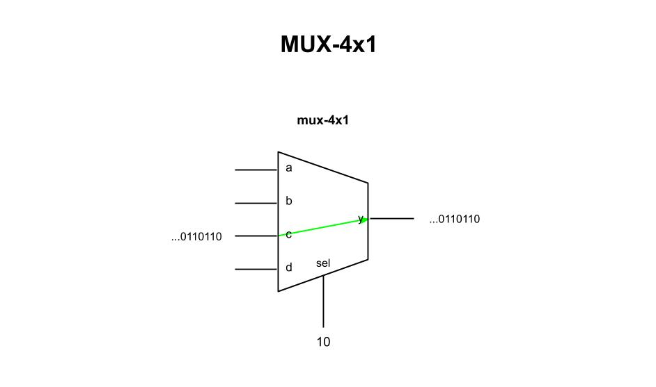

# MUX 4x1 EXAMPLE

_Multiplexer - Four inputs, one output (using a case statement)._

Table of Contents

* [OVERVIEW](https://github.com/JeffDeCola/my-verilog-examples/tree/master/combinational-logic/multiplexers-and-demultiplexers/mux_4x1#overview)
* [SCHEMATIC](https://github.com/JeffDeCola/my-verilog-examples/tree/master/combinational-logic/multiplexers-and-demultiplexers/mux_4x1#schematic)
* [VERILOG CODE](https://github.com/JeffDeCola/my-verilog-examples/tree/master/combinational-logic/multiplexers-and-demultiplexers/mux_4x1#verilog-code)
* [RUN (SIMULATE)](https://github.com/JeffDeCola/my-verilog-examples/tree/master/combinational-logic/multiplexers-and-demultiplexers/mux_4x1#run-simulate)
* [CHECK WAVEFORM](https://github.com/JeffDeCola/my-verilog-examples/tree/master/combinational-logic/multiplexers-and-demultiplexers/mux_4x1#check-waveform)
* [TESTED IN HARDWARE - BURNED TO A FPGA](https://github.com/JeffDeCola/my-verilog-examples/tree/master/combinational-logic/multiplexers-and-demultiplexers/mux_4x1#tested-in-hardware---burned-to-a-fpga)

## OVERVIEW

_I used
[iverilog](https://github.com/JeffDeCola/my-cheat-sheets/tree/master/hardware/tools/simulation/iverilog-cheat-sheet)
to simulate and
[GTKWave](https://github.com/JeffDeCola/my-cheat-sheets/tree/master/hardware/tools/simulation/gtkwave-cheat-sheet)
to view the waveform. I also used
[Xilinx Vivado](https://github.com/JeffDeCola/my-cheat-sheets/tree/master/hardware/tools/synthesis/xilinx-vivado-cheat-sheet)
to synthesize and program this example on a
[Digilent ARTY-S7](https://github.com/JeffDeCola/my-cheat-sheets/tree/master/hardware/development/fpga-development-boards/digilent-arty-s7-cheat-sheet)
FPGA development board._

## SCHEMATIC

This may help,



## VERILOG CODE

The
[mux_4x1.v](https://github.com/JeffDeCola/my-verilog-examples/blob/master/combinational-logic/multiplexers-and-demultiplexers/mux_4x1/mux_4x1.v)
uses behavioral modeling,

```verilog
    reg  y;

    always @ ( * ) begin
        case(sel)
            2'b00 : y <= a;
            2'b01 : y <= b;
            2'b10 : y <= c;
            2'b11 : y <= d;
        endcase
    end
```

## RUN (SIMULATE)

I created,

* [mux_4x1_tb.v](https://github.com/JeffDeCola/my-verilog-examples/blob/master/combinational-logic/multiplexers-and-demultiplexers/mux_4x1/mux_4x1_tb.v)
the testbench
* [mux_4x1.vh](https://github.com/JeffDeCola/my-verilog-examples/blob/master/combinational-logic/multiplexers-and-demultiplexers/mux_4x1/mux_4x1.vh)
the header file listing the verilog code
* [run-simulation.sh](https://github.com/JeffDeCola/my-verilog-examples/blob/master/combinational-logic/multiplexers-and-demultiplexers/mux_4x1/run-simulation.sh)
a script containing the commands below

Use **iverilog** to compile the verilog to a vvp format
which is used by the vvp runtime simulation engine,

```bash
iverilog -o mux_4x1_tb.vvp mux_4x1_tb.v mux_4x1.vh
```

Use **vvp** to run the simulation, which creates a waveform dump file *.vcd.

```bash
vvp mux_4x1_tb.vvp
```

## CHECK WAVEFORM

Open the waveform file mux_4x1_tb.vcd file with GTKWave,

```bash
gtkwave -f mux_4x1_tb.vcd &
```

Save your waveform to a .gtkw file.

Now you can
[launch-gtkwave.sh](https://github.com/JeffDeCola/my-verilog-examples/blob/master/launch-GTKWave-script/launch-gtkwave.sh)
anytime you want,

```bash
gtkwave -f mux_4x1_tb.gtkw &
```


## TESTED IN HARDWARE - BURNED TO A FPGA

The above code was synthesized using the
[Xilinx Vivado](https://github.com/JeffDeCola/my-cheat-sheets/tree/master/hardware/tools/synthesis/xilinx-vivado-cheat-sheet)
IDE software suite and burned to a FPGA development board.
