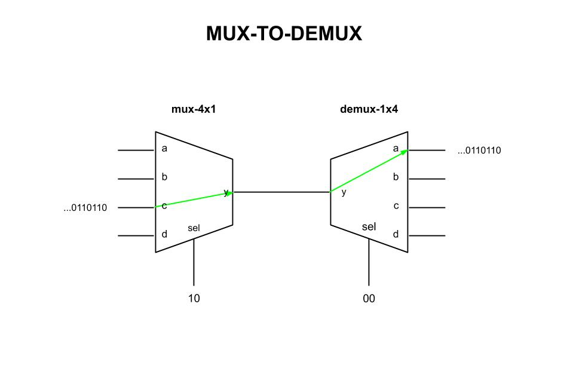
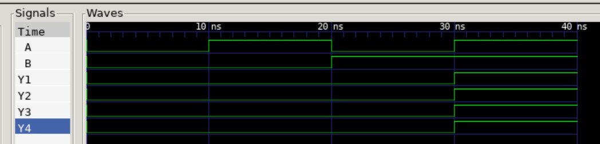

# MUX TO DEMUX EXAMPLE

_Combining the
[mux-4x1](https://github.com/JeffDeCola/my-verilog-examples/tree/master/combinational-logic/multiplexers-and-demultiplexers/mux-4x1)
to the
[demux-1x4](https://github.com/JeffDeCola/my-verilog-examples/tree/master/combinational-logic/multiplexers-and-demultiplexers/demux-1x4)
to prove the input will equal
the output (for the selected output)._

Table of Contents

* [SCHEMATIC](https://github.com/JeffDeCola/my-verilog-examples/tree/master/combinational-logic/multiplexers-and-demultiplexers/mux-to-demux#schematic)
* [VERILOG CODE](https://github.com/JeffDeCola/my-verilog-examples/tree/master/combinational-logic/multiplexers-and-demultiplexers/mux-to-demux#verilog-code)
* [RUN (SIMULATE)](https://github.com/JeffDeCola/my-verilog-examples/tree/master/combinational-logic/multiplexers-and-demultiplexers/mux-to-demux#run-simulate)
* [CHECK WAVEFORM](https://github.com/JeffDeCola/my-verilog-examples/tree/master/combinational-logic/multiplexers-and-demultiplexers/mux-to-demux#check-waveform)

## OVERVIEW

_I used
[iverilog](https://github.com/JeffDeCola/my-cheat-sheets/tree/master/hardware/tools/simulation/iverilog-cheat-sheet)
to simulate and
[GTKWave](https://github.com/JeffDeCola/my-cheat-sheets/tree/master/hardware/tools/simulation/gtkwave-cheat-sheet)
to view the waveform. I also used
[Xilinx Vivado](https://github.com/JeffDeCola/my-cheat-sheets/tree/master/hardware/tools/synthesis/xilinx-vivado-cheat-sheet)
to synthesize and program this example on a
[Digilent ARTY-S7](https://github.com/JeffDeCola/my-cheat-sheets/tree/master/hardware/development/fpga-development-boards/digilent-arty-s7-cheat-sheet)
FPGA development board._

## SCHEMATIC

This may help,



## VERILOG CODE

The
[and_gates.v](https://github.com/JeffDeCola/my-verilog-examples/blob/master/basic-code/combinational-logic/and_gates/and_gates.v)
uses behavioral modeling,

```verilog
    wire  y;

    mux_4x1 MUX_4X1 (
        .a(a_in), .b(b_in), .c(c_in), .d(d_in),
        .sel(sel),
        .y(y)
    );

    demux_1x4 DEMUX_1X4 (
        .y(y),
        .sel(sel),
        .a(a_out), .b(b_out), .c(c_out), .d(d_out)
    );
```

## RUN (SIMULATE)

I created,

* [and_gates_tb.v](https://github.com/JeffDeCola/my-verilog-examples/blob/master/basic-code/combinational-logic/and_gates/and_gates_tb.v)
the testbench
* [and_gates.vh](https://github.com/JeffDeCola/my-verilog-examples/blob/master/basic-code/combinational-logic/and_gates/and_gates.vh)
the header file listing the verilog code
* [run-simulation.sh](https://github.com/JeffDeCola/my-verilog-examples/blob/master/basic-code/combinational-logic/and_gates/run-simulation.sh)
a script containing the commands below

Use **iverilog** to compile the verilog to a vvp format
which is used by the vvp runtime simulation engine,

```bash
iverilog -o and_gates_tb.vvp and_gates_tb.v and_gates.vh
```

Use **vvp** to run the simulation, which creates a waveform dump file *.vcd.

```bash
vvp and_gates_tb.vvp
```

## CHECK WAVEFORM

Open the waveform file and_gates_tb.vcd file with GTKWave,

```bash
gtkwave -f and_gates_tb.vcd &
```

Save your waveform to a .gtkw file.

Now you can
[launch-gtkwave.sh](https://github.com/JeffDeCola/my-verilog-examples/blob/master/launch-GTKWave-script/launch-gtkwave.sh)
anytime you want,

```bash
gtkwave -f and_gates_tb.gtkw &
```



## TESTED IN HARDWARE - BURNED TO A FPGA

The above code was synthesized using the
[Xilinx Vivado](https://github.com/JeffDeCola/my-cheat-sheets/tree/master/hardware/tools/synthesis/xilinx-vivado-cheat-sheet)
IDE software suite and burned to a FPGA development board.
