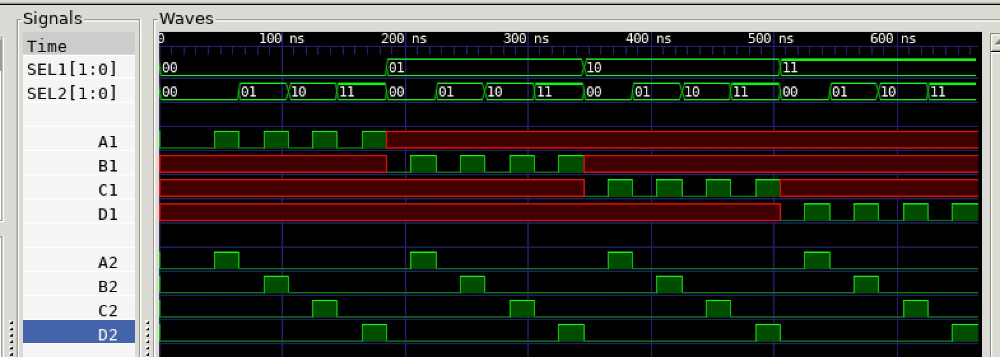

# MUX TO DEMUX EXAMPLE

_Combining the
[mux_4x1](https://github.com/JeffDeCola/my-verilog-examples/tree/master/combinational-logic/multiplexers-and-demultiplexers/mux_4x1)
to the
[demux_1x4](https://github.com/JeffDeCola/my-verilog-examples/tree/master/combinational-logic/multiplexers-and-demultiplexers/demux_1x4)
to prove the input will equal
the output (for the selected output)._

Table of Contents

* [OVERVIEW](https://github.com/JeffDeCola/my-verilog-examples/tree/master/combinational-logic/multiplexers-and-demultiplexers/mux_to_demux#overview)
* [SCHEMATIC](https://github.com/JeffDeCola/my-verilog-examples/tree/master/combinational-logic/multiplexers-and-demultiplexers/mux_to_demux#schematic)
* [TRUTH TABLE](https://github.com/JeffDeCola/my-verilog-examples/tree/master/combinational-logic/multiplexers-and-demultiplexers/mux_to_demux#truth-table)
* [VERILOG CODE](https://github.com/JeffDeCola/my-verilog-examples/tree/master/combinational-logic/multiplexers-and-demultiplexers/mux_to_demux#verilog-code)
* [RUN (SIMULATE)](https://github.com/JeffDeCola/my-verilog-examples/tree/master/combinational-logic/multiplexers-and-demultiplexers/mux_to_demux#run-simulate)
* [VIEW WAVEFORM](https://github.com/JeffDeCola/my-verilog-examples/tree/master/combinational-logic/multiplexers-and-demultiplexers/mux_to_demux#view-waveform)
* [TESTED IN HARDWARE - BURNED TO A FPGA](https://github.com/JeffDeCola/my-verilog-examples/tree/master/combinational-logic/multiplexers-and-demultiplexers/mux_to_demux#tested-in-hardware---burned-to-a-fpga)

## OVERVIEW

_I used
[iverilog](https://github.com/JeffDeCola/my-cheat-sheets/tree/master/hardware/tools/simulation/iverilog-cheat-sheet)
to simulate and
[GTKWave](https://github.com/JeffDeCola/my-cheat-sheets/tree/master/hardware/tools/simulation/gtkwave-cheat-sheet)
to view the waveform. I also used
[Xilinx Vivado](https://github.com/JeffDeCola/my-cheat-sheets/tree/master/hardware/tools/synthesis/xilinx-vivado-cheat-sheet)
to synthesize and program this example on a
[Digilent ARTY-S7](https://github.com/JeffDeCola/my-cheat-sheets/tree/master/hardware/development/fpga-development-boards/digilent-arty-s7-cheat-sheet)
FPGA development board._

## SCHEMATIC

_This figure was created using `LaTeX` in
[my-latex-graphs](https://github.com/JeffDeCola/my-latex-graphs/tree/master/mathematics/applied/electrical-engineering/combinational-logic/mux-to-demux)
repo._

<p align="center">
    

## TRUTH TABLE

| sel1 | sel2 | a1 | b1 | c1 | d1 | a2 | b2 | c2 | d2 |
|:----:|:----:|:--:|:--:|:--:|:--:|:--:|:--:|:--:|:--:|
| 00   | 00   | 0  | X  |  X |  X |  0 |  0 |  0 |  0 |
| 00   | 00   | 0  | X  |  X |  X |  0 |  0 |  0 |  0 |
| 00   | 00   | 1  | X  |  X |  X |  1 |  0 |  0 |  0 |
| 00   | 01   | 0  | X  |  X |  X |  0 |  0 |  0 |  0 |
| 00   | 01   | 1  | X  |  X |  X |  0 |  1 |  0 |  0 |
| 00   | 10   | 0  | X  |  X |  X |  0 |  0 |  0 |  0 |
| 00   | 10   | 1  | X  |  X |  X |  0 |  0 |  1 |  0 |
| 00   | 11   | 0  | X  |  X |  X |  0 |  0 |  0 |  0 |
| 00   | 11   | 1  | X  |  X |  X |  0 |  0 |  0 |  1 |
| 01   | 00   | X  | 0  |  X |  X |  0 |  0 |  0 |  0 |
| 01   | 00   | X  | 1  |  X |  X |  1 |  0 |  0 |  0 |
| 01   | 01   | X  | 0  |  X |  X |  0 |  0 |  0 |  0 |
| 01   | 01   | X  | 1  |  X |  X |  0 |  1 |  0 |  0 |
| 01   | 10   | X  | 0  |  X |  X |  0 |  0 |  0 |  0 |
| 01   | 10   | X  | 1  |  X |  X |  0 |  0 |  1 |  0 |
| 01   | 11   | X  | 0  |  X |  X |  0 |  0 |  0 |  0 |
| 01   | 11   | X  | 1  |  X |  X |  0 |  0 |  0 |  1 |
| 10   | 00   | X  | X  |  0 |  X |  0 |  0 |  0 |  0 |
| 10   | 00   | X  | X  |  1 |  X |  1 |  0 |  0 |  0 |
| 10   | 01   | X  | X  |  0 |  X |  0 |  0 |  0 |  0 |
| 10   | 01   | X  | X  |  1 |  X |  0 |  1 |  0 |  0 |
| 10   | 10   | X  | X  |  0 |  X |  0 |  0 |  0 |  0 |
| 10   | 10   | X  | X  |  1 |  X |  0 |  0 |  1 |  0 |
| 10   | 11   | X  | X  |  0 |  X |  0 |  0 |  0 |  0 |
| 10   | 11   | X  | X  |  1 |  X |  0 |  0 |  0 |  1 |
| 11   | 00   | X  | X  |  X |  0 |  0 |  0 |  0 |  0 |
| 11   | 00   | X  | X  |  X |  1 |  1 |  0 |  0 |  0 |
| 11   | 01   | X  | X  |  X |  0 |  0 |  0 |  0 |  0 |
| 11   | 01   | X  | X  |  X |  1 |  0 |  1 |  0 |  0 |
| 11   | 10   | X  | X  |  X |  0 |  0 |  0 |  0 |  0 |
| 11   | 10   | X  | X  |  X |  1 |  0 |  0 |  1 |  0 |
| 11   | 11   | X  | X  |  X |  0 |  0 |  0 |  0 |  0 |
| 11   | 11   | X  | X  |  X |  1 |  0 |  0 |  0 |  1 |

## VERILOG CODE

The
[mux_to_demux.v](https://github.com/JeffDeCola/my-verilog-examples/blob/master/combinational-logic/multiplexers-and-demultiplexers/mux_to_demux/mux_to_demux.v)
structural model,

```verilog
    wire  y;

    // 4x1 MULTIPLEXER
    mux_4x1 MUX_4X1 (
        .a(a1), .b(b1), .c(c1), .d(d1),
        .sel(sel1),
        .y(y)
    );

    // 1x4 DEMULTIPLEXER
    demux_1x4 DEMUX_1X4 (
        .y(y),
        .sel(sel2),
        .a(a2), .b(b2), .c(c2), .d(d2)
    );
```

## RUN (SIMULATE)

The testbench uses two files,

* [mux_to_demux_tb.v](https://github.com/JeffDeCola/my-verilog-examples/blob/master/combinational-logic/multiplexers-and-demultiplexers/mux_to_demux/mux_to_demux_tb.v)
  the testbench
* [mux_to_demux_tb.tv](https://github.com/JeffDeCola/my-verilog-examples/blob/master/combinational-logic/multiplexers-and-demultiplexers/mux_to_demux/mux_to_demux_tb.tv)
  the test vectors and expected results

with,

* [mux_to_demux.vh](https://github.com/JeffDeCola/my-verilog-examples/blob/master/combinational-logic/multiplexers-and-demultiplexers/mux_to_demux/mux_to_demux.vh)
  is the header file listing the verilog models
* [run-simulation.sh](https://github.com/JeffDeCola/my-verilog-examples/blob/master/combinational-logic/multiplexers-and-demultiplexers/mux_to_demux/run-simulation.sh)
  is a script containing the commands below

Use **iverilog** to compile the verilog to a vvp format
which is used by the vvp runtime simulation engine,

```bash
iverilog -o mux_to_demux_tb.vvp mux_to_demux_tb.v mux_to_demux.vh
```

Use **vvp** to run the simulation, which checks the UUT
and creates a waveform dump file *.vcd.

```bash
vvp mux_to_demux_tb.vvp
```

The output of the test,

```text
TEST START --------------------------------

                 | TIME(ns) | SEL1 | SEL2 | A1 | B1 | C1 | D1 | A2 | B2 | C2 | D2 |
                 ------------------------------------------------------------------
   1        INIT |       15 |  00  |  00  | 0  | x  | x  | x  | 0  | 0  | 0  | 0  |
   2      INPUTA |       35 |  00  |  00  | 0  | x  | x  | x  | 0  | 0  | 0  | 0  |
   3           - |       55 |  00  |  00  | 1  | x  | x  | x  | 1  | 0  | 0  | 0  |
   4           - |       75 |  00  |  01  | 0  | x  | x  | x  | 0  | 0  | 0  | 0  |
   5           - |       95 |  00  |  01  | 1  | x  | x  | x  | 0  | 1  | 0  | 0  |
   6           - |      115 |  00  |  10  | 0  | x  | x  | x  | 0  | 0  | 0  | 0  |
   7           - |      135 |  00  |  10  | 1  | x  | x  | x  | 0  | 0  | 1  | 0  |
   8           - |      155 |  00  |  11  | 0  | x  | x  | x  | 0  | 0  | 0  | 0  |
   9           - |      175 |  00  |  11  | 1  | x  | x  | x  | 0  | 0  | 0  | 1  |
  10      INPUTB |      195 |  01  |  00  | x  | 0  | x  | x  | 0  | 0  | 0  | 0  |
  11           - |      215 |  01  |  00  | x  | 1  | x  | x  | 1  | 0  | 0  | 0  |
  12           - |      235 |  01  |  01  | x  | 0  | x  | x  | 0  | 0  | 0  | 0  |
  13           - |      255 |  01  |  01  | x  | 1  | x  | x  | 0  | 1  | 0  | 0  |
  14           - |      275 |  01  |  10  | x  | 0  | x  | x  | 0  | 0  | 0  | 0  |
  15           - |      295 |  01  |  10  | x  | 1  | x  | x  | 0  | 0  | 1  | 0  |
  16           - |      315 |  01  |  11  | x  | 0  | x  | x  | 0  | 0  | 0  | 0  |
  17           - |      335 |  01  |  11  | x  | 1  | x  | x  | 0  | 0  | 0  | 1  |
  18      INPUTC |      355 |  10  |  00  | x  | x  | 0  | x  | 0  | 0  | 0  | 0  |
  19           - |      375 |  10  |  00  | x  | x  | 1  | x  | 1  | 0  | 0  | 0  |
  20           - |      395 |  10  |  01  | x  | x  | 0  | x  | 0  | 0  | 0  | 0  |
  21           - |      415 |  10  |  01  | x  | x  | 1  | x  | 0  | 1  | 0  | 0  |
  22           - |      435 |  10  |  10  | x  | x  | 0  | x  | 0  | 0  | 0  | 0  |
  23           - |      455 |  10  |  10  | x  | x  | 1  | x  | 0  | 0  | 1  | 0  |
  24           - |      475 |  10  |  11  | x  | x  | 0  | x  | 0  | 0  | 0  | 0  |
  25           - |      495 |  10  |  11  | x  | x  | 1  | x  | 0  | 0  | 0  | 1  |
  26      INPUTD |      515 |  11  |  00  | x  | x  | x  | 0  | 0  | 0  | 0  | 0  |
  27           - |      535 |  11  |  00  | x  | x  | x  | 1  | 1  | 0  | 0  | 0  |
  28           - |      555 |  11  |  01  | x  | x  | x  | 0  | 0  | 0  | 0  | 0  |
  29           - |      575 |  11  |  01  | x  | x  | x  | 1  | 0  | 1  | 0  | 0  |
  30           - |      595 |  11  |  10  | x  | x  | x  | 0  | 0  | 0  | 0  | 0  |
  31           - |      615 |  11  |  10  | x  | x  | x  | 1  | 0  | 0  | 1  | 0  |
  32           - |      635 |  11  |  11  | x  | x  | x  | 0  | 0  | 0  | 0  | 0  |
  33           - |      655 |  11  |  11  | x  | x  | x  | 1  | 0  | 0  | 0  | 1  |

 VECTORS:   33
  ERRORS:    0

TEST END ----------------------------------
```

## VIEW WAVEFORM

Open the waveform file mux_to_demux_tb.vcd file with GTKWave,

```bash
gtkwave -f mux_to_demux_tb.vcd &
```

Save your waveform to a .gtkw file.

Now you can use the script
[launch-gtkwave.sh](https://github.com/JeffDeCola/my-verilog-examples/blob/master/launch-GTKWave-script/launch-gtkwave.sh)
anytime you want,

```bash
gtkwave -f mux_to_demux_tb.gtkw &
```



## TESTED IN HARDWARE - BURNED TO A FPGA

The above code was synthesized using the
[Xilinx Vivado](https://github.com/JeffDeCola/my-cheat-sheets/tree/master/hardware/tools/synthesis/xilinx-vivado-cheat-sheet)
IDE software suite and burned to a FPGA development board.
