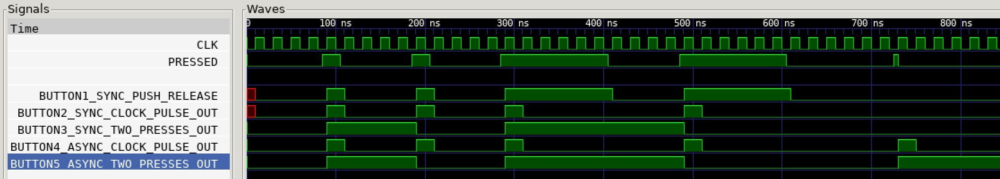

# BUTTONS EXAMPLE

_A few different ways to use buttons on a FPGA development board._

Table of Contents

* [OVERVIEW](https://github.com/JeffDeCola/my-verilog-examples/tree/master/fpga-development-boards/buttons/buttons#overview)
* [TRUTH TABLE](https://github.com/JeffDeCola/my-verilog-examples/tree/master/fpga-development-boards/buttons/buttons#truth-table)
* [VERILOG CODE](https://github.com/JeffDeCola/my-verilog-examples/tree/master/fpga-development-boards/buttons/buttons#verilog-code)
  * [BUTTON 1 - PRESS AND RELEASE OF THE BUTTON SYNCHRONOUSLY (SYNC PRESS AND RELEASE)](https://github.com/JeffDeCola/my-verilog-examples/tree/master/fpga-development-boards/buttons/buttons#button-1---press-and-release-of-the-button-synchronously-sync-press-and-release)
  * [BUTTON 2 - PULSE HIGH FOR 1 CLOCK CYCLE WHEN BUTTON PRESSED (SYNC PRESS)](https://github.com/JeffDeCola/my-verilog-examples/tree/master/fpga-development-boards/buttons/buttons#button-2---pulse-high-for-1-clock-cycle-when-button-pressed-sync-press)
  * [BUTTON 3 - TWO PRESSES - FIRST PRESS HIGH, SECOND PRESS LOW (SYNC PRESSES)](https://github.com/JeffDeCola/my-verilog-examples/tree/master/fpga-development-boards/buttons/buttons#button-3---two-presses---first-press-high-second-press-low-sync-presses)
  * [BUTTON 4 - PULSE HIGH FOR 1 CLOCK CYCLE WHEN BUTTON PRESSED (ACYNC PRESS)](https://github.com/JeffDeCola/my-verilog-examples/tree/master/fpga-development-boards/buttons/buttons#button-4---pulse-high-for-1-clock-cycle-when-button-pressed-acync-press)
  * [BUTTON 5 - TWO PRESSES - FIRST PRESS HIGH, SECOND PRESS LOW (ASYNC PRESSES)](https://github.com/JeffDeCola/my-verilog-examples/tree/master/fpga-development-boards/buttons/buttons#button-5---two-presses---first-press-high-second-press-low-async-presses)
* [RUN (SIMULATE)](https://github.com/JeffDeCola/my-verilog-examples/tree/master/fpga-development-boards/buttons/buttons#run-simulate)
* [VIEW WAVEFORM](https://github.com/JeffDeCola/my-verilog-examples/tree/master/fpga-development-boards/buttons/buttons#view-waveform)
* [TESTED IN HARDWARE - BURNED TO A FPGA](https://github.com/JeffDeCola/my-verilog-examples/tree/master/fpga-development-boards/buttons/buttons#tested-in-hardware---burned-to-a-fpga)

## OVERVIEW

_I used
[iverilog](https://github.com/JeffDeCola/my-cheat-sheets/tree/master/hardware/tools/simulation/iverilog-cheat-sheet)
to simulate and
[GTKWave](https://github.com/JeffDeCola/my-cheat-sheets/tree/master/hardware/tools/simulation/gtkwave-cheat-sheet)
to view the waveform. I also used
[Xilinx Vivado](https://github.com/JeffDeCola/my-cheat-sheets/tree/master/hardware/tools/synthesis/xilinx-vivado-cheat-sheet)
to synthesize and program this example on a
[Digilent ARTY-S7](https://github.com/JeffDeCola/my-cheat-sheets/tree/master/hardware/development/fpga-development-boards/digilent-arty-s7-cheat-sheet)
FPGA development board._

## TRUTH TABLE

| pressed  | out  |
|:--------:|:----:|
| 0        | 0    |
| 1        | 1    |

## VERILOG CODE

The
[buttons.v](https://github.com/JeffDeCola/my-verilog-examples/blob/master/fpga-development-boards/buttons/buttons/buttons.v)
behavioral models

### BUTTON 1 - PRESS AND RELEASE OF THE BUTTON SYNCHRONOUSLY (SYNC PRESS AND RELEASE)

I designed a few buttons. The entire code is
[buttons.v](https://github.com/JeffDeCola/my-verilog-examples/blob/master/fpga-development-boards/buttons/buttons/buttons.v)
that uses behavioral modeling,

```verilog
    // ALWAYS BLOCK with NON-BLOCKING PROCEDURAL ASSIGNMENT STATEMENT
    always @(posedge clk) begin
            if (pressed) begin          // BUTTON PRESSED
                out <= 1'b1;
            end else begin              //  BUTTON NOT PRESSED
                out <= 1'b0;
            end
    end
```

### BUTTON 2 - PULSE HIGH FOR 1 CLOCK CYCLE WHEN BUTTON PRESSED (SYNC PRESS)

```verilog
    reg lock = 0;

    // ALWAYS BLOCK with NON-BLOCKING PROCEDURAL ASSIGNMENT STATEMENT
    always @(posedge clk) begin
            if (pressed & ~lock) begin              // BUTTON PRESSED
                lock <= 1'b1;                       // - Lock
                out <= 1'b1;                        // - Pulse
            end else if (~pressed & lock) begin     // RELEASE LOCK
                lock <= 1'b0;
                out <= 1'b0;
            end else begin
                out <= 1'b0;
            end
    end
```

### BUTTON 3 - TWO PRESSES - FIRST PRESS HIGH, SECOND PRESS LOW (SYNC PRESSES)

```verilog
    reg lock = 0;
    reg toggle = 0;

    assign out = toggle;

    // ALWAYS BLOCK with NON-BLOCKING PROCEDURAL ASSIGNMENT STATEMENT
    always @ (posedge clk) begin
        if (pressed & ~lock) begin              // BUTTON PRESSED
            lock <= 1'b1;                       // - Lock
            toggle <= ~toggle;                  // - Toggle
        end else if (~pressed & lock) begin     // WAIT TILL BUTTON RELEASED
            lock <= 1'b0;                       // - Release Lock
        end
    end
```

### BUTTON 4 - PULSE HIGH FOR 1 CLOCK CYCLE WHEN BUTTON PRESSED (ACYNC PRESS)

Don't use, this is here for fun.

```verilog
    assign out = pre_out;

    // ALWAYS BLOCK with NON-BLOCKING PROCEDURAL ASSIGNMENT STATEMENT
    always @(posedge clk or posedge pressed) begin
        if (pressed & ~was_pressed & ~lock) begin       // BUTTON PRESSED - Then forget about it until later
            was_pressed <= 1'b1;
        end else if (was_pressed & ~lock) begin         // OUT HIGH
            lock <= 1;
            was_pressed <= 0;
            pre_out <= 1'b1;
        end else if (lock & out) begin                  // OUT LOW
            pre_out <= 1'b0;
        end else if (~pressed & lock) begin             // WAIT TILL BUTTON RELEASED
            lock <= 1'b0;
        end
    end
```

### BUTTON 5 - TWO PRESSES - FIRST PRESS HIGH, SECOND PRESS LOW (ASYNC PRESSES)

Don't use, this is here for fun.

```verilog
    assign out = toggle;

    // ALWAYS BLOCK with NON-BLOCKING PROCEDURAL ASSIGNMENT STATEMENT
    always @(posedge clk or posedge pressed) begin
        if (pressed & ~was_pressed & ~lock) begin       // BUTTON PRESSED - Then forget about it for now
            was_pressed <= 1'b1;
        end else if (was_pressed & ~lock) begin         // OUT HIGH
            toggle <= ~toggle;                          // - toggle
            was_pressed <= 1'b0;
            lock <= 1;
        end else if (~pressed & lock) begin             // WAIT TILL BUTTON RELEASED
            lock <= 1'b0;
        end
    end
```

## RUN (SIMULATE)

The testbench uses two files,

* [buttons_tb.v](https://github.com/JeffDeCola/my-verilog-examples/blob/master/fpga-development-boards/buttons/buttons/buttons_tb.v)
  the testbench
* [buttons_tb.tv](https://github.com/JeffDeCola/my-verilog-examples/blob/master/fpga-development-boards/buttons/buttons/buttons_tb.tv)
  the test vectors and expected results

with,

* [buttons.vh](https://github.com/JeffDeCola/my-verilog-examples/blob/master/fpga-development-boards/buttons/buttons/buttons.vh)
  is the header file listing the verilog models
* [run-simulation.sh](https://github.com/JeffDeCola/my-verilog-examples/blob/master/fpga-development-boards/buttons/buttons/run-simulation.sh)
  is a script containing the commands below

Use **iverilog** to compile the verilog to a vvp format
which is used by the vvp runtime simulation engine,

```bash
iverilog -o buttons_tb.vvp buttons_tb.v buttons.vh
```

Use **vvp** to run the simulation, which checks the UUT
and creates a waveform dump file *.vcd.

```bash
vvp buttons_tb.vvp
```

The output of the test,

```text
TEST START --------------------------------

                                         1     2     3     4     5
                 | TIME(ns) | PRESSED | OUT | OUT | OUT | OUT | OUT |
                 ----------------------------------------------------
   1        INIT |       15 |    0    |  0  |  0  |  0  |  0  |  0  |
   2           - |       35 |    0    |  0  |  0  |  0  |  0  |  0  |
   3           - |       55 |    0    |  0  |  0  |  0  |  0  |  0  |
   4           - |       75 |    0    |  0  |  0  |  0  |  0  |  0  |
   5     PRESSED |       95 |    1    |  1  |  1  |  1  |  1  |  1  |
   6           - |      115 |    0    |  0  |  0  |  1  |  0  |  1  |
   7           - |      135 |    0    |  0  |  0  |  1  |  0  |  1  |
   8           - |      155 |    0    |  0  |  0  |  1  |  0  |  1  |
   9           - |      175 |    0    |  0  |  0  |  1  |  0  |  1  |
  10     PRESSED |      195 |    1    |  1  |  1  |  0  |  1  |  0  |
  11           - |      215 |    0    |  0  |  0  |  0  |  0  |  0  |
  12           - |      235 |    0    |  0  |  0  |  0  |  0  |  0  |
  13           - |      255 |    0    |  0  |  0  |  0  |  0  |  0  |
  14           - |      275 |    0    |  0  |  0  |  0  |  0  |  0  |
  15     PRESSED |      295 |    1    |  1  |  1  |  1  |  1  |  1  |
  16        HOLD |      315 |    1    |  1  |  0  |  1  |  0  |  1  |
  17        HOLD |      335 |    1    |  1  |  0  |  1  |  0  |  1  |
  18        HOLD |      355 |    1    |  1  |  0  |  1  |  0  |  1  |
  19        HOLD |      375 |    1    |  1  |  0  |  1  |  0  |  1  |
  20        HOLD |      395 |    1    |  1  |  0  |  1  |  0  |  1  |
  21           - |      415 |    0    |  0  |  0  |  1  |  0  |  1  |
  22           - |      435 |    0    |  0  |  0  |  1  |  0  |  1  |
  23           - |      455 |    0    |  0  |  0  |  1  |  0  |  1  |
  24           - |      475 |    0    |  0  |  0  |  1  |  0  |  1  |
  25     PRESSED |      495 |    1    |  1  |  1  |  0  |  1  |  0  |
  26        HOLD |      515 |    1    |  1  |  0  |  0  |  0  |  0  |
  27        HOLD |      535 |    1    |  1  |  0  |  0  |  0  |  0  |
  28        HOLD |      555 |    1    |  1  |  0  |  0  |  0  |  0  |
  29        HOLD |      575 |    1    |  1  |  0  |  0  |  0  |  0  |
  30        HOLD |      595 |    1    |  1  |  0  |  0  |  0  |  0  |
  31           - |      615 |    0    |  0  |  0  |  0  |  0  |  0  |
  32           - |      635 |    0    |  0  |  0  |  0  |  0  |  0  |
  33           - |      655 |    0    |  0  |  0  |  0  |  0  |  0  |
  34           - |      675 |    0    |  0  |  0  |  0  |  0  |  0  |
  35           - |      695 |    0    |  0  |  0  |  0  |  0  |  0  |
  36           - |      715 |    0    |  0  |  0  |  0  |  0  |  0  |
  37       ASYNC |      735 |    0    |  0  |  0  |  0  |  1  |  1  |
  38           - |      755 |    0    |  0  |  0  |  0  |  0  |  1  |
  39           - |      775 |    0    |  0  |  0  |  0  |  0  |  1  |
  40           - |      795 |    0    |  0  |  0  |  0  |  0  |  1  |
  41           - |      815 |    0    |  0  |  0  |  0  |  0  |  1  |
  42           - |      835 |    0    |  0  |  0  |  0  |  0  |  1  |

 VECTORS:   42
  ERRORS:    0

TEST END ----------------------------------
```

## VIEW WAVEFORM

Open the waveform file buttons_tb.vcd file with GTKWave,

```bash
gtkwave -f buttons_tb.vcd &
```

Save your waveform to a .gtkw file.

Now you can use the script
[launch-gtkwave.sh](https://github.com/JeffDeCola/my-verilog-examples/blob/master/launch-GTKWave-script/launch-gtkwave.sh)
anytime you want,

```bash
gtkwave -f buttons_tb.gtkw &
```



## TESTED IN HARDWARE - BURNED TO A FPGA

The above code was synthesized using the
[Xilinx Vivado](https://github.com/JeffDeCola/my-cheat-sheets/tree/master/hardware/tools/synthesis/xilinx-vivado-cheat-sheet)
IDE software suite and burned to a FPGA development board.
