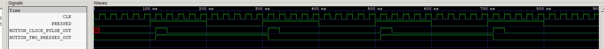

# BUTTONS EXAMPLE

_A few different ways to use buttons on a FPGA development board._

Table of Contents

* [OVERVIEW](https://github.com/JeffDeCola/my-verilog-examples/tree/master/fpga-development-boards/buttons/buttons#overview)
* [PRESS AND RELEASE OF THE BUTTON SYNCHRONOUSLY (SYNCHRONOUS PRESS AND RELEASE)](https://github.com/JeffDeCola/my-verilog-examples/tree/master/fpga-development-boards/buttons/buttons#press-and-release-of-the-button-synchronously-synchronous-press-and-release)
* [PULSE HIGH FOR 1 CLOCK CYCLE WHEN BUTTON PRESSED (SYNCHRONOUS PRESS)](https://github.com/JeffDeCola/my-verilog-examples/tree/master/fpga-development-boards/buttons/buttons#pulse-high-for-1-clock-cycle-when-button-pressed-synchronous-press)
* [TWO PRESSES - FIRST PRESS HIGH, SECOND PRESS LOW (SYNCHRONOUS PRESSES)](https://github.com/JeffDeCola/my-verilog-examples/tree/master/fpga-development-boards/buttons/buttons#two-presses---first-press-high-second-press-low-synchronous-presses)
* [RUN (SIMULATE)](https://github.com/JeffDeCola/my-verilog-examples/tree/master/fpga-development-boards/buttons/buttons#run-simulate)
* [CHECK WAVEFORM](https://github.com/JeffDeCola/my-verilog-examples/tree/master/fpga-development-boards/buttons/buttons#check-waveform)
* [TESTED IN HARDWARE - BURNED TO A FPGA](https://github.com/JeffDeCola/my-verilog-examples/tree/master/fpga-development-boards/buttons/buttons#tested-in-hardware---burned-to-a-fpga)

Documentation and Reference

* [Xilinx Vivado](https://github.com/JeffDeCola/my-cheat-sheets/tree/master/hardware/tools/synthesis/xilinx-vivado-cheat-sheet)
  used to synthesize and program an FPGA on a development board
* These buttons used in a FPGA with my
  [programable_8_bit_microprocessor](https://github.com/JeffDeCola/my-verilog-examples/tree/master/systems/microprocessors/programable_8_bit_microprocessor)
* [Digilent ARTY-S7](https://github.com/JeffDeCola/my-cheat-sheets/tree/master/hardware/development/fpga-development-boards/digilent-arty-s7-cheat-sheet)
  FPGA development board

## OVERVIEW

_I used
[iverilog](https://github.com/JeffDeCola/my-cheat-sheets/tree/master/hardware/tools/simulation/iverilog-cheat-sheet)
to simulate and
[GTKWave](https://github.com/JeffDeCola/my-cheat-sheets/tree/master/hardware/tools/simulation/gtkwave-cheat-sheet)
to view the waveform. I also used
[Xilinx Vivado](https://github.com/JeffDeCola/my-cheat-sheets/tree/master/hardware/tools/synthesis/xilinx-vivado-cheat-sheet)
to synthesize and program this example on a
[Digilent ARTY-S7](https://github.com/JeffDeCola/my-cheat-sheets/tree/master/hardware/development/fpga-development-boards/digilent-arty-s7-cheat-sheet)
FPGA development board._

## PRESS AND RELEASE OF THE BUTTON SYNCHRONOUSLY (SYNCHRONOUS PRESS AND RELEASE)

I designed a few buttons. The entire code is
[buttons.v](https://github.com/JeffDeCola/my-verilog-examples/blob/master/fpga-development-boards/buttons/buttons/buttons.v)
that uses behavioral modeling,

```verilog
    always @ (posedge clk) begin
            if (pressed) begin          // BUTTON PRESSED
                out <= 1'b1;
            end else begin              //  BUTTON NOT PRESSED
                out <= 1'b0;
            end
    end
```

## PULSE HIGH FOR 1 CLOCK CYCLE WHEN BUTTON PRESSED (SYNCHRONOUS PRESS)

```verilog
    reg lock = 0;

    always @ (posedge clk) begin
            if (pressed & ~lock) begin              // BUTTON PRESSED
                lock <= 1'b1;                       // - Lock
                out <= 1'b1;                        // - Pulse
            end else if (~pressed & lock) begin     // RELEASE LOCK
                lock <= 1'b0;
                out <= 1'b0;
            end else begin
                out <= 1'b0;
            end
    end
```

## TWO PRESSES - FIRST PRESS HIGH, SECOND PRESS LOW (SYNCHRONOUS PRESSES)

```verilog
    reg lock = 0;
    reg toggle = 0;

    assign out = toggle;

    always @ (posedge clk) begin
        if (pressed & ~lock) begin              // BUTTON PRESSED
            lock <= 1'b1;                       // - Lock
            toggle <= ~toggle;                  // - Toggle
        end else if (~pressed & lock) begin     // WAIT TILL BUTTON RELEASED
            lock <= 1'b0;                       // - Release Lock
        end
    end
```

## RUN (SIMULATE)

I created,

* [buttons_tb.v](https://github.com/JeffDeCola/my-verilog-examples/blob/master/fpga-development-boards/buttons/buttons/buttons_tb.v)
  the testbench
* [buttons.vh](https://github.com/JeffDeCola/my-verilog-examples/blob/master/fpga-development-boards/buttons/buttons/buttons.vh)
  the header file listing the verilog code
* [run-simulation.sh](https://github.com/JeffDeCola/my-verilog-examples/blob/master/fpga-development-boards/buttons/buttons/run-simulation.sh)
  a script containing the commands below

Use **iverilog** to compile the verilog to a vvp format
which is used by the vvp runtime simulation engine,

```bash
iverilog -o buttons_tb.vvp buttons_tb.v buttons.vh
```

Use **vvp** to run the simulation, which creates a waveform dump file *.vcd.

```bash
vvp buttons_tb.vvp
```

## CHECK WAVEFORM

Open the waveform file buttons_tb.vcd file with GTKWave,

```bash
gtkwave -f buttons_tb.vcd &
```

Save your waveform to a .gtkw file.

Now you can
[launch-gtkwave.sh](https://github.com/JeffDeCola/my-verilog-examples/blob/master/launch-GTKWave-script/launch-gtkwave.sh)
anytime you want,

```bash
gtkwave -f buttons_tb.gtkw &
```



## TESTED IN HARDWARE - BURNED TO A FPGA

The above code was synthesized using the
[Xilinx Vivado](https://github.com/JeffDeCola/my-cheat-sheets/tree/master/hardware/tools/synthesis/xilinx-vivado-cheat-sheet)
IDE software suite and burned to a FPGA development board.
