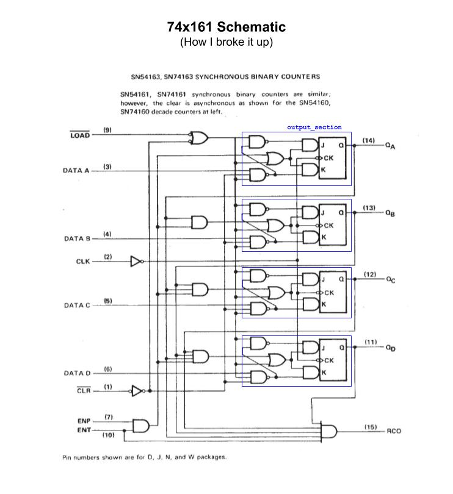
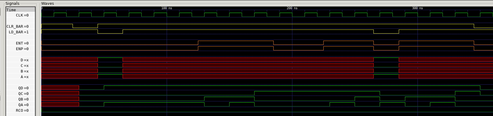

# JEFF 74x161 EXAMPLE

_Synchronous presettable 4-bit binary counter, asynchronous clear.
Based on the 7400-series integrated circuits used in my
[programable_8_bit_microprocessor](https://github.com/JeffDeCola/my-verilog-examples/tree/master/systems/microprocessors/programable_8_bit_microprocessor)._

Table of Contents

* [OVERVIEW](https://github.com/JeffDeCola/my-verilog-examples/tree/master/sequential-logic/counters/jeff_74x161#overview)
* [SCHEMATIC](https://github.com/JeffDeCola/my-verilog-examples/tree/master/sequential-logic/counters/jeff_74x161#schematic)
* [TRUTH TABLE](https://github.com/JeffDeCola/my-verilog-examples/tree/master/sequential-logic/counters/jeff_74x161#truth-table)
* [VERILOG CODE](https://github.com/JeffDeCola/my-verilog-examples/tree/master/sequential-logic/counters/jeff_74x161#verilog-code)
* [RUN (SIMULATE)](https://github.com/JeffDeCola/my-verilog-examples/tree/master/sequential-logic/counters/jeff_74x161#run-simulate)
* [VIEW WAVEFORM](https://github.com/JeffDeCola/my-verilog-examples/tree/master/sequential-logic/counters/jeff_74x161#view-waveform)
* [TESTED IN HARDWARE - BURNED TO A FPGA](https://github.com/JeffDeCola/my-verilog-examples/tree/master/sequential-logic/counters/jeff_74x161#tested-in-hardware---burned-to-a-fpga)

Documentation and Reference

* I'm using my
  [jk_flip_flop_pos_edge_sync_clear](https://github.com/JeffDeCola/my-verilog-examples/tree/master/basic-code/sequential-logic/jk_flip_flop_pos_edge_sync_clear)

## OVERVIEW

_I used
[iverilog](https://github.com/JeffDeCola/my-cheat-sheets/tree/master/hardware/tools/simulation/iverilog-cheat-sheet)
to simulate and
[GTKWave](https://github.com/JeffDeCola/my-cheat-sheets/tree/master/hardware/tools/simulation/gtkwave-cheat-sheet)
to view the waveform. I also used
[Xilinx Vivado](https://github.com/JeffDeCola/my-cheat-sheets/tree/master/hardware/tools/synthesis/xilinx-vivado-cheat-sheet)
to synthesize and program this example on a
[Digilent ARTY-S7](https://github.com/JeffDeCola/my-cheat-sheets/tree/master/hardware/development/fpga-development-boards/digilent-arty-s7-cheat-sheet)
FPGA development board._

## SCHEMATIC

I designed this processor form the 1976 Texas Instruments spec sheet.
The `clr_bar` is connected directly to the JK flip-flops.



## TRUTH TABLE

| clr_bar | ld_bar | ent | enp | d | c | b | a | qd | qc  | qb  | qa  | rco | COMMENT |
|:-------:|:------:|:---:|:---:|:-:|:-:|:-:|:-:|:--:|:---:|:---:|:---:|:---:|:--------|
|    1    |    1   |  0  |  0  | x | x | x | x | qd | qc  | qb  | qa  | rco | WAIT    |
|    0    |    1   |  0  |  0  | x | x | x | x | 0  | 0   | 0   | 0   |  0  | CLEAR   |
|    1    |    0   |  0  |  0  | d | c | b | a | d  | c   | b   | a   |  0  | LOAD    |
|    1    |    1   |  1  |  1  | x | x | x | x | +  | +   | +   | +   |  0  | COUNT   |

## VERILOG CODE

The
[jeff_74x161.v](https://github.com/JeffDeCola/my-verilog-examples/blob/master/sequential-logic/counters/jeff_74x161/jeff_74x161.v)
dataflow and structural model.

```verilog
    wire ld;
    wire ent_and_enp;

    assign rco = ent & qd & qc & qb & qa;

    assign ld = ~ld_bar;
    assign ent_and_enp = ent & enp;

    assign feedback_qd = ent_and_enp & qc & qb & qa;

    output_section OUTPUT_QD (
        .clr_bar(clr_bar),
        .ld(ld),
        .feedback(feedback_qd),
        .clk(clk),
        .data(d),
        .q(qd)
    );

    assign feedback_qc =  ent_and_enp & qb & qa;

    output_section OUTPUT_QC (
        .clr_bar(clr_bar),
        .ld(ld),
        .feedback(feedback_qc),
        .clk(clk),
        .data(c),
        .q(qc)
    );

    assign feedback_qb = ent_and_enp & qa;

    output_section OUTPUT_QB (
        .clr_bar(clr_bar),
        .ld(ld),
        .feedback(feedback_qb),
        .clk(clk),
        .data(b),
        .q(qb)
    );

    assign feedback_qa = ent_and_enp;

    output_section OUTPUT_QA (
        .clr_bar(clr_bar),
        .ld(ld),
        .feedback(feedback_qa),
        .clk(clk),
        .data(a),
        .q(qa)
    );
```

## RUN (SIMULATE)

The testbench uses two files,

* [jeff_74x161_tb.v](https://github.com/JeffDeCola/my-verilog-examples/blob/master/sequential-logic/counters/jeff_74x161/jeff_74x161_tb.v)
  the testbench
* [jeff_74x161_tb.tv](https://github.com/JeffDeCola/my-verilog-examples/blob/master/sequential-logic/counters/jeff_74x161/jeff_74x161_tb.tv)
  the test vectors and expected results

with,

* [jeff_74x161.vh](https://github.com/JeffDeCola/my-verilog-examples/blob/master/sequential-logic/counters/jeff_74x161/jeff_74x161.vh)
  is the header file listing the verilog models
* [run-simulation.sh](https://github.com/JeffDeCola/my-verilog-examples/blob/master/sequential-logic/counters/jeff_74x161/run-simulation.sh)
  is a script containing the commands below

Use **iverilog** to compile the verilog to a vvp format
which is used by the vvp runtime simulation engine,

```bash
iverilog -o jeff_74x161_tb.vvp jeff_74x161_tb.v jeff_74x161.vh
```

Use **vvp** to run the simulation, which checks the UUT
and creates a waveform dump file *.vcd.

```bash
vvp jeff_74x161_tb.vvp
```

The output of the test,

```text
TEST START --------------------------------

                 | TIME(ns) | CLR_BAR | LD_BAR | ENT | ENP | D | C | B | A | QD | QC | QB | QA | RCO |
                 -------------------------------------------------------------------------------------
   1        INIT |       15 |    1    |   1    |  0  | 0  | x  | x | x | x | x  | x  | x  | x  | 0   |
   2       CLEAR |       35 |    0    |   1    |  0  | 0  | x  | x | x | x | 0  | 0  | 0  | 0  | 0   |
   3      LOAD-9 |       55 |    1    |   0    |  0  | 0  | 1  | 0 | 0 | 1 | 1  | 0  | 0  | 1  | 0   |
   4      WAIT-1 |       75 |    1    |   1    |  0  | 0  | x  | x | x | x | 1  | 0  | 0  | 1  | 0   |
   5      WAIT-2 |       95 |    1    |   1    |  0  | 0  | x  | x | x | x | 1  | 0  | 0  | 1  | 0   |
   6      WAIT-3 |      115 |    1    |   1    |  0  | 0  | x  | x | x | x | 1  | 0  | 0  | 1  | 0   |
   7     COUNT-9 |      135 |    1    |   1    |  1  | 1  | x  | x | x | x | 1  | 0  | 1  | 0  | 0   |
   8    COUNT-10 |      155 |    1    |   1    |  1  | 1  | x  | x | x | x | 1  | 0  | 1  | 1  | 0   |
   9    COUNT-11 |      175 |    1    |   1    |  1  | 1  | x  | x | x | x | 1  | 1  | 0  | 0  | 0   |
  10      WAIT-4 |      195 |    1    |   1    |  0  | 0  | x  | x | x | x | 1  | 1  | 0  | 0  | 0   |
  11      WAIT-5 |      215 |    1    |   1    |  0  | 0  | x  | x | x | x | 1  | 1  | 0  | 0  | 0   |
  12    COUNT-12 |      235 |    1    |   1    |  1  | 1  | x  | x | x | x | 1  | 1  | 0  | 1  | 0   |
  13    COUNT-13 |      255 |    1    |   1    |  1  | 1  | x  | x | x | x | 1  | 1  | 1  | 0  | 0   |
  14      LOAD-9 |      275 |    1    |   0    |  0  | 0  | 1  | 0 | 0 | 1 | 1  | 0  | 0  | 1  | 0   |
  15     COUNT-9 |      295 |    1    |   1    |  1  | 1  | x  | x | x | x | 1  | 0  | 1  | 0  | 0   |
  16    COUNT-10 |      315 |    1    |   1    |  1  | 1  | x  | x | x | x | 1  | 0  | 1  | 1  | 0   |
  17    COUNT-11 |      335 |    1    |   1    |  1  | 1  | x  | x | x | x | 1  | 1  | 0  | 0  | 0   |
  18       CLEAR |      355 |    0    |   1    |  0  | 0  | x  | x | x | x | 0  | 0  | 0  | 0  | 0   |

 VECTORS:   18
  ERRORS:    0

TEST END ----------------------------------
```

## VIEW WAVEFORM

Open the waveform file jeff_74x161_tb.vcd file with GTKWave,

```bash
gtkwave -f jeff_74x161_tb.vcd &
```

Save your waveform to a .gtkw file.

Now you can use the script
[launch-gtkwave.sh](https://github.com/JeffDeCola/my-verilog-examples/blob/master/launch-GTKWave-script/launch-gtkwave.sh)
anytime you want,

```bash
gtkwave -f jeff_74x161_tb.gtkw &
```



## TESTED IN HARDWARE - BURNED TO A FPGA

The above code was synthesized using the
[Xilinx Vivado](https://github.com/JeffDeCola/my-cheat-sheets/tree/master/hardware/tools/synthesis/xilinx-vivado-cheat-sheet)
IDE software suite and burned to a FPGA development board.
