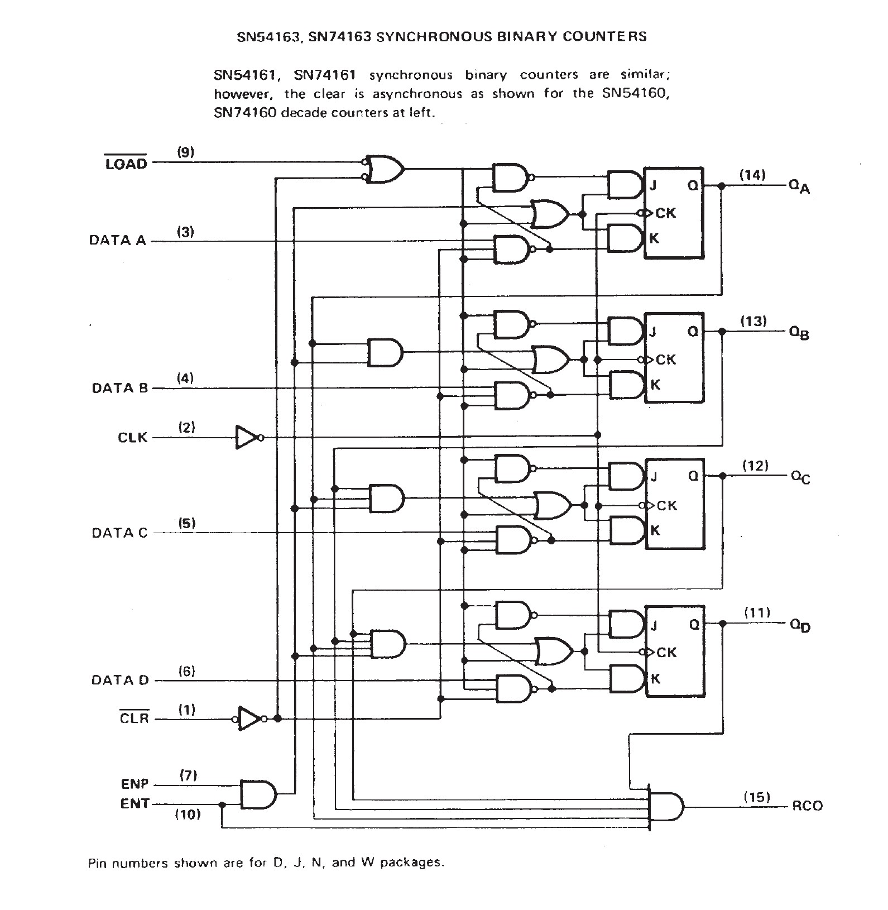

# JEFF 74x161 EXAMPLE

_Synchronous presettable 4-bit binary counter, asynchronous clear.
Based on the 7400-series integrated circuits used in my
[programable-8-bit-microprocessor](https://github.com/JeffDeCola/my-verilog-examples/tree/master/systems/microprocessors/programable-8-bit-microprocessor)._

Table of Contents

* [OVERVIEW](https://github.com/JeffDeCola/my-verilog-examples/tree/master/sequential-logic/counters/jeff_74x161#overview)
* [SCHEMATIC](https://github.com/JeffDeCola/my-verilog-examples/tree/master/sequential-logic/counters/jeff_74x161#schematic)
* [VERILOG CODE](https://github.com/JeffDeCola/my-verilog-examples/tree/master/sequential-logic/counters/jeff_74x161#verilog-code)
* [RUN (SIMULATE)](https://github.com/JeffDeCola/my-verilog-examples/tree/master/sequential-logic/counters/jeff_74x161#run-simulate)
* [CHECK WAVEFORM](https://github.com/JeffDeCola/my-verilog-examples/tree/master/sequential-logic/counters/jeff_74x161#check-waveform)
* [TESTED IN HARDWARE - BURNED TO A FPGA](https://github.com/JeffDeCola/my-verilog-examples/tree/master/sequential-logic/counters/jeff_74x161#tested-in-hardware---burned-to-a-fpga)

Documentation and Reference

* I'm using my
  [jk-flip-flop](https://github.com/JeffDeCola/my-verilog-examples/tree/master/basic-code/sequential-logic/jk-flip-flop)

## OVERVIEW

_I used
[iverilog](https://github.com/JeffDeCola/my-cheat-sheets/tree/master/hardware/tools/simulation/iverilog-cheat-sheet)
to simulate and
[GTKWave](https://github.com/JeffDeCola/my-cheat-sheets/tree/master/hardware/tools/simulation/gtkwave-cheat-sheet)
to view the waveform. I also used
[Xilinx Vivado](https://github.com/JeffDeCola/my-cheat-sheets/tree/master/hardware/tools/synthesis/xilinx-vivado-cheat-sheet)
to synthesize and program this example on a
[Digilent ARTY-S7](https://github.com/JeffDeCola/my-cheat-sheets/tree/master/hardware/development/fpga-development-boards/digilent-arty-s7-cheat-sheet)
FPGA development board._

## SCHEMATIC

I designed this processor form the 1976 Texas Instruments spec sheet.
The `clr_bar` is connected directly to the JK flip-flops.



## VERILOG CODE

The
[jeff_74x161.v](https://github.com/JeffDeCola/my-verilog-examples/blob/master/sequential-logic/counters/jeff_74x161/jeff_74x161.v)
uses behavioral modeling.

## RUN (SIMULATE)

I created,

* [jeff_74x161_tb.v](https://github.com/JeffDeCola/my-verilog-examples/blob/master/sequential-logic/counters/jeff_74x161/jeff_74x161_tb.v)
  the testbench
* [jeff_74x161.vh](https://github.com/JeffDeCola/my-verilog-examples/blob/master/sequential-logic/counters/jeff_74x161/jeff_74x161.vh)
  the header file listing the verilog code
* [run-simulation.sh](https://github.com/JeffDeCola/my-verilog-examples/blob/master/sequential-logic/counters/jeff_74x161/run-simulation.sh)
  a script containing the commands below

Use **iverilog** to compile the verilog to a vvp format
which is used by the vvp runtime simulation engine,

```bash
iverilog -o jeff_74x161_tb.vvp jeff_74x161_tb.v jeff_74x161.vh
```

Use **vvp** to run the simulation, which creates a waveform dump file *.vcd.

```bash
vvp jeff_74x161_tb.vvp
```

## CHECK WAVEFORM

Open the waveform file jeff_74x161_tb.vcd file with GTKWave,

```bash
gtkwave -f jeff_74x161_tb.vcd &
```

Save your waveform to a .gtkw file.

Now you can
[launch-gtkwave.sh](https://github.com/JeffDeCola/my-verilog-examples/blob/master/launch-GTKWave-script/launch-gtkwave.sh)
anytime you want,

```bash
gtkwave -f jeff_74x161_tb.gtkw &
```


## TESTED IN HARDWARE - BURNED TO A FPGA

The above code was synthesized using the
[Xilinx Vivado](https://github.com/JeffDeCola/my-cheat-sheets/tree/master/hardware/tools/synthesis/xilinx-vivado-cheat-sheet)
IDE software suite and burned to a FPGA development board.
