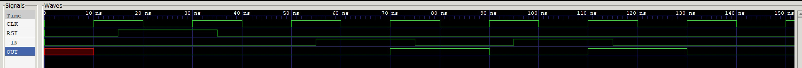

# JEFF 74x161 EXAMPLE

_Synchronous presettable 4-bit binary counter, asynchronous clear.
Based on the 7400-series integrated circuits used in my
[programable-8-bit-microprocessor](https://github.com/JeffDeCola/my-verilog-examples/tree/master/systems/microprocessors/programable-8-bit-microprocessor)._

Table of Contents

* [SCHEMATIC](https://github.com/JeffDeCola/my-verilog-examples/tree/master/sequential-logic/counters/jeff-74x161#schematic)
* [VERILOG CODE](https://github.com/JeffDeCola/my-verilog-examples/tree/master/sequential-logic/counters/jeff-74x161#verilog-code)
* [RUN (SIMULATE)](https://github.com/JeffDeCola/my-verilog-examples/tree/master/sequential-logic/counters/jeff-74x161#run-simulate)
* [CHECK WAVEFORM](https://github.com/JeffDeCola/my-verilog-examples/tree/master/sequential-logic/counters/jeff-74x161#check-waveform)
* [TESTED IN HARDWARE - BURNED TO AN FPGA](https://github.com/JeffDeCola/my-verilog-examples/tree/master/sequential-logic/counters/jeff-74x161#tested-in-hardware---burned-to-an-fpga)

Documentation and Reference

* I'm using my
  [jk-flip-flop](https://github.com/JeffDeCola/my-verilog-examples/tree/master/basic-code/sequential-logic/jk-flip-flop)

## SCHEMATIC

I designed this processor form the 1976 Texas Instruments spec sheet.
The `clr_bar` is connected directly to the JK flip-flops.


## VERILOG CODE

The entire code is
[jeff-74x161.v](jeff-74x161.v).

## RUN (SIMULATE)

I used my testbench
[jeff-74x161-tb.v](jeff-74x161-tb.v) with
[iverilog](https://github.com/JeffDeCola/my-cheat-sheets/tree/master/hardware/tools/simulation/iverilog-cheat-sheet)
to simulate and create a `.vcd` file.

```bash
sh run-test.sh
```

## CHECK WAVEFORM

Check you waveform using your `.vcd` file with a waveform viewer.

I used [GTKWave](https://github.com/JeffDeCola/my-cheat-sheets/tree/master/hardware/tools/simulation/gtkwave-cheat-sheet)
and launch it using
[launch-gtkwave.sh](launch-gtkwave.sh).



## TESTED IN HARDWARE - BURNED TO AN FPGA

To test my design in real hardware, the above code was synthesized using the
[Xilinx Vivado](https://github.com/JeffDeCola/my-cheat-sheets/tree/master/hardware/tools/synthesis/xilinx-vivado-cheat-sheet)
IDE software suite and burned to a FPGA development board.
