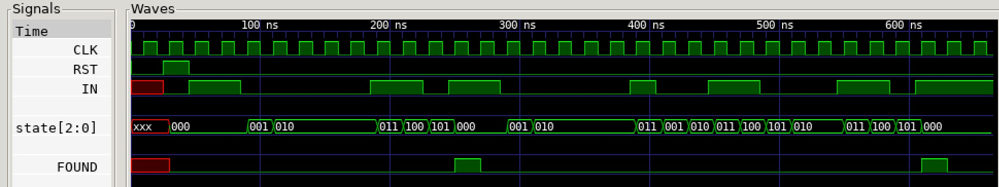

# MEALY STATE MACHINE EXAMPLE

_Recognize the pattern 00110 in a serial stream.
Output depends on current state and current inputs._

Table of Contents

* [OVERVIEW](https://github.com/JeffDeCola/my-verilog-examples/tree/master/sequential-logic/finite-state-machines/mealy_state_machine#overview)
* [STATE DIAGRAM](https://github.com/JeffDeCola/my-verilog-examples/tree/master/sequential-logic/finite-state-machines/mealy_state_machine#state-diagram)
* [VERILOG CODE](https://github.com/JeffDeCola/my-verilog-examples/tree/master/sequential-logic/finite-state-machines/mealy_state_machine#verilog-code)
* [RUN (SIMULATE)](https://github.com/JeffDeCola/my-verilog-examples/tree/master/sequential-logic/finite-state-machines/mealy_state_machine#run-simulate)
* [VIEW WAVEFORM](https://github.com/JeffDeCola/my-verilog-examples/tree/master/sequential-logic/finite-state-machines/mealy_state_machine#view-waveform)
* [TESTED IN HARDWARE - BURNED TO A FPGA](https://github.com/JeffDeCola/my-verilog-examples/tree/master/sequential-logic/finite-state-machines/mealy_state_machine#tested-in-hardware---burned-to-a-fpga)

## OVERVIEW

_I used
[iverilog](https://github.com/JeffDeCola/my-cheat-sheets/tree/master/hardware/tools/simulation/iverilog-cheat-sheet)
to simulate and
[GTKWave](https://github.com/JeffDeCola/my-cheat-sheets/tree/master/hardware/tools/simulation/gtkwave-cheat-sheet)
to view the waveform. I also used
[Xilinx Vivado](https://github.com/JeffDeCola/my-cheat-sheets/tree/master/hardware/tools/synthesis/xilinx-vivado-cheat-sheet)
to synthesize and program this example on a
[Digilent ARTY-S7](https://github.com/JeffDeCola/my-cheat-sheets/tree/master/hardware/development/fpga-development-boards/digilent-arty-s7-cheat-sheet)
FPGA development board._

## STATE DIAGRAM

This may help,


## VERILOG CODE

The
[mealy_state_machine.v](https://github.com/JeffDeCola/my-verilog-examples/blob/master/sequential-logic/finite-state-machines/mealy_state_machine/mealy_state_machine.v)
behavioral model,

```verilog
    // DATA TYPES
    reg [2:0] state;

    // STATES - BINARY ENCODED STYLE - USE ANY STYLE YOU WANT
    parameter [2:0] START     = 3'b000;
    parameter [2:0] ZERO      = 3'b001;
    parameter [2:0] WAIT      = 3'b010;
    parameter [2:0] S1        = 3'b011;
    parameter [2:0] S2        = 3'b100;
    parameter [2:0] S3        = 3'b101;

    // MEALY STATE MACHINE
    // ALWAYS BLOCK with NON-BLOCKING PROCEDURAL ASSIGNMENT STATEMENT
    always @ (posedge clk) begin
        if (rst) begin
            state <= START;
            found <= 1'b0;
        end else begin
            case (state)
                START: begin
                    if (in==0)  begin state <= ZERO;  found <= 1'b0; end
                    else        begin state <= START; found <= 1'b0; end
                end
                ZERO: begin
                    if (in==0)  begin state <= WAIT;  found <= 1'b0; end
                    else        begin state <= START; found <= 1'b0; end
                end
                WAIT: begin
                    if (in==1)  begin state <= S1;    found <= 1'b0; end
                    else        begin state <= WAIT;  found <= 1'b0; end
                end
                S1: begin
                    if (in==1)  begin state <= S2;    found <= 1'b0; end
                    else        begin state <= ZERO;  found <= 1'b0; end
                end
                S2:begin
                    if (in==0)  begin state <= S3;    found <= 1'b0; end
                    else        begin state <= START; found <= 1'b0; end
                end
                S3:begin
                    if (in==1)  begin state <= START; found <= 1'b1; end // Found pattern
                    else        begin state <= WAIT;  found <= 1'b0; end
                end
            endcase
        end
    end
```

## RUN (SIMULATE)

The testbench uses two files,

* [mealy_state_machine_tb.v](https://github.com/JeffDeCola/my-verilog-examples/blob/master/sequential-logic/finite-state-machines/mealy_state_machine/mealy_state_machine_tb.v)
  the testbench
* [mealy_state_machine_tb.tv](https://github.com/JeffDeCola/my-verilog-examples/blob/master/sequential-logic/finite-state-machines/mealy_state_machine/mealy_state_machine_tb.tv)
  the test vectors and expected results

with,

* [mealy_state_machine.vh](https://github.com/JeffDeCola/my-verilog-examples/blob/master/sequential-logic/finite-state-machines/mealy_state_machine/mealy_state_machine.vh)
  is the header file listing the verilog models
* [run-simulation.sh](https://github.com/JeffDeCola/my-verilog-examples/blob/master/sequential-logic/finite-state-machines/mealy_state_machine/run-simulation.sh)
  is a script containing the commands below

Use **iverilog** to compile the verilog to a vvp format
which is used by the vvp runtime simulation engine,

```bash
iverilog -o mealy_state_machine_tb.vvp mealy_state_machine_tb.v mealy_state_machine.vh
```

Use **vvp** to run the simulation, which checks the UUT
and creates a waveform dump file *.vcd.

```bash
vvp mealy_state_machine_tb.vvp
```

The output of the test,

```text
TEST START --------------------------------

                 | TIME(ns) | RST | IN | FOUND |
                 -------------------------------
   0             |        0 |  0  | x  |   x   |
   1       RESET |       25 |  1  | 0  |   x   |
   1       RESET |       30 |  1  | 0  |   0   |
   2       START |       45 |  0  | 1  |   0   |
   3       START |       65 |  0  | 1  |   0   |
   4        ZERO |       85 |  0  | 0  |   0   |
   5        WAIT |      105 |  0  | 0  |   0   |
   6        WAIT |      125 |  0  | 0  |   0   |
   7        WAIT |      145 |  0  | 0  |   0   |
   8        WAIT |      165 |  0  | 0  |   0   |
   9          S1 |      185 |  0  | 1  |   0   |
  10          S2 |      205 |  0  | 1  |   0   |
  11          S3 |      225 |  0  | 0  |   0   |
  12       START |      245 |  0  | 1  |   0   |
  12       START |      250 |  0  | 1  |   1   |
  13       START |      265 |  0  | 1  |   1   |
  13       START |      270 |  0  | 1  |   0   |
  14        ZERO |      285 |  0  | 0  |   0   |
  15        WAIT |      305 |  0  | 0  |   0   |
  16        WAIT |      325 |  0  | 0  |   0   |
  17        WAIT |      345 |  0  | 0  |   0   |
  18        WAIT |      365 |  0  | 0  |   0   |
  19          S1 |      385 |  0  | 1  |   0   |
  20        ZERO |      405 |  0  | 0  |   0   |
  21        WAIT |      425 |  0  | 0  |   0   |
  22          S1 |      445 |  0  | 1  |   0   |
  23          S2 |      465 |  0  | 1  |   0   |
  24          S3 |      485 |  0  | 0  |   0   |
  25        WAIT |      505 |  0  | 0  |   0   |
  26        WAIT |      525 |  0  | 0  |   0   |
  27          S1 |      545 |  0  | 1  |   0   |
  28          S2 |      565 |  0  | 1  |   0   |
  29          S3 |      585 |  0  | 0  |   0   |
  30       START |      605 |  0  | 1  |   0   |
  30       START |      610 |  0  | 1  |   1   |
  31       START |      625 |  0  | 1  |   1   |
  31       START |      630 |  0  | 1  |   0   |
  32       START |      645 |  0  | 1  |   0   |

 VECTORS:   32
  ERRORS:    0

TEST END ----------------------------------
```

## VIEW WAVEFORM

Open the waveform file mealy_state_machine_tb.vcd file with GTKWave,

```bash
gtkwave -f mealy_state_machine_tb.vcd &
```

Save your waveform to a .gtkw file.

Now you can use the script
[launch-gtkwave.sh](https://github.com/JeffDeCola/my-verilog-examples/blob/master/launch-GTKWave-script/launch-gtkwave.sh)
anytime you want,

```bash
gtkwave -f mealy_state_machine_tb.gtkw &
```



## TESTED IN HARDWARE - BURNED TO A FPGA

The above code was synthesized using the
[Xilinx Vivado](https://github.com/JeffDeCola/my-cheat-sheets/tree/master/hardware/tools/synthesis/xilinx-vivado-cheat-sheet)
IDE software suite and burned to a FPGA development board.
