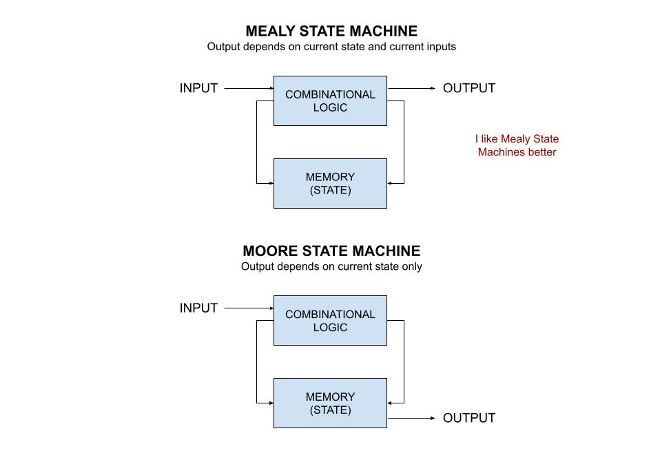
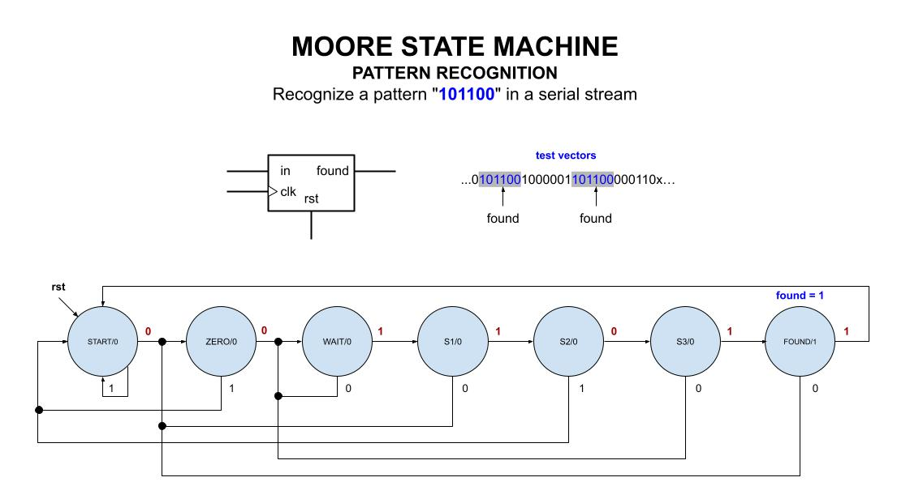

# MOORE STATE MACHINE EXAMPLE

_Recognize the pattern 00110 in a serial stream.
Output depends on current state only._

Table of Contents

* [OVERVIEW](https://github.com/JeffDeCola/my-verilog-examples/tree/master/sequential-logic/finite-state-machines/moore_state_machine#overview)
* [STATE DIAGRAM](https://github.com/JeffDeCola/my-verilog-examples/tree/master/sequential-logic/finite-state-machines/moore_state_machine#state-diagram)
* [VERILOG CODE](https://github.com/JeffDeCola/my-verilog-examples/tree/master/sequential-logic/finite-state-machines/moore_state_machine#verilog-code)
* [RUN (SIMULATE)](https://github.com/JeffDeCola/my-verilog-examples/tree/master/sequential-logic/finite-state-machines/moore_state_machine#run-simulate)
* [VIEW WAVEFORM](https://github.com/JeffDeCola/my-verilog-examples/tree/master/sequential-logic/finite-state-machines/moore_state_machine#view-waveform)
* [TESTED IN HARDWARE - BURNED TO A FPGA](https://github.com/JeffDeCola/my-verilog-examples/tree/master/sequential-logic/finite-state-machines/moore_state_machine#tested-in-hardware---burned-to-a-fpga)

## OVERVIEW

I like mealy state machines because they are more intuitive.
I'm not a fan of moore state machines.



_I used
[iverilog](https://github.com/JeffDeCola/my-cheat-sheets/tree/master/hardware/tools/simulation/iverilog-cheat-sheet)
to simulate and
[GTKWave](https://github.com/JeffDeCola/my-cheat-sheets/tree/master/hardware/tools/simulation/gtkwave-cheat-sheet)
to view the waveform. I also used
[Xilinx Vivado](https://github.com/JeffDeCola/my-cheat-sheets/tree/master/hardware/tools/synthesis/xilinx-vivado-cheat-sheet)
to synthesize and program this example on a
[Digilent ARTY-S7](https://github.com/JeffDeCola/my-cheat-sheets/tree/master/hardware/development/fpga-development-boards/digilent-arty-s7-cheat-sheet)
FPGA development board._

## STATE DIAGRAM

This may help,



## VERILOG CODE

The
[moore_state_machine.v](https://github.com/JeffDeCola/my-verilog-examples/blob/master/sequential-logic/finite-state-machines/moore_state_machine/moore_state_machine.v)
behavioral model,

```verilog
???
```

## RUN (SIMULATE)

The testbench uses two files,

* [moore_state_machine_tb.v](https://github.com/JeffDeCola/my-verilog-examples/blob/master/sequential-logic/finite-state-machines/moore_state_machine/moore_state_machine_tb.v)
  the testbench
* [moore_state_machine_tb.tv](https://github.com/JeffDeCola/my-verilog-examples/blob/master/sequential-logic/finite-state-machines/moore_state_machine/moore_state_machine_tb.tv)
  the test vectors and expected results

with,

* [moore_state_machine.vh](https://github.com/JeffDeCola/my-verilog-examples/blob/master/sequential-logic/finite-state-machines/moore_state_machine/moore_state_machine.vh)
  is the header file listing the verilog models
* [run-simulation.sh](https://github.com/JeffDeCola/my-verilog-examples/blob/master/sequential-logic/finite-state-machines/moore_state_machine/run-simulation.sh)
  is a script containing the commands below

Use **iverilog** to compile the verilog to a vvp format
which is used by the vvp runtime simulation engine,

```bash
iverilog -o moore_state_machine_tb.vvp moore_state_machine_tb.v moore_state_machine.vh
```

Use **vvp** to run the simulation, which checks the UUT
and creates a waveform dump file *.vcd.

```bash
vvp moore_state_machine_tb.vvp
```

The output of the test,

```text
???
```

## VIEW WAVEFORM

Open the waveform file moore_state_machine_tb.vcd file with GTKWave,

```bash
gtkwave -f moore_state_machine_tb.vcd &
```

Save your waveform to a .gtkw file.

Now you can use the script
[launch-gtkwave.sh](https://github.com/JeffDeCola/my-verilog-examples/blob/master/launch-GTKWave-script/launch-gtkwave.sh)
anytime you want,

```bash
gtkwave -f moore_state_machine_tb.gtkw &
```


## TESTED IN HARDWARE - BURNED TO A FPGA

The above code was synthesized using the
[Xilinx Vivado](https://github.com/JeffDeCola/my-cheat-sheets/tree/master/hardware/tools/synthesis/xilinx-vivado-cheat-sheet)
IDE software suite and burned to a FPGA development board.
