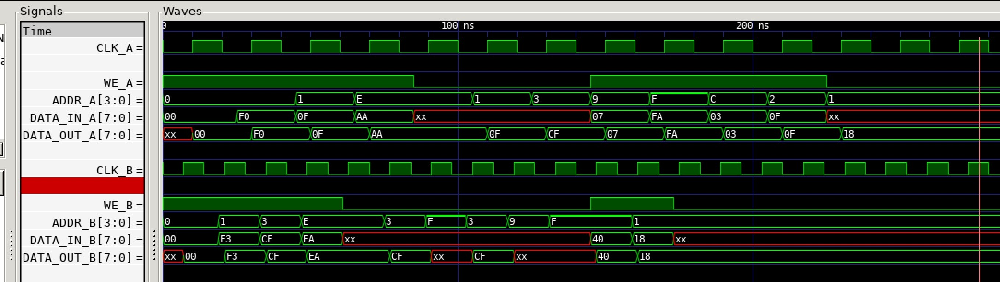

# DUAL-PORT RAM ASYNCHRONOUS EXAMPLE

_Dual-port asynchronous RAM using two different clocks._

Table of Contents

* [OVERVIEW](https://github.com/JeffDeCola/my-verilog-examples/tree/master/sequential-logic/memory/dual_port_ram_asynchronous#overview)
* [SCHEMATIC](https://github.com/JeffDeCola/my-verilog-examples/tree/master/sequential-logic/memory/dual_port_ram_asynchronous#schematic)
* [TRUTH TABLE](https://github.com/JeffDeCola/my-verilog-examples/tree/master/sequential-logic/memory/dual_port_ram_asynchronous#truth-table)
* [VERILOG CODE](https://github.com/JeffDeCola/my-verilog-examples/tree/master/sequential-logic/memory/dual_port_ram_asynchronous#verilog-code)
* [RUN (SIMULATE)](https://github.com/JeffDeCola/my-verilog-examples/tree/master/sequential-logic/memory/dual_port_ram_asynchronous#run-simulate)
* [VIEW WAVEFORM](https://github.com/JeffDeCola/my-verilog-examples/tree/master/sequential-logic/memory/dual_port_ram_asynchronous#view-waveform)
* [TESTED IN HARDWARE - BURNED TO A FPGA](https://github.com/JeffDeCola/my-verilog-examples/tree/master/sequential-logic/memory/dual_port_ram_asynchronous#tested-in-hardware---burned-to-a-fpga)

## OVERVIEW

Dual-port RAM is a type of computer memory that allows
two separate devices to read and write data simultaneously.
This is achieved by having two separate access ports, one for each device.

The B port will have precedence if data is written to both ports at the same time.

_I used
[iverilog](https://github.com/JeffDeCola/my-cheat-sheets/tree/master/hardware/tools/simulation/iverilog-cheat-sheet)
to simulate and
[GTKWave](https://github.com/JeffDeCola/my-cheat-sheets/tree/master/hardware/tools/simulation/gtkwave-cheat-sheet)
to view the waveform. I also used
[Xilinx Vivado](https://github.com/JeffDeCola/my-cheat-sheets/tree/master/hardware/tools/synthesis/xilinx-vivado-cheat-sheet)
to synthesize and program this example on a
[Digilent ARTY-S7](https://github.com/JeffDeCola/my-cheat-sheets/tree/master/hardware/development/fpga-development-boards/digilent-arty-s7-cheat-sheet)
FPGA development board._

## SCHEMATIC

This may help,


## TRUTH TABLE

Each clk has it's own write enable (we) address (addr) and data,

| we    | addr | data_in  | data_out | comment     |
|:-----:|:----:|:--------:|:--------:|:-----------:|
| 0     | 0000 | xxxxxxxx | 00111100 | READ 0000   |
| 1     | 1100 | 11110000 | 11110000 | WRITE 1100  |

## VERILOG CODE

The
[dual_port_ram_asynchronous.v](https://github.com/JeffDeCola/my-verilog-examples/blob/master/sequential-logic/memory/dual_port_ram_asynchronous/dual_port_ram_asynchronous.v)
behavioral model,

```verilog
    // PARAMETERS
    parameter DATA_WIDTH = 8;
    parameter ADDR_WIDTH = 4;
    parameter MEM_DEPTH = 16;

    // DATA TYPES
    reg [DATA_WIDTH-1:0] mem [0:MEM_DEPTH-1];           // RAM (16x8)

    // PORT A
    // ALWAYS BLOCK with NON-BLOCKING PROCEDURAL ASSIGNMENT STATEMENT
    always @(posedge clk_A) begin
        // WRITE (DATA PASS)
        if (we_A) begin
            mem[addr_A] <= data_in_A;
            data_out_A <= data_in_A;
        // READ
        end else begin
            data_out_A <= mem[addr_A];
        end
    end

    // PORT B - HAS PRECEDENCE FOR WRITE
    // ALWAYS BLOCK with NON-BLOCKING PROCEDURAL ASSIGNMENT STATEMENT
    always @(posedge clk_B) begin
        //WRITE (DATA PASS)
        if (we_B) begin
            mem[addr_B] <= data_in_B;
            data_out_B <= data_in_B;
        //READ
        end else begin
            data_out_B <= mem[addr_B];
        end
    end

endmodule
```

## RUN (SIMULATE)

The testbench uses two files,

* [dual_port_ram_asynchronous_tb.v](https://github.com/JeffDeCola/my-verilog-examples/blob/master/sequential-logic/memory/dual_port_ram_asynchronous/dual_port_ram_asynchronous_tb.v)
  the testbench
* [dual_port_ram_asynchronous_tb_A.tv](https://github.com/JeffDeCola/my-verilog-examples/blob/master/sequential-logic/memory/dual_port_ram_asynchronous/dual_port_ram_asynchronous_tb_A.tv)
  the test vectors for clk_A and expected results
* [dual_port_ram_asynchronous_tb_B.tv](https://github.com/JeffDeCola/my-verilog-examples/blob/master/sequential-logic/memory/dual_port_ram_asynchronous/dual_port_ram_asynchronous_tb_B.tv)
  the test vectors for clk_B and expected results

with,

* [dual_port_ram_asynchronous.vh](https://github.com/JeffDeCola/my-verilog-examples/blob/master/sequential-logic/memory/dual_port_ram_asynchronous/dual_port_ram_asynchronous.vh)
  is the header file listing the verilog models
* [run-simulation.sh](https://github.com/JeffDeCola/my-verilog-examples/blob/master/sequential-logic/memory/dual_port_ram_asynchronous/run-simulation.sh)
  is a script containing the commands below

Use **iverilog** to compile the verilog to a vvp format
which is used by the vvp runtime simulation engine,

```bash
iverilog -o dual_port_ram_asynchronous_tb.vvp dual_port_ram_asynchronous_tb.v dual_port_ram_asynchronous.vh
```

Use **vvp** to run the simulation, which checks the UUT
and creates a waveform dump file *.vcd.

```bash
vvp dual_port_ram_asynchronous_tb.vvp
```

The test uses two different clocks (CLK_A and CLK_B). The output of the test,

```text
TEST START --------------------------------

                     | TIME(ns) | WE_A | ADDR_A | DATA_IN_A | DATA_OUT_A | WE_B | ADDR_B | DATA_IN_B | DATA_OUT_B |
                     ----------------------------------------------------------------------------------------------
       1        INIT |       12 |                                        |  1   |  0000  | 00000000  |  00000000  |
   1           INIT_ |       15 |  1   |  0000  | 00000000  |  00000000  |
       2        WR_B |       26 |                                        |  1   |  0001  | 11110011  |  11110011  |
   2           WR_A_ |       35 |  1   |  0000  | 11110000  |  11110000  |
       3        WR_B |       40 |                                        |  1   |  0011  | 11001111  |  11001111  |
       4        WR_B |       54 |                                        |  1   |  1110  | 11101010  |  11101010  |
   3           WR_A_ |       55 |  1   |  0001  | 00001111  |  00001111  |
       5        RD_B |       68 |                                        |  0   |  1110  | xxxxxxxx  |  11101010  |
   4           WR_A_ |       75 |  1   |  1110  | 10101010  |  10101010  |
       6        RD_B |       82 |                                        |  0   |  0011  | xxxxxxxx  |  11001111  |
   5           RD_A_ |       95 |  0   |  1110  | xxxxxxxx  |  10101010  |
       7        RD_B |       96 |                                        |  0   |  1111  | xxxxxxxx  |  xxxxxxxx  |
       8        RD_B |      110 |                                        |  0   |  0011  | xxxxxxxx  |  11001111  |
   6           RD_A_ |      115 |  0   |  0001  | xxxxxxxx  |  00001111  |
       9        RD_B |      124 |                                        |  0   |  1001  | xxxxxxxx  |  xxxxxxxx  |
   7           RD_A_ |      135 |  0   |  0011  | xxxxxxxx  |  11001111  |
      10        RD_B |      138 |                                        |  0   |  1111  | xxxxxxxx  |  xxxxxxxx  |
      11        WR_B |      152 |                                        |  1   |  1111  | 01000000  |  01000000  |
   8           WR_A_ |      155 |  1   |  1001  | 00000111  |  00000111  |
      12        WR_B |      166 |                                        |  1   |  0001  | 00011000  |  00011000  |
   9           WR_A_ |      175 |  1   |  1111  | 11111010  |  11111010  |
      13        RD_B |      180 |                                        |  0   |  0001  | xxxxxxxx  |  00011000  |
      14        RD_B |      194 |                                        |  0   |  0001  | xxxxxxxx  |  00011000  |
  10           WR_A_ |      195 |  1   |  1100  | 00000011  |  00000011  |
  11           WR_A_ |      215 |  1   |  0010  | 00001111  |  00001111  |
  12           RD_A_ |      235 |  0   |  0001  | xxxxxxxx  |  00011000  |
  13           RD_A_ |      255 |  0   |  0001  | xxxxxxxx  |  00011000  |
  14           RD_A_ |      275 |  0   |  0001  | xxxxxxxx  |  00011000  |

 VECTORS_A:   14
  ERRORS_A:    0
 VECTORS_B:   14
  ERRORS_B:    0

TEST END ----------------------------------
```

## VIEW WAVEFORM

Open the waveform file dual_port_ram_asynchronous_tb.vcd file with GTKWave,

```bash
gtkwave -f dual_port_ram_asynchronous_tb.vcd &
```

Save your waveform to a .gtkw file.

Now you can use the script
[launch-gtkwave.sh](https://github.com/JeffDeCola/my-verilog-examples/blob/master/launch-GTKWave-script/launch-gtkwave.sh)
anytime you want,

```bash
gtkwave -f dual_port_ram_asynchronous_tb.gtkw &
```



## TESTED IN HARDWARE - BURNED TO A FPGA

The above code was synthesized using the
[Xilinx Vivado](https://github.com/JeffDeCola/my-cheat-sheets/tree/master/hardware/tools/synthesis/xilinx-vivado-cheat-sheet)
IDE software suite and burned to a FPGA development board.
