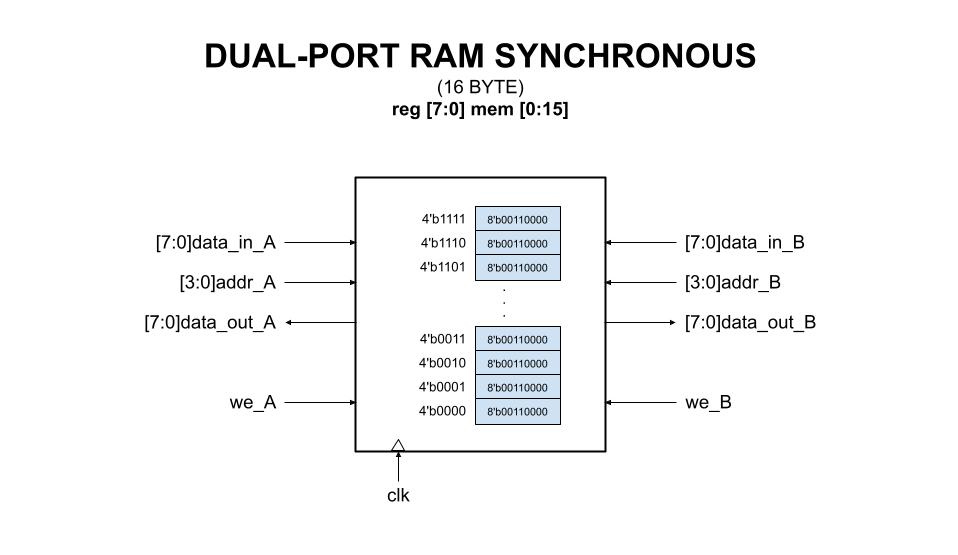

# DUAL-PORT RAM SYNCHRONOUS EXAMPLE

_Dual-port synchronous RAM._

Table of Contents

* [OVERVIEW](https://github.com/JeffDeCola/my-verilog-examples/tree/master/sequential-logic/memory/dual_port_ram_synchronous#overview)
* [SCHEMATIC](https://github.com/JeffDeCola/my-verilog-examples/tree/master/sequential-logic/memory/dual_port_ram_synchronous#schematic)
* [TRUTH TABLE](https://github.com/JeffDeCola/my-verilog-examples/tree/master/sequential-logic/memory/dual_port_ram_synchronous#truth-table)
* [VERILOG CODE](https://github.com/JeffDeCola/my-verilog-examples/tree/master/sequential-logic/memory/dual_port_ram_synchronous#verilog-code)
* [RUN (SIMULATE)](https://github.com/JeffDeCola/my-verilog-examples/tree/master/sequential-logic/memory/dual_port_ram_synchronous#run-simulate)
* [VIEW WAVEFORM](https://github.com/JeffDeCola/my-verilog-examples/tree/master/sequential-logic/memory/dual_port_ram_synchronous#view-waveform)
* [TESTED IN HARDWARE - BURNED TO A FPGA](https://github.com/JeffDeCola/my-verilog-examples/tree/master/sequential-logic/memory/dual_port_ram_synchronous#tested-in-hardware---burned-to-a-fpga)

## OVERVIEW

Dual-port RAM is a type of computer memory that allows
two separate devices to read and write data simultaneously.
This is achieved by having two separate access ports, one for each device.

_I used
[iverilog](https://github.com/JeffDeCola/my-cheat-sheets/tree/master/hardware/tools/simulation/iverilog-cheat-sheet)
to simulate and
[GTKWave](https://github.com/JeffDeCola/my-cheat-sheets/tree/master/hardware/tools/simulation/gtkwave-cheat-sheet)
to view the waveform. I also used
[Xilinx Vivado](https://github.com/JeffDeCola/my-cheat-sheets/tree/master/hardware/tools/synthesis/xilinx-vivado-cheat-sheet)
to synthesize and program this example on a
[Digilent ARTY-S7](https://github.com/JeffDeCola/my-cheat-sheets/tree/master/hardware/development/fpga-development-boards/digilent-arty-s7-cheat-sheet)
FPGA development board._

## SCHEMATIC

This may help,



## TRUTH TABLE

| we    | addr | data_in  | data_out | comment     |
|:-----:|:----:|:--------:|:--------:|:-----------:|
| 0     | 0000 | xxxxxxxx | 00111100 | READ 0000   |
| 1     | 1100 | 11110000 | 11110000 | WRITE 1100  |

## VERILOG CODE

The
[dual_port_ram_synchronous.v](https://github.com/JeffDeCola/my-verilog-examples/blob/master/sequential-logic/memory/dual_port_ram_synchronous/dual_port_ram_synchronous.v)
behavioral model,

```verilog
    // DATA TYPES
    reg [7:0] mem [0:15];
    reg [3:0] address_register_A, address_register_B;

    // OUTPUT (THIS MAKES IT SYNCHRONOUS)
    assign data_out_A = mem[address_register_A];
    assign data_out_B = mem[address_register_B];

    // RAM
    // ALWAYS BLOCK with NON-BLOCKING PROCEDURAL ASSIGNMENT STATEMENT
    always @(posedge clk) begin
        if (we_A) begin
            mem[addr_A] <= data_in_A;
        end else begin
            address_register_A <= addr_A;
        end
    end

    // RAM
    // ALWAYS BLOCK with NON-BLOCKING PROCEDURAL ASSIGNMENT STATEMENT
    always @(posedge clk) begin
        if (we_B) begin
            mem[addr_B] <= data_in_B;
        end else begin
            address_register_B <= addr_B;
        end
    end
```

## RUN (SIMULATE)

The testbench uses two files,

* [dual_port_ram_synchronous_tb.v](https://github.com/JeffDeCola/my-verilog-examples/blob/master/sequential-logic/memory/dual_port_ram_synchronous/dual_port_ram_synchronous_tb.v)
  the testbench
* [dual_port_ram_synchronous_tb.tv](https://github.com/JeffDeCola/my-verilog-examples/blob/master/sequential-logic/memory/dual_port_ram_synchronous/dual_port_ram_synchronous_tb.tv)
  the test vectors and expected results

with,

* [dual_port_ram_synchronous.vh](https://github.com/JeffDeCola/my-verilog-examples/blob/master/sequential-logic/memory/dual_port_ram_synchronous/dual_port_ram_synchronous.vh)
  is the header file listing the verilog models
* [run-simulation.sh](https://github.com/JeffDeCola/my-verilog-examples/blob/master/sequential-logic/memory/dual_port_ram_synchronous/run-simulation.sh)
  is a script containing the commands below

Use **iverilog** to compile the verilog to a vvp format
which is used by the vvp runtime simulation engine,

```bash
iverilog -o dual_port_ram_synchronous_tb.vvp dual_port_ram_synchronous_tb.v dual_port_ram_synchronous.vh
```

Use **vvp** to run the simulation, which checks the UUT
and creates a waveform dump file *.vcd.

```bash
vvp dual_port_ram_synchronous_tb.vvp
```

The output of the test,

```text
TEST START --------------------------------

                 | TIME(ns) | WE_A | ADDR_A | DATA_IN_A | DATA_OUT_A |
                 ---------------------------------------------
   0        INIT |        0 |  1  |  0000  |    00000000    |    xxxxxxxx    |   1  |  0000  |    00000000    |    xxxxxxxx    
   1   WR_A_WR_B |       25 |  1  |  0000  |    11110000    |    xxxxxxxx    |   1  |  0001  |    11110011    |    xxxxxxxx    
   2   WR_A_WR_B |       45 |  1  |  0001  |    00001111    |    xxxxxxxx    |   1  |  0011  |    11001111    |    xxxxxxxx    
   3   WR_A_WR_B |       65 |  1  |  1110  |    10101010    |    xxxxxxxx    |   1  |  1111  |    11101010    |    xxxxxxxx    
   4   RD_A_RD_B |       85 |  0  |  0000  |    xxxxxxxx    |    xxxxxxxx    |   0  |  0001  |    xxxxxxxx    |    xxxxxxxx    
   4   RD_A_RD_B |       90 |  0  |  0000  |    xxxxxxxx    |    11110000    |   0  |  0001  |    xxxxxxxx    |    00001111    
   5   RD_A_RD_B |      105 |  0  |  0001  |    xxxxxxxx    |    11110000    |   0  |  0011  |    xxxxxxxx    |    00001111    
   5   RD_A_RD_B |      110 |  0  |  0001  |    xxxxxxxx    |    00001111    |   0  |  0011  |    xxxxxxxx    |    11001111    
   6   RD_A_RD_B |      125 |  0  |  1110  |    xxxxxxxx    |    00001111    |   0  |  1111  |    xxxxxxxx    |    11001111    
   6   RD_A_RD_B |      130 |  0  |  1110  |    xxxxxxxx    |    10101010    |   0  |  1111  |    xxxxxxxx    |    11101010    
   7   WR_A_RD_B |      145 |  1  |  1001  |    00000111    |    10101010    |   0  |  1110  |    xxxxxxxx    |    11101010    
   7   WR_A_RD_B |      150 |  1  |  1001  |    00000111    |    10101010    |   0  |  1110  |    xxxxxxxx    |    10101010    
   8   WR_A_RD_B |      165 |  1  |  1111  |    11111010    |    10101010    |   0  |  1001  |    xxxxxxxx    |    10101010    
   8   WR_A_RD_B |      170 |  1  |  1111  |    11111010    |    10101010    |   0  |  1001  |    xxxxxxxx    |    00000111    
   9   WR_A_RD_B |      185 |  1  |  1100  |    00000011    |    10101010    |   0  |  1111  |    xxxxxxxx    |    00000111    
   9   WR_A_RD_B |      190 |  1  |  1100  |    00000011    |    10101010    |   0  |  1111  |    xxxxxxxx    |    11111010    
  10   WR_A_WR_B |      205 |  1  |  0010  |    00001111    |    10101010    |   1  |  1111  |    00000000    |    11111010    
  10   WR_A_WR_B |      210 |  1  |  0010  |    00001111    |    10101010    |   1  |  1111  |    00000000    |    00000000    
  11   RD_A_WR_B |      225 |  0  |  0001  |    xxxxxxxx    |    10101010    |   1  |  0001  |    00011000    |    00000000    
  11   RD_A_WR_B |      230 |  0  |  0001  |    xxxxxxxx    |    00011000    |   1  |  0001  |    00011000    |    00000000    
  12   RD_A_RD_B |      245 |  0  |  1111  |    xxxxxxxx    |    00011000    |   0  |  1111  |    xxxxxxxx    |    00000000    
  12   RD_A_RD_B |      250 |  0  |  1111  |    xxxxxxxx    |    00000000    |   0  |  1111  |    xxxxxxxx    |    00000000    
  13   RD_A_RD_B |      265 |  0  |  0001  |    xxxxxxxx    |    00000000    |   0  |  0001  |    xxxxxxxx    |    00000000    
  13   RD_A_RD_B |      270 |  0  |  0001  |    xxxxxxxx    |    00011000    |   0  |  0001  |    xxxxxxxx    |    00011000    

 VECTORS:   13
  ERRORS:    0

TEST END ----------------------------------
```

## VIEW WAVEFORM

Open the waveform file dual_port_ram_synchronous_tb.vcd file with GTKWave,

```bash
gtkwave -f dual_port_ram_synchronous_tb.vcd &
```

Save your waveform to a .gtkw file.

Now you can use the script
[launch-gtkwave.sh](https://github.com/JeffDeCola/my-verilog-examples/blob/master/launch-GTKWave-script/launch-gtkwave.sh)
anytime you want,

```bash
gtkwave -f dual_port_ram_synchronous_tb.gtkw &
```


## TESTED IN HARDWARE - BURNED TO A FPGA

The above code was synthesized using the
[Xilinx Vivado](https://github.com/JeffDeCola/my-cheat-sheets/tree/master/hardware/tools/synthesis/xilinx-vivado-cheat-sheet)
IDE software suite and burned to a FPGA development board.
