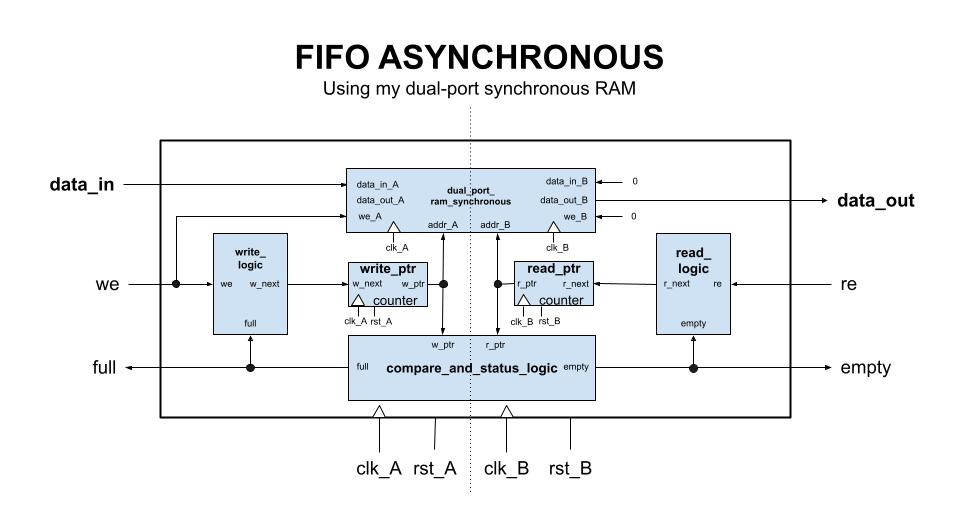
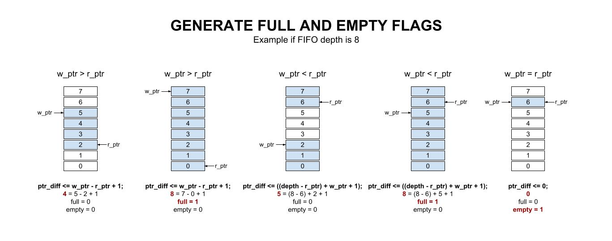
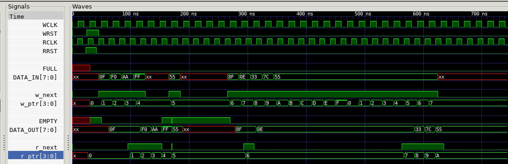

# FIFO SYNCHRONOUS EXAMPLE

_An asynchronous fifo using dual-port asynchronous RAM._

Table of Contents

* [OVERVIEW](https://github.com/JeffDeCola/my-verilog-examples/tree/master/sequential-logic/memory/fifo_asynchronous#overview)
* [SCHEMATIC](https://github.com/JeffDeCola/my-verilog-examples/tree/master/sequential-logic/memory/fifo_asynchronous#schematic)
* [TRUTH TABLE](https://github.com/JeffDeCola/my-verilog-examples/tree/master/sequential-logic/memory/fifo_asynchronous#truth-table)
* [VERILOG CODE](https://github.com/JeffDeCola/my-verilog-examples/tree/master/sequential-logic/memory/fifo_asynchronous#verilog-code)
  * [WRITE AND READ LOGIC](https://github.com/JeffDeCola/my-verilog-examples/tree/master/sequential-logic/memory/fifo_asynchronous#write-and-read-logic)
  * [WRITE AND READ PTRS](https://github.com/JeffDeCola/my-verilog-examples/tree/master/sequential-logic/memory/fifo_asynchronous#write-and-read-ptrs)
  * [COMPARE AND STATUS LOGIC](https://github.com/JeffDeCola/my-verilog-examples/tree/master/sequential-logic/memory/fifo_asynchronous#compare-and-status-logic)
* [RUN (SIMULATE)](https://github.com/JeffDeCola/my-verilog-examples/tree/master/sequential-logic/memory/fifo_asynchronous#run-simulate)
* [VIEW WAVEFORM](https://github.com/JeffDeCola/my-verilog-examples/tree/master/sequential-logic/memory/fifo_asynchronous#view-waveform)
* [TESTED IN HARDWARE - BURNED TO A FPGA](https://github.com/JeffDeCola/my-verilog-examples/tree/master/sequential-logic/memory/fifo_asynchronous#tested-in-hardware---burned-to-a-fpga)

Documentation and Reference

* Using my
  [dual_port_ram_asynchronous](https://github.com/JeffDeCola/my-verilog-examples/tree/master/sequential-logic/memory/dual_port_ram_asynchronous)

## OVERVIEW

A FIFO is a special type of buffer. The name FIFO stands for first in first out
and means that the data written into the buffer first comes out of it first.
A synchronous FIFO is a FIFO where the same clock is used for both reading and
writing.

_I used
[iverilog](https://github.com/JeffDeCola/my-cheat-sheets/tree/master/hardware/tools/simulation/iverilog-cheat-sheet)
to simulate and
[GTKWave](https://github.com/JeffDeCola/my-cheat-sheets/tree/master/hardware/tools/simulation/gtkwave-cheat-sheet)
to view the waveform. I also used
[Xilinx Vivado](https://github.com/JeffDeCola/my-cheat-sheets/tree/master/hardware/tools/synthesis/xilinx-vivado-cheat-sheet)
to synthesize and program this example on a
[Digilent ARTY-S7](https://github.com/JeffDeCola/my-cheat-sheets/tree/master/hardware/development/fpga-development-boards/digilent-arty-s7-cheat-sheet)
FPGA development board._

## SCHEMATIC

This fifo is made up with mt dual port synchronous RAM.

The structure is,



The full and empy logic is,



## TRUTH TABLE

I made this more complicated then it should be,
but I wanted to show all the cases.
It's really just pushing and popping data
off the FIFO.

| rst | we | full | data_in  | re | empty | data_out | comment          |
|:---:|:--:|:----:|:--------:|:--:|:-----:|:--------:|:----------------:|
|  1  | 0  | 0    | xxxxxxxx | 0  | 0     | xxxxxxxx | RESETS PTRS      |
|  0  | 0  | 0    | xxxxxxxx | 0  | 0     | data_out | -                |
|  0  | 0  | 0    | xxxxxxxx | 0  | 1     | data_out | EMPTY            |
|  0  | 0  | 0    | xxxxxxxx | 1  | 0     | POP      | POP              |
|  0  | 0  | 0    | xxxxxxxx | 1  | 1     | data_out | NO POP - EMPTY   |
|  0  | 0  | 1    | xxxxxxxx | 0  | 0     | data_out | FULL             |
|  0  | 0  | 1    | xxxxxxxx | 0  | 1     | -        | N/A              |
|  0  | 0  | 1    | xxxxxxxx | 1  | 0     | POP      | FULL - POP       |
|  0  | 0  | 1    | xxxxxxxx | 1  | 1     | -        | N/A              |
|  0  | 1  | 0    | data     | 0  | 0     | data_out | PUSH             |
|  0  | 1  | 0    | data     | 0  | 1     | data_out | PUSH - EMPTY     |
|  0  | 1  | 0    | data     | 1  | 0     | POP      | PUSH - POP       |
|  0  | 1  | 0    | data     | 1  | 1     | data_out | N/A              |
|  0  | 1  | 1    | xxxxxxxx | 0  | 0     | data_out | NO PUSH - FULL   |
|  0  | 1  | 1    | xxxxxxxx | 0  | 1     | data_out | N/A              |
|  0  | 1  | 1    | xxxxxxxx | 1  | 0     | POP      | N/A              |
|  0  | 1  | 1    | xxxxxxxx | 1  | 1     | data_out | N/A              |

## VERILOG CODE

The
[fifo_asynchronous.v](https://github.com/JeffDeCola/my-verilog-examples/blob/master/sequential-logic/memory/fifo_asynchronous/fifo_asynchronous.v)
behavioral model,

### WRITE AND READ LOGIC

```verilog
    //If FIFO full write counter should not increment
    always @(*) begin
        if (we && (!full))
            w_next=1;
        else
            w_next=0;
    end
```

```verilog
    //If FIFO empty read counter should not increment
    always @(*) begin
        if (re && (!empty))
            r_next=1;
        else
            r_next=0;
    end
```

### WRITE AND READ PTRS

```verilog
    // ALWAYS BLOCK with NON-BLOCKING PROCEDURAL ASSIGNMENT STATEMENT
    always @ (posedge clk) begin
        if (rst) begin
            w_ptr <= 3'b000;
        end else if (w_next) begin
            w_ptr <= w_ptr + 1;
        end else begin
            w_ptr <= w_ptr;
        end
    end
```

```verilog
    // ALWAYS BLOCK with NON-BLOCKING PROCEDURAL ASSIGNMENT STATEMENT
    always @ (posedge clk) begin
        if (rst) begin
            r_ptr <= 3'b000;
        end else if (r_next) begin
            r_ptr <= r_ptr + 1;
        end else begin
            r_ptr <= r_ptr;
        end
    end
```

### COMPARE AND STATUS LOGIC

```verilog
    parameter depth = 4'b1111;  // Depth of the FIFO

    // DATA TYPES
    reg [3:0] ptr_diff;

    // FULL STATUS
    always @(*) begin
        if (ptr_diff == depth) begin
          full = 1'b1;
        end else begin
          full = 1'b0;
        end
    end

    // EMPTY STATUS
    always @(*) begin
        if (ptr_diff == 0) begin
          empty = 1'b1;
        end else begin
          empty = 1'b0;
        end
    end

    // HOW MUCH MEMORY USED
    // ALWAYS BLOCK with NON-BLOCKING PROCEDURAL ASSIGNMENT STATEMENT
    always @(*) begin
        if (w_ptr > r_ptr) begin
            ptr_diff <= w_ptr - r_ptr + 1;
        end else if (w_ptr < r_ptr) begin
            ptr_diff <= (depth - r_ptr) + w_ptr + 1;
        end else if (w_ptr == r_ptr) begin
            ptr_diff <= 0;
        end
    end
```

## RUN (SIMULATE)

The testbench uses two files,

* [fifo_asynchronous_tb.v](https://github.com/JeffDeCola/my-verilog-examples/blob/master/sequential-logic/memory/fifo_asynchronous/fifo_asynchronous_tb.v)
  the testbench
* [fifo_asynchronous_tb.tv](https://github.com/JeffDeCola/my-verilog-examples/blob/master/sequential-logic/memory/fifo_asynchronous/fifo_asynchronous_tb.tv)
  the test vectors and expected results

with,

* [fifo_asynchronous.vh](https://github.com/JeffDeCola/my-verilog-examples/blob/master/sequential-logic/memory/fifo_asynchronous/fifo_asynchronous.vh)
  is the header file listing the verilog models
* [run-simulation.sh](https://github.com/JeffDeCola/my-verilog-examples/blob/master/sequential-logic/memory/fifo_asynchronous/run-simulation.sh)
  is a script containing the commands below

Use **iverilog** to compile the verilog to a vvp format
which is used by the vvp runtime simulation engine,

```bash
iverilog -o fifo_asynchronous_tb.vvp fifo_asynchronous_tb.v fifo_asynchronous.vh
```

Use **vvp** to run the simulation, which checks the UUT
and creates a waveform dump file *.vcd.

```bash
vvp fifo_asynchronous_tb.vvp
```

The output of the test,

```text
TEST START --------------------------------

                 | TIME(ns) | RST | WE | FULL | DATA_IN  | RE | EMPTY | DATA_OUT |
                 ----------------------------------------------------------------
   0        INIT |        0 |  0  | 0  |  x   | xxxxxxxx | 0  |   x   | xxxxxxxx |
   1       RESET |       25 |  1  | 0  |  x   | xxxxxxxx | 0  |   x   | xxxxxxxx |
   1       RESET |       30 |  1  | 0  |  0   | xxxxxxxx | 0  |   1   | xxxxxxxx |
   2      PUSH-1 |       45 |  0  | 1  |  0   | 00001111 | 0  |   1   | xxxxxxxx |
   2      PUSH-1 |       50 |  0  | 1  |  0   | 00001111 | 0  |   0   | 00001111 |
   3      PUSH-2 |       65 |  0  | 1  |  0   | 11110000 | 0  |   0   | 00001111 |
   4      PUSH-3 |       85 |  0  | 1  |  0   | 10101010 | 0  |   0   | 00001111 |
   5  PUSH4-POP1 |      105 |  0  | 1  |  0   | 11111111 | 1  |   0   | 00001111 |
   6       POP-2 |      125 |  0  | 0  |  0   | xxxxxxxx | 1  |   0   | 00001111 |
   6       POP-2 |      130 |  0  | 0  |  0   | xxxxxxxx | 1  |   0   | 11110000 |
   7       POP-3 |      145 |  0  | 0  |  0   | xxxxxxxx | 1  |   0   | 11110000 |
   7       POP-3 |      150 |  0  | 0  |  0   | xxxxxxxx | 1  |   0   | 10101010 |
   8  PUSH5-POP4 |      165 |  0  | 1  |  0   | 01010101 | 1  |   0   | 10101010 |
   8  PUSH5-POP4 |      170 |  0  | 1  |  0   | 01010101 | 1  |   0   | 11111111 |
   9       POP-5 |      185 |  0  | 0  |  0   | xxxxxxxx | 1  |   0   | 11111111 |
   9       POP-5 |      190 |  0  | 0  |  0   | xxxxxxxx | 1  |   1   | 01010101 |
  10           - |      205 |  0  | 0  |  0   | xxxxxxxx | 0  |   1   | 01010101 |
  10           - |      210 |  0  | 0  |  0   | xxxxxxxx | 0  |   1   | xxxxxxxx |
  11           - |      225 |  0  | 0  |  0   | xxxxxxxx | 0  |   1   | xxxxxxxx |
  12           - |      245 |  0  | 0  |  0   | xxxxxxxx | 0  |   1   | xxxxxxxx |
  13      PUSH-6 |      265 |  0  | 1  |  0   | 10001111 | 0  |   1   | xxxxxxxx |
  13      PUSH-6 |      270 |  0  | 1  |  0   | 10001111 | 0  |   0   | 10001111 |
  14      PUSH-7 |      285 |  0  | 1  |  0   | 00001110 | 0  |   0   | 10001111 |
  15      PUSH-8 |      305 |  0  | 1  |  0   | 00110011 | 0  |   0   | 10001111 |
  16  PUSH9-POP6 |      325 |  0  | 1  |  0   | 01111100 | 1  |   0   | 10001111 |
  17     PUSH-10 |      345 |  0  | 1  |  0   | 01010101 | 0  |   0   | 10001111 |
  17     PUSH-10 |      350 |  0  | 1  |  0   | 01010101 | 0  |   0   | 00001110 |
  18     PUSH-11 |      365 |  0  | 1  |  0   | 01010101 | 0  |   0   | 00001110 |
  19     PUSH-12 |      385 |  0  | 1  |  0   | 01010101 | 0  |   0   | 00001110 |
  20     PUSH-13 |      405 |  0  | 1  |  0   | 01010101 | 0  |   0   | 00001110 |
  21     PUSH-14 |      425 |  0  | 1  |  0   | 01010101 | 0  |   0   | 00001110 |
  22     PUSH-15 |      445 |  0  | 1  |  0   | 01010101 | 0  |   0   | 00001110 |
  23     PUSH-16 |      465 |  0  | 1  |  0   | 01010101 | 0  |   0   | 00001110 |
  24     PUSH-17 |      485 |  0  | 1  |  0   | 01010101 | 0  |   0   | 00001110 |
  25     PUSH-18 |      505 |  0  | 1  |  0   | 01010101 | 0  |   0   | 00001110 |
  26     PUSH-19 |      525 |  0  | 1  |  0   | 01010101 | 0  |   0   | 00001110 |
  27     PUSH-20 |      545 |  0  | 1  |  0   | 01010101 | 0  |   0   | 00001110 |
  28     PUSH-21 |      565 |  0  | 1  |  0   | 01010101 | 0  |   0   | 00001110 |
  28     PUSH-21 |      570 |  0  | 1  |  1   | 01010101 | 0  |   0   | 00001110 |
  29     PUSH-22 |      585 |  0  | 1  |  1   | 01010101 | 0  |   0   | 00001110 |
  30     PUSH-23 |      605 |  0  | 1  |  1   | 01010101 | 0  |   0   | 00001110 |
  31       POP-7 |      625 |  0  | 0  |  1   | xxxxxxxx | 1  |   0   | 00001110 |
  31       POP-7 |      630 |  0  | 0  |  0   | xxxxxxxx | 1  |   0   | 00001110 |
  32       POP-8 |      645 |  0  | 0  |  0   | xxxxxxxx | 1  |   0   | 00001110 |
  32       POP-8 |      650 |  0  | 0  |  0   | xxxxxxxx | 1  |   0   | 00110011 |
  33       POP-9 |      665 |  0  | 0  |  0   | xxxxxxxx | 1  |   0   | 00110011 |
  33       POP-9 |      670 |  0  | 0  |  0   | xxxxxxxx | 1  |   0   | 01111100 |
  34      POP-10 |      685 |  0  | 0  |  0   | xxxxxxxx | 1  |   0   | 01111100 |
  34      POP-10 |      690 |  0  | 0  |  0   | xxxxxxxx | 1  |   0   | 01010101 |
  35           - |      705 |  0  | 0  |  0   | xxxxxxxx | 0  |   0   | 01010101 |
  36           - |      725 |  0  | 0  |  0   | xxxxxxxx | 0  |   0   | 01010101 |
  37           - |      745 |  0  | 0  |  0   | xxxxxxxx | 0  |   0   | 01010101 |

 VECTORS:   37
  ERRORS:    0

TEST END ----------------------------------
```

## VIEW WAVEFORM

Open the waveform file fifo_asynchronous_tb.vcd file with GTKWave,

```bash
gtkwave -f fifo_asynchronous_tb.vcd &
```

Save your waveform to a .gtkw file.

Now you can use the script
[launch-gtkwave.sh](https://github.com/JeffDeCola/my-verilog-examples/blob/master/launch-GTKWave-script/launch-gtkwave.sh)
anytime you want,

```bash
gtkwave -f fifo_asynchronous_tb.gtkw &
```



## TESTED IN HARDWARE - BURNED TO A FPGA

The above code was synthesized using the
[Xilinx Vivado](https://github.com/JeffDeCola/my-cheat-sheets/tree/master/hardware/tools/synthesis/xilinx-vivado-cheat-sheet)
IDE software suite and burned to a FPGA development board.
