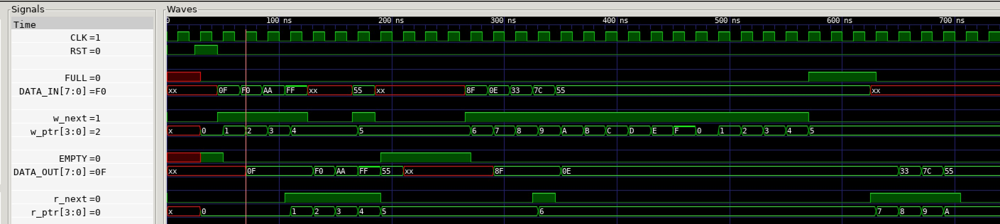

# FIFO SYNCHRONOUS EXAMPLE

_A synchronous fifo._

Table of Contents

* [OVERVIEW](https://github.com/JeffDeCola/my-verilog-examples/tree/master/sequential-logic/memory/fifo_synchronous#overview)
* [SCHEMATIC](https://github.com/JeffDeCola/my-verilog-examples/tree/master/sequential-logic/memory/fifo_synchronous#schematic)
* [TRUTH TABLE](https://github.com/JeffDeCola/my-verilog-examples/tree/master/sequential-logic/memory/fifo_synchronous#truth-table)
* [VERILOG CODE](https://github.com/JeffDeCola/my-verilog-examples/tree/master/sequential-logic/memory/fifo_synchronous#verilog-code)
* [RUN (SIMULATE)](https://github.com/JeffDeCola/my-verilog-examples/tree/master/sequential-logic/memory/fifo_synchronous#run-simulate)
* [VIEW WAVEFORM](https://github.com/JeffDeCola/my-verilog-examples/tree/master/sequential-logic/memory/fifo_synchronous#view-waveform)
* [TESTED IN HARDWARE - BURNED TO A FPGA](https://github.com/JeffDeCola/my-verilog-examples/tree/master/sequential-logic/memory/fifo_synchronous#tested-in-hardware---burned-to-a-fpga)

## OVERVIEW

_I used
[iverilog](https://github.com/JeffDeCola/my-cheat-sheets/tree/master/hardware/tools/simulation/iverilog-cheat-sheet)
to simulate and
[GTKWave](https://github.com/JeffDeCola/my-cheat-sheets/tree/master/hardware/tools/simulation/gtkwave-cheat-sheet)
to view the waveform. I also used
[Xilinx Vivado](https://github.com/JeffDeCola/my-cheat-sheets/tree/master/hardware/tools/synthesis/xilinx-vivado-cheat-sheet)
to synthesize and program this example on a
[Digilent ARTY-S7](https://github.com/JeffDeCola/my-cheat-sheets/tree/master/hardware/development/fpga-development-boards/digilent-arty-s7-cheat-sheet)
FPGA development board._

## SCHEMATIC

This may help,


## TRUTH TABLE

| write | addr | wdata    |  rdata   | comment     |
|:-----:|:----:|:--------:|:--------:|:-----------:|
| 1     | 0000 | 00111100 | 00111100 | WRITE 0000  |
| 1     | 1100 | 11110000 | 11110000 | WRITE 1100  |
| 0     | 0000 | xxxxxxxx | 00111100 | READ  0000  |
| 0     | 1100 | xxxxxxxx | 11110000 | READ  1100  |

## VERILOG CODE

The
[fifo_synchronous.v](https://github.com/JeffDeCola/my-verilog-examples/blob/master/sequential-logic/memory/fifo_synchronous/fifo_synchronous.v)
behavioral model,

```verilog
???
```

## RUN (SIMULATE)

The testbench uses two files,

* [fifo_synchronous_tb.v](https://github.com/JeffDeCola/my-verilog-examples/blob/master/sequential-logic/memory/fifo_synchronous/fifo_synchronous_tb.v)
  the testbench
* [fifo_synchronous_tb.tv](https://github.com/JeffDeCola/my-verilog-examples/blob/master/sequential-logic/memory/fifo_synchronous/fifo_synchronous_tb.tv)
  the test vectors and expected results

with,

* [fifo_synchronous.vh](https://github.com/JeffDeCola/my-verilog-examples/blob/master/sequential-logic/memory/fifo_synchronous/fifo_synchronous.vh)
  is the header file listing the verilog models
* [run-simulation.sh](https://github.com/JeffDeCola/my-verilog-examples/blob/master/sequential-logic/memory/fifo_synchronous/run-simulation.sh)
  is a script containing the commands below

Use **iverilog** to compile the verilog to a vvp format
which is used by the vvp runtime simulation engine,

```bash
iverilog -o fifo_synchronous_tb.vvp fifo_synchronous_tb.v fifo_synchronous.vh
```

Use **vvp** to run the simulation, which checks the UUT
and creates a waveform dump file *.vcd.

```bash
vvp fifo_synchronous_tb.vvp
```

The output of the test,

```text
???
```

## VIEW WAVEFORM

Open the waveform file fifo_synchronous_tb.vcd file with GTKWave,

```bash
gtkwave -f fifo_synchronous_tb.vcd &
```

Save your waveform to a .gtkw file.

Now you can use the script
[launch-gtkwave.sh](https://github.com/JeffDeCola/my-verilog-examples/blob/master/launch-GTKWave-script/launch-gtkwave.sh)
anytime you want,

```bash
gtkwave -f fifo_synchronous_tb.gtkw &
```



## TESTED IN HARDWARE - BURNED TO A FPGA

The above code was synthesized using the
[Xilinx Vivado](https://github.com/JeffDeCola/my-cheat-sheets/tree/master/hardware/tools/synthesis/xilinx-vivado-cheat-sheet)
IDE software suite and burned to a FPGA development board.
