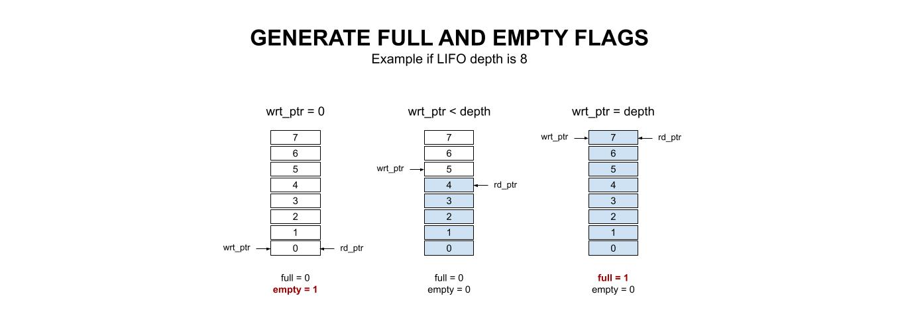

# LIFO SYNCHRONOUS EXAMPLE

_A synchronous lifo using dual-port synchronous RAM._

Table of Contents

* [OVERVIEW](https://github.com/JeffDeCola/my-verilog-examples/tree/master/sequential-logic/memory/lifo_synchronous#overview)
* [SCHEMATIC](https://github.com/JeffDeCola/my-verilog-examples/tree/master/sequential-logic/memory/lifo_synchronous#schematic)
* [TRUTH TABLE](https://github.com/JeffDeCola/my-verilog-examples/tree/master/sequential-logic/memory/lifo_synchronous#truth-table)
* [VERILOG CODE](https://github.com/JeffDeCola/my-verilog-examples/tree/master/sequential-logic/memory/lifo_synchronous#verilog-code)
  * [WRITE AND READ LOGIC](https://github.com/JeffDeCola/my-verilog-examples/tree/master/sequential-logic/memory/lifo_synchronous#write-and-read-logic)
  * [WRITE AND READ PTRS](https://github.com/JeffDeCola/my-verilog-examples/tree/master/sequential-logic/memory/lifo_synchronous#write-and-read-ptrs)
  * [COMPARE AND STATUS LOGIC](https://github.com/JeffDeCola/my-verilog-examples/tree/master/sequential-logic/memory/lifo_synchronous#compare-and-status-logic)
* [RUN (SIMULATE)](https://github.com/JeffDeCola/my-verilog-examples/tree/master/sequential-logic/memory/lifo_synchronous#run-simulate)
* [VIEW WAVEFORM](https://github.com/JeffDeCola/my-verilog-examples/tree/master/sequential-logic/memory/lifo_synchronous#view-waveform)
* [TESTED IN HARDWARE - BURNED TO A FPGA](https://github.com/JeffDeCola/my-verilog-examples/tree/master/sequential-logic/memory/lifo_synchronous#tested-in-hardware---burned-to-a-fpga)

Documentation and Reference

* Using my
  [dual_port_ram_synchronous](https://github.com/JeffDeCola/my-verilog-examples/tree/master/sequential-logic/memory/dual_port_ram_synchronous)

## OVERVIEW

A FIFO is a special type of buffer. The name LIFO stands for lst in first out
and means that the data written into the buffer last comes out of it first.
A synchronous LIFO is a LIFO where the same clock is used for both reading and
writing.

_I used
[iverilog](https://github.com/JeffDeCola/my-cheat-sheets/tree/master/hardware/tools/simulation/iverilog-cheat-sheet)
to simulate and
[GTKWave](https://github.com/JeffDeCola/my-cheat-sheets/tree/master/hardware/tools/simulation/gtkwave-cheat-sheet)
to view the waveform. I also used
[Xilinx Vivado](https://github.com/JeffDeCola/my-cheat-sheets/tree/master/hardware/tools/synthesis/xilinx-vivado-cheat-sheet)
to synthesize and program this example on a
[Digilent ARTY-S7](https://github.com/JeffDeCola/my-cheat-sheets/tree/master/hardware/development/fpga-development-boards/digilent-arty-s7-cheat-sheet)
FPGA development board._

## SCHEMATIC

This fifo uses my dual port synchronous RAM.

The structure is,


The full and empy logic is,



## TRUTH TABLE

I made this more complicated then it should be,
but I wanted to show all the cases.
It's really just pushing and popping data
off the FIFO.

| rst | push | full | data_in  | pop | empty | data_out | comment          |
|:---:|:----:|:----:|:--------:|:---:|:-----:|:--------:|:----------------:|
|  1  |  0   | 0    | xxxxxxxx | 0   | 0     | xxxxxxxx | RESETS PTR       |
|  0  |  0   | 0    | xxxxxxxx | 0   | 0     | data_out | -                |
|  0  |  0   | 0    | xxxxxxxx | 0   | 1     | data_out | EMPTY            |
|  0  |  0   | 0    | xxxxxxxx | 1   | 0     | POP      | POP              |
|  0  |  0   | 0    | xxxxxxxx | 1   | 1     | data_out | NO POP - EMPTY   |
|  0  |  0   | 1    | xxxxxxxx | 0   | 0     | data_out | FULL             |
|  0  |  0   | 1    | xxxxxxxx | 0   | 1     | -        | N/A              |
|  0  |  0   | 1    | xxxxxxxx | 1   | 0     | POP      | FULL - POP       |
|  0  |  0   | 1    | xxxxxxxx | 1   | 1     | -        | N/A              |
|  0  |  1   | 0    | data     | 0   | 0     | data_out | PUSH             |
|  0  |  1   | 0    | data     | 0   | 1     | data_out | PUSH - EMPTY     |
|  0  |  1   | 0    | data     | 1   | 0     | POP      | PUSH - POP       |
|  0  |  1   | 0    | data     | 1   | 1     | data_out | N/A              |
|  0  |  1   | 1    | xxxxxxxx | 0   | 0     | data_out | NO PUSH - FULL   |
|  0  |  1   | 1    | xxxxxxxx | 0   | 1     | data_out | N/A              |
|  0  |  1   | 1    | xxxxxxxx | 1   | 0     | POP      | N/A              |
|  0  |  1   | 1    | xxxxxxxx | 1   | 1     | data_out | N/A              |

## VERILOG CODE

The
[lifo_synchronous.v](https://github.com/JeffDeCola/my-verilog-examples/blob/master/sequential-logic/memory/lifo_synchronous/lifo_synchronous.v)
behavioral model,

### WRITE AND READ LOGIC

```verilog
    //If FIFO full write counter should not increment
    always @(*) begin
        if (we && (!full))
            w_next=1;
        else
            w_next=0;
    end
```

```verilog
    //If FIFO empty read counter should not increment
    always @(*) begin
        if (re && (!empty))
            r_next=1;
        else
            r_next=0;
    end
```

### STACK PTRS

The top memory location is unused since the logic required to utilize that location
would take up more real estate than it's worth.

```verilog
    // ALWAYS BLOCK with NON-BLOCKING PROCEDURAL ASSIGNMENT STATEMENT
    always @ (posedge clk) begin
        //RESET
        if (rst) begin
            wrt_ptr <= 4'b0000;
            rd_ptr <= 4'b0000;
        // BOTTOM - PUSH    
        end else if ((wrt_ptr == 4'b0000) & (w_next)) begin
            wrt_ptr <= wrt_ptr + 1;
        // BOTTOM - POP
        end else if ((rd_ptr == 4'b0000) & (r_next)) begin
            wrt_ptr <= 4'b0000;
        // PUSH
        end else if (w_next) begin
            wrt_ptr <= wrt_ptr + 1;
            rd_ptr <= rd_ptr + 1;
        // POP    
        end else if (r_next) begin
            wrt_ptr <= wrt_ptr - 1;
            rd_ptr <= rd_ptr - 1;
        end
    end
```

### COMPARE AND STATUS LOGIC

```verilog
    parameter depth = 4'b1111;    // Depth of the FIFO

    // HOW MUCH MEMORY USED
    // ALWAYS BLOCK with NON-BLOCKING PROCEDURAL ASSIGNMENT STATEMENT
    always @(*) begin
        if (wrt_ptr == 0) begin
            full <= 1'b0;
            empty <= 1'b1;
        end else if (wrt_ptr < depth) begin
            full <= 1'b0;
            empty <= 1'b0;
        end else if (wrt_ptr == depth) begin
            full <= 1'b1;
            empty <= 1'b0;
        end
    end
```

## RUN (SIMULATE)

The testbench uses two files,

* [lifo_synchronous_tb.v](https://github.com/JeffDeCola/my-verilog-examples/blob/master/sequential-logic/memory/lifo_synchronous/lifo_synchronous_tb.v)
  the testbench
* [lifo_synchronous_tb.tv](https://github.com/JeffDeCola/my-verilog-examples/blob/master/sequential-logic/memory/lifo_synchronous/lifo_synchronous_tb.tv)
  the test vectors and expected results

with,

* [lifo_synchronous.vh](https://github.com/JeffDeCola/my-verilog-examples/blob/master/sequential-logic/memory/lifo_synchronous/lifo_synchronous.vh)
  is the header file listing the verilog models
* [run-simulation.sh](https://github.com/JeffDeCola/my-verilog-examples/blob/master/sequential-logic/memory/lifo_synchronous/run-simulation.sh)
  is a script containing the commands below

Use **iverilog** to compile the verilog to a vvp format
which is used by the vvp runtime simulation engine,

```bash
iverilog -o lifo_synchronous_tb.vvp lifo_synchronous_tb.v lifo_synchronous.vh
```

Use **vvp** to run the simulation, which checks the UUT
and creates a waveform dump file *.vcd.

```bash
vvp lifo_synchronous_tb.vvp
```

The output of the test,

```text
TEST START --------------------------------

                 | TIME(ns) | RST | PUSH | FULL | DATA_IN  | POP | EMPTY | DATA_OUT |
                 ----------------------------------------------------------------
   1        INIT |       15 |  0  |  0   |  x   | xxxxxxxx |  0  |   x   | xxxxxxxx |
   2       RESET |       35 |  1  |  0   |  0   | xxxxxxxx |  0  |   1   | xxxxxxxx |
   3      PUSH-1 |       55 |  0  |  1   |  0   | 00001111 |  0  |   0   | xxxxxxxx |
   4      PUSH-2 |       75 |  0  |  1   |  0   | 11110000 |  0  |   0   | 00001111 |
   5      PUSH-3 |       95 |  0  |  1   |  0   | 10101010 |  0  |   0   | 11110000 |
   6           - |      115 |  0  |  0   |  0   | xxxxxxxx |  0  |   0   | 10101010 |
   7           - |      135 |  0  |  0   |  0   | xxxxxxxx |  0  |   0   | 10101010 |
   8           - |      155 |  0  |  0   |  0   | xxxxxxxx |  0  |   0   | 10101010 |
   9       POP-3 |      175 |  0  |  0   |  0   | xxxxxxxx |  1  |   0   | 10101010 |
  10       POP-2 |      195 |  0  |  0   |  0   | xxxxxxxx |  1  |   0   | 11110000 |
  11       POP-1 |      215 |  0  |  0   |  0   | xxxxxxxx |  1  |   1   | 00001111 |
  12    POP-NULL |      235 |  0  |  0   |  0   | xxxxxxxx |  1  |   1   | 00001111 |
  13    POP-NULL |      255 |  0  |  0   |  0   | xxxxxxxx |  1  |   1   | 00001111 |
  14    POP-NULL |      275 |  0  |  0   |  0   | xxxxxxxx |  1  |   1   | 00001111 |
  15           - |      295 |  0  |  0   |  0   | xxxxxxxx |  0  |   1   | 00001111 |
  16           - |      315 |  0  |  0   |  0   | xxxxxxxx |  0  |   1   | 00001111 |
  17           - |      335 |  0  |  0   |  0   | xxxxxxxx |  0  |   1   | 00001111 |
  18      PUSH-1 |      355 |  0  |  1   |  0   | 00001111 |  0  |   0   | 00001111 |
  19      PUSH-2 |      375 |  0  |  1   |  0   | 11110000 |  0  |   0   | 00001111 |
  20      PUSH-3 |      395 |  0  |  1   |  0   | 10101010 |  0  |   0   | 11110000 |
  21      PUSH-4 |      415 |  0  |  1   |  0   | 01001111 |  0  |   0   | 10101010 |
  22      PUSH-5 |      435 |  0  |  1   |  0   | 11110000 |  0  |   0   | 01001111 |
  23       POP-5 |      455 |  0  |  0   |  0   | xxxxxxxx |  1  |   0   | 11110000 |
  24       POP-4 |      475 |  0  |  0   |  0   | xxxxxxxx |  1  |   0   | 01001111 |
  25      PUSH-4 |      495 |  0  |  1   |  0   | 10101011 |  0  |   0   | 10101010 |
  26      PUSH-5 |      515 |  0  |  1   |  0   | 00001110 |  0  |   0   | 10101011 |
  27      PUSH-6 |      535 |  0  |  1   |  0   | 11110001 |  0  |   0   | 00001110 |
  28      PUSH-7 |      555 |  0  |  1   |  0   | 10101000 |  0  |   0   | 11110001 |
  29      PUSH-8 |      575 |  0  |  1   |  0   | 10111000 |  0  |   0   | 10101000 |
  30      PUSH-9 |      595 |  0  |  1   |  0   | 10111000 |  0  |   0   | 10111000 |
  31     PUSH-10 |      615 |  0  |  1   |  0   | 10111000 |  0  |   0   | 10111000 |
  32     PUSH-11 |      635 |  0  |  1   |  0   | 10111000 |  0  |   0   | 10111000 |
  33     PUSH-12 |      655 |  0  |  1   |  0   | 10111001 |  0  |   0   | 10111000 |
  34     PUSH-13 |      675 |  0  |  1   |  0   | 10111010 |  0  |   0   | 10111001 |
  35     PUSH-14 |      695 |  0  |  1   |  0   | 10111100 |  0  |   0   | 10111010 |
  36     PUSH-15 |      715 |  0  |  1   |  1   | 00110000 |  0  |   0   | 10111100 |
  37   PUSH-NULL |      735 |  0  |  1   |  1   | 01011000 |  0  |   0   | 00110000 |
  38   PUSH-NULL |      755 |  0  |  1   |  1   | 00001011 |  0  |   0   | 00110000 |
  39   PUSH-NULL |      775 |  0  |  1   |  1   | 00011111 |  0  |   0   | 00110000 |
  40           - |      795 |  0  |  0   |  1   | xxxxxxxx |  0  |   0   | 00110000 |
  41           - |      815 |  0  |  0   |  1   | xxxxxxxx |  0  |   0   | 00110000 |
  42           - |      835 |  0  |  0   |  1   | xxxxxxxx |  0  |   0   | 00110000 |
  43      POP-15 |      855 |  0  |  0   |  0   | xxxxxxxx |  1  |   0   | 00110000 |
  44      POP-14 |      875 |  0  |  0   |  0   | xxxxxxxx |  1  |   0   | 10111100 |
  45      POP-13 |      895 |  0  |  0   |  0   | xxxxxxxx |  1  |   0   | 10111010 |
  46      POP-12 |      915 |  0  |  0   |  0   | xxxxxxxx |  1  |   0   | 10111001 |

 VECTORS:   46
  ERRORS:    0

TEST END ----------------------------------
```

## VIEW WAVEFORM

Open the waveform file lifo_synchronous_tb.vcd file with GTKWave,

```bash
gtkwave -f lifo_synchronous_tb.vcd &
```

Save your waveform to a .gtkw file.

Now you can use the script
[launch-gtkwave.sh](https://github.com/JeffDeCola/my-verilog-examples/blob/master/launch-GTKWave-script/launch-gtkwave.sh)
anytime you want,

```bash
gtkwave -f lifo_synchronous_tb.gtkw &
```


## TESTED IN HARDWARE - BURNED TO A FPGA

The above code was synthesized using the
[Xilinx Vivado](https://github.com/JeffDeCola/my-cheat-sheets/tree/master/hardware/tools/synthesis/xilinx-vivado-cheat-sheet)
IDE software suite and burned to a FPGA development board.
