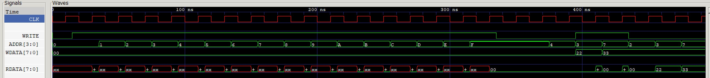

# SIMPLE MEMORY USING 1D ARRAY EXAMPLE

_A simple 16 Byte memory modeled using a 1D array._

Table of Contents

* [SCHEMATIC](https://github.com/JeffDeCola/my-verilog-examples/tree/master/sequential-logic/memory/simple-memory-using-1d-array#schematic)
* [VERILOG CODE](https://github.com/JeffDeCola/my-verilog-examples/tree/master/sequential-logic/memory/simple-memory-using-1d-array#verilog-code)
* [RUN (SIMULATE)](https://github.com/JeffDeCola/my-verilog-examples/tree/master/sequential-logic/memory/simple-memory-using-1d-array#run-simulate)
* [CHECK WAVEFORM](https://github.com/JeffDeCola/my-verilog-examples/tree/master/sequential-logic/memory/simple-memory-using-1d-array#check-waveform)

## SCHEMATIC

This may help,


## VERILOG CODE

The main part of the code is,

```verilog
    // DATA TYPES
    reg [7:0] mem [0:15];

    assign rdata = mem[addr];

    always @ (posedge clk) begin
        if (write) begin
            // WRITE DATA TO ADDR
            mem[addr] <= wdata;
        end
    end
```

The entire code is
[simple-memory-using-1d-array.v](simple-memory-using-1d-array.v).

## RUN (SIMULATE)

I used my testbench
[simple-memory-using-1d-array-tb.v](simple-memory-using-1d-array-tb.v) with
[iverilog](https://github.com/JeffDeCola/my-cheat-sheets/tree/master/hardware/tools/simulation/iverilog-cheat-sheet)
to simulate and create a `.vcd` file.

```bash
sh run-test.sh
```

## CHECK WAVEFORM

Check you waveform using your `.vcd` file with a waveform viewer.

I used [GTKWave](https://github.com/JeffDeCola/my-cheat-sheets/tree/master/hardware/tools/simulation/gtkwave-cheat-sheet)
and launch it using
[launch-gtkwave.sh](launch-gtkwave.sh).


