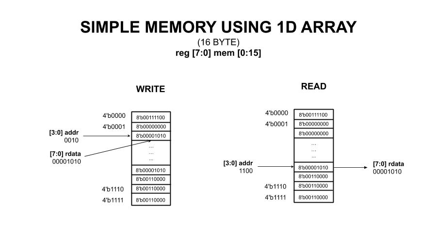
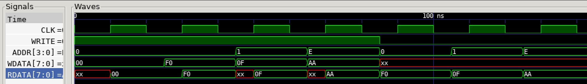

# SIMPLE MEMORY USING 1D ARRAY EXAMPLE

_A simple 16 Byte memory modeled using a 1D array._

Table of Contents

* [OVERVIEW](https://github.com/JeffDeCola/my-verilog-examples/tree/master/sequential-logic/memory/simple_memory_using_1d_array#overview)
* [SCHEMATIC](https://github.com/JeffDeCola/my-verilog-examples/tree/master/sequential-logic/memory/simple_memory_using_1d_array#schematic)
* [TRUTH TABLE](https://github.com/JeffDeCola/my-verilog-examples/tree/master/sequential-logic/memory/simple_memory_using_1d_array#truth-table)
* [VERILOG CODE](https://github.com/JeffDeCola/my-verilog-examples/tree/master/sequential-logic/memory/simple_memory_using_1d_array#verilog-code)
* [RUN (SIMULATE)](https://github.com/JeffDeCola/my-verilog-examples/tree/master/sequential-logic/memory/simple_memory_using_1d_array#run-simulate)
* [VIEW WAVEFORM](https://github.com/JeffDeCola/my-verilog-examples/tree/master/sequential-logic/memory/simple_memory_using_1d_array#view-waveform)
* [TESTED IN HARDWARE - BURNED TO A FPGA](https://github.com/JeffDeCola/my-verilog-examples/tree/master/sequential-logic/memory/simple_memory_using_1d_array#tested-in-hardware---burned-to-a-fpga)

## OVERVIEW

_I used
[iverilog](https://github.com/JeffDeCola/my-cheat-sheets/tree/master/hardware/tools/simulation/iverilog-cheat-sheet)
to simulate and
[GTKWave](https://github.com/JeffDeCola/my-cheat-sheets/tree/master/hardware/tools/simulation/gtkwave-cheat-sheet)
to view the waveform. I also used
[Xilinx Vivado](https://github.com/JeffDeCola/my-cheat-sheets/tree/master/hardware/tools/synthesis/xilinx-vivado-cheat-sheet)
to synthesize and program this example on a
[Digilent ARTY-S7](https://github.com/JeffDeCola/my-cheat-sheets/tree/master/hardware/development/fpga-development-boards/digilent-arty-s7-cheat-sheet)
FPGA development board._

## SCHEMATIC

This may help,



## TRUTH TABLE

| write | addr | wdata    |  rdata   | comment     |
|:-----:|:----:|:--------:|:--------:|:-----------:|
| 1     | 0000 | 00111100 | 00111100 | WRITE 0000  |
| 1     | 1100 | 11110000 | 11110000 | WRITE 1100  |
| 0     | 0000 | xxxxxxxx | 00111100 | READ  0000  |
| 0     | 1100 | xxxxxxxx | 11110000 | READ  1100  |

## VERILOG CODE

The
[simple_memory_using_1d_array.v](https://github.com/JeffDeCola/my-verilog-examples/blob/master/sequential-logic/memory/simple_memory_using_1d_array/simple_memory_using_1d_array.v)
behavioral model,

```verilog
    // DATA TYPES
    reg [7:0] mem [0:15];

    assign rdata = mem[addr];

    // MEMORY
    // ALWAYS BLOCK with NON-BLOCKING PROCEDURAL ASSIGNMENT STATEMENT
    always @(posedge clk) begin
        if (write) begin
            // WRITE DATA TO ADDR
            mem[addr] <= wdata;
        end
    end
```

## RUN (SIMULATE)

The testbench uses two files,

* [simple_memory_using_1d_array_tb.v](https://github.com/JeffDeCola/my-verilog-examples/blob/master/sequential-logic/memory/simple_memory_using_1d_array/simple_memory_using_1d_array_tb.v)
  the testbench
* [simple_memory_using_1d_array_tb.tv](https://github.com/JeffDeCola/my-verilog-examples/blob/master/sequential-logic/memory/simple_memory_using_1d_array/simple_memory_using_1d_array_tb.tv)
  the test vectors and expected results

with,

* [simple_memory_using_1d_array.vh](https://github.com/JeffDeCola/my-verilog-examples/blob/master/sequential-logic/memory/simple_memory_using_1d_array/simple_memory_using_1d_array.vh)
  is the header file listing the verilog models
* [run-simulation.sh](https://github.com/JeffDeCola/my-verilog-examples/blob/master/sequential-logic/memory/simple_memory_using_1d_array/run-simulation.sh)
  is a script containing the commands below

Use **iverilog** to compile the verilog to a vvp format
which is used by the vvp runtime simulation engine,

```bash
iverilog -o simple_memory_using_1d_array_tb.vvp simple_memory_using_1d_array_tb.v simple_memory_using_1d_array.vh
```

Use **vvp** to run the simulation, which checks the UUT
and creates a waveform dump file *.vcd.

```bash
vvp simple_memory_using_1d_array_tb.vvp
```

The output of the test,

```text
TEST START --------------------------------

                 | TIME(ns) | WRITE | ADDR |  WDATA   |  RDATA   |
                 -------------------------------------------------
   0        INIT |        0 |   1   | 0000 | 00000000 | xxxxxxxx |
   0        INIT |       10 |   1   | 0000 | 00000000 | 00000000 |
   1       WRITE |       25 |   1   | 0000 | 11110000 | 00000000 |
   1       WRITE |       30 |   1   | 0000 | 11110000 | 11110000 |
   2       WRITE |       45 |   1   | 0001 | 00001111 | xxxxxxxx |
   2       WRITE |       50 |   1   | 0001 | 00001111 | 00001111 |
   3       WRITE |       65 |   1   | 1110 | 10101010 | xxxxxxxx |
   3       WRITE |       70 |   1   | 1110 | 10101010 | 10101010 |
   4        READ |       85 |   0   | 0000 | xxxxxxxx | 11110000 |
   5        READ |      105 |   0   | 0001 | xxxxxxxx | 00001111 |
   6        READ |      125 |   0   | 1110 | xxxxxxxx | 10101010 |

 VECTORS:    6
  ERRORS:    0

TEST END ----------------------------------
```

## VIEW WAVEFORM

Open the waveform file simple_memory_using_1d_array_tb.vcd file with GTKWave,

```bash
gtkwave -f simple_memory_using_1d_array_tb.vcd &
```

Save your waveform to a .gtkw file.

Now you can use the script
[launch-gtkwave.sh](https://github.com/JeffDeCola/my-verilog-examples/blob/master/launch-GTKWave-script/launch-gtkwave.sh)
anytime you want,

```bash
gtkwave -f simple_memory_using_1d_array_tb.gtkw &
```



## TESTED IN HARDWARE - BURNED TO A FPGA

The above code was synthesized using the
[Xilinx Vivado](https://github.com/JeffDeCola/my-cheat-sheets/tree/master/hardware/tools/synthesis/xilinx-vivado-cheat-sheet)
IDE software suite and burned to a FPGA development board.
