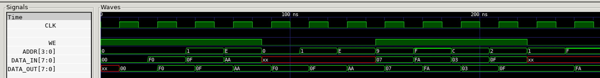

# SINGLE-PORT RAM SYNCHRONOUS EXAMPLE

_Single-port synchronous RAM._

Table of Contents

* [OVERVIEW](https://github.com/JeffDeCola/my-verilog-examples/tree/master/sequential-logic/memory/single_port_ram_synchronous#overview)
* [SCHEMATIC](https://github.com/JeffDeCola/my-verilog-examples/tree/master/sequential-logic/memory/single_port_ram_synchronous#schematic)
* [TRUTH TABLE](https://github.com/JeffDeCola/my-verilog-examples/tree/master/sequential-logic/memory/single_port_ram_synchronous#truth-table)
* [VERILOG CODE](https://github.com/JeffDeCola/my-verilog-examples/tree/master/sequential-logic/memory/single_port_ram_synchronous#verilog-code)
* [RUN (SIMULATE)](https://github.com/JeffDeCola/my-verilog-examples/tree/master/sequential-logic/memory/single_port_ram_synchronous#run-simulate)
* [VIEW WAVEFORM](https://github.com/JeffDeCola/my-verilog-examples/tree/master/sequential-logic/memory/single_port_ram_synchronous#view-waveform)
* [TESTED IN HARDWARE - BURNED TO A FPGA](https://github.com/JeffDeCola/my-verilog-examples/tree/master/sequential-logic/memory/single_port_ram_synchronous#tested-in-hardware---burned-to-a-fpga)

## OVERVIEW

A single port RAM is a that RAM in which only one address can be accessed
at a particular time.
The address can be accessed for read operation or write operation.
I could of made this a bi-directional read.

_I used
[iverilog](https://github.com/JeffDeCola/my-cheat-sheets/tree/master/hardware/tools/simulation/iverilog-cheat-sheet)
to simulate and
[GTKWave](https://github.com/JeffDeCola/my-cheat-sheets/tree/master/hardware/tools/simulation/gtkwave-cheat-sheet)
to view the waveform. I also used
[Xilinx Vivado](https://github.com/JeffDeCola/my-cheat-sheets/tree/master/hardware/tools/synthesis/xilinx-vivado-cheat-sheet)
to synthesize and program this example on a
[Digilent ARTY-S7](https://github.com/JeffDeCola/my-cheat-sheets/tree/master/hardware/development/fpga-development-boards/digilent-arty-s7-cheat-sheet)
FPGA development board._

## SCHEMATIC

This may help,


## TRUTH TABLE

| we    | addr | data_in  | data_out                | comment     |
|:-----:|:----:|:--------:|:-----------------------:|:-----------:|
| 0     | 0000 | xxxxxxxx | data @addr              | READ 0000   |
| 1     | 1100 | 11110000 | data_out@last read addr | WRITE 1100  |

## VERILOG CODE

The
[single_port_ram_synchronous.v](https://github.com/JeffDeCola/my-verilog-examples/blob/master/sequential-logic/memory/single_port_ram_synchronous/single_port_ram_synchronous.v)
behavioral model,

```verilog
    // DATA TYPES
    reg [7:0] mem [0:15];         //RAM
    reg [3:0] address_register;

    // OUTPUT (THIS MAKES IT SYNCHRONOUS)
    assign data_out = mem[address_register];

    // RAM
    // ALWAYS BLOCK with NON-BLOCKING PROCEDURAL ASSIGNMENT STATEMENT
    always @(posedge clk) begin
        if (we) begin
            mem[addr] <= data_in;
        end else begin
            address_register <= addr;
        end
    end
```

## RUN (SIMULATE)

The testbench uses two files,

* [single_port_ram_synchronous_tb.v](https://github.com/JeffDeCola/my-verilog-examples/blob/master/sequential-logic/memory/single_port_ram_synchronous/single_port_ram_synchronous_tb.v)
  the testbench
* [single_port_ram_synchronous_tb.tv](https://github.com/JeffDeCola/my-verilog-examples/blob/master/sequential-logic/memory/single_port_ram_synchronous/single_port_ram_synchronous_tb.tv)
  the test vectors and expected results

with,

* [single_port_ram_synchronous.vh](https://github.com/JeffDeCola/my-verilog-examples/blob/master/sequential-logic/memory/single_port_ram_synchronous/single_port_ram_synchronous.vh)
  is the header file listing the verilog models
* [run-simulation.sh](https://github.com/JeffDeCola/my-verilog-examples/blob/master/sequential-logic/memory/single_port_ram_synchronous/run-simulation.sh)
  is a script containing the commands below

Use **iverilog** to compile the verilog to a vvp format
which is used by the vvp runtime simulation engine,

```bash
iverilog -o single_port_ram_synchronous_tb.vvp single_port_ram_synchronous_tb.v single_port_ram_synchronous.vh
```

Use **vvp** to run the simulation, which checks the UUT
and creates a waveform dump file *.vcd.

```bash
vvp single_port_ram_synchronous_tb.vvp
```

The output of the test,

```text
TEST START --------------------------------

                 | TIME(ns) | WE | ADDR | DATA_IN  | DATA_OUT |
                 ----------------------------------------------
   1        INIT |       15 | 1 | 0000  | 00000000 | xxxxxxxx |
   2       WRITE |       35 | 1 | 0000  | 11110000 | xxxxxxxx |
   3       WRITE |       55 | 1 | 0001  | 00001111 | xxxxxxxx |
   4       WRITE |       75 | 1 | 1110  | 10101010 | xxxxxxxx |
   5        READ |       95 | 0 | 0000  | xxxxxxxx | 11110000 |
   6        READ |      115 | 0 | 0001  | xxxxxxxx | 00001111 |
   7        READ |      135 | 0 | 1110  | xxxxxxxx | 10101010 |
   8       WRITE |      155 | 1 | 1001  | 00000111 | 10101010 |
   9       WRITE |      175 | 1 | 1111  | 11111010 | 10101010 |
  10       WRITE |      195 | 1 | 1100  | 00000011 | 10101010 |
  11       WRITE |      215 | 1 | 0010  | 00001111 | 10101010 |
  12        READ |      235 | 0 | 0001  | xxxxxxxx | 00001111 |
  13        READ |      255 | 0 | 1111  | xxxxxxxx | 11111010 |

 VECTORS:   13
  ERRORS:    0

TEST END ----------------------------------
```

## VIEW WAVEFORM

Open the waveform file single_port_ram_synchronous_tb.vcd file with GTKWave,

```bash
gtkwave -f single_port_ram_synchronous_tb.vcd &
```

Save your waveform to a .gtkw file.

Now you can use the script
[launch-gtkwave.sh](https://github.com/JeffDeCola/my-verilog-examples/blob/master/launch-GTKWave-script/launch-gtkwave.sh)
anytime you want,

```bash
gtkwave -f single_port_ram_synchronous_tb.gtkw &
```



## TESTED IN HARDWARE - BURNED TO A FPGA

The above code was synthesized using the
[Xilinx Vivado](https://github.com/JeffDeCola/my-cheat-sheets/tree/master/hardware/tools/synthesis/xilinx-vivado-cheat-sheet)
IDE software suite and burned to a FPGA development board.
